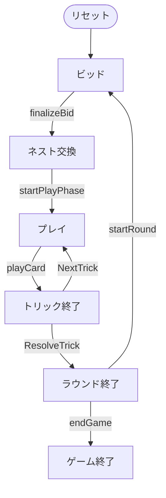

# 四色入札（CUI版）遊び方

## ゲーム概要

四色入札はアメリカ生まれの4人チーム制**ポイント・トリックテイキングゲーム**です。標準の52枚トランプではなく、専用の**57枚デッキ**（赤・黄・緑・黒の4色 × 1〜14 と、特別札「ルーク鳥（Rook Bird）」1枚）を使います。あなた（プレイヤー0）とその対面がチームを組み、2人のCPUチームと対戦します。オークションでノルマ（契約点）を競い、トリックで得点札を奪い合い、先に**500点**へ到達したチームが勝ちます。

> **原作クレジット**: 『Rook（ルーク）』は Parker Brothers が1906年に発売し、現在は Hasbro が発行しているカードゲームです。本実装は非公式・非営利のファン実装であり、権利者とは関係がありません。ルールのみを独自に実装しており、原版のカードデザインやルールブック本文は使用していません。

## 起動方法

```sh
go run ./cmd/trumpcards rook
go run ./cmd/trumpcards --lang en rook  # 英語モード
```

## ルール

### デッキと配布

- **デッキ**: 57枚。4色（赤・黄・緑・黒）× 1〜14 の56枚 ＋ ルーク鳥1枚。
- **プレイヤー**: 4人（プレイヤー0 = あなた、対面 = パートナー、残り2人 = CPUの相手チーム）。2チーム制。
- **配布**: 各プレイヤー13枚 ＋ 場に伏せた**ネスト（Nest）**5枚。

### ビッド（オークション）

各プレイヤーは順に、**70〜120点を5点刻み**でビッドするかパスします。直前の最高ビッドより高くなければビッドできません。最後まで残ったプレイヤーが**落札者（デクレアラー）**です。

### ネスト交換と切り札色の宣言

落札者はネスト5枚を手札に加えて18枚とし、不要な**5枚を捨て**、**切り札色（1=赤, 2=黄, 3=緑, 4=黒）**を宣言します。捨てた5枚の得点は最終トリックの勝者チームに加算されます。

### プレイとカードの強さ

- **フォロー義務**: リード色を持っていれば必ず従います。ボイド時は任意の札（切り札含む）を出せます。
- **強さ**: 同色では **1 が最強**、続いて 14 → 13 → … → 2。切り札色は他色すべてに勝ち、**ルーク鳥は最強の切り札**です。

### 得点札

- **5** = 5点、**10** と **14** = 各10点、**1** = 15点、**ルーク鳥** = 20点（合計200点／ラウンド）。

### スコアリング

- 落札チームは得点札合計が契約点以上なら加点、届かなければ契約点を失点。相手チームは得点札合計を加点。
- 先に目標スコア（既定500点）へ到達したチームの勝ち。

## ゲームの流れ

ゲームの進行は `internal/domain/Rook.go` のフェーズ機械そのものです。各ノードは同ファイルの `RookPhase` 定数、矢印ラベルはその遷移を行うメソッド名です。



## コマンド一覧

| コマンド | 短縮形 | 説明 |
|----------|--------|------|
| `bid <点数>` | `b` | ビッド（70〜120、5点刻み） |
| `pass` | `pa` | パス |
| `exchange <i> <j> <k> <l> <m> <色>` | `e` | ネスト交換（5枚を捨て、色 1=赤 2=黄 3=緑 4=黒 を宣言） |
| `play <idx>` | `p` | カードを出す |
| `next` | `n` | 次のトリックへ |
| `nextround` | `nr` | 次のラウンドへ |
| `reset` | `r` | ゲームをリセット |
| `quit` | `q` | ゲーム終了（`exit` も同じ） |
| `help` | `?` | コマンド一覧を表示 |

## 画面の見方

実際の出力例です。配りは毎回シャッフルされるので、カードの並びは実行ごとに変わります。

```
==========
ルーク (Rook)
==========
ラウンド: 1  トリック: 0
ディーラー: あなた
最高ビッド: 80
チーム0: 0点  チーム1: 0点
あなた (チーム0) トリック:0 得点:0 手札:13
[0]赤 6  [1]赤 8  [2]赤 14  [3]黄 4  [4]黄 8  [5]緑 3  [6]緑 12  [7]緑 14  [8]緑 1  [9]黒 4  [10]黒 5  [11]黒 11  [12]黒 1
CPU 1 (チーム1) トリック:0 得点:0 手札:13 [70]
CPU 2 (チーム0) トリック:0 得点:0 手札:13 [75]
CPU 3 (チーム1) トリック:0 得点:0 手札:13 [80]
----------
あなた のビッドです
b <points> (70-120, 5刻み) / pa でパス
==========
```

- **1〜3行目**: ゲーム名の見出し
- **ラウンド / トリック**: 進行状況
- **ディーラー**: 配り手
- **最高ビッド**: 現在の最高入札
- **チーム0 / チーム1**: 累積得点
- **プレイヤー行**: 所属チーム、獲得トリック数・得点、残り手札枚数。末尾の `[70]` などは**その席のビッド**
- **`[i]` 付きの行**: あなたの手札。色は 赤 / 黄 / 緑 / 黒 の4色で、各色 1 が最強、以降 14→13→…→2
- **`----------` の下**: 現在のフェーズと打てるコマンド（ビッドは 70〜120 の5刻み）
