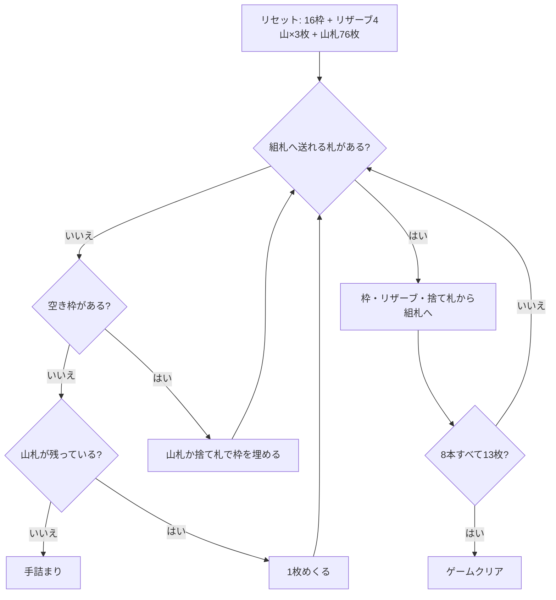

# ロイヤルコティヨン（CUI版）遊び方

## ゲーム概要

イギリス発祥の 2 デッキソリティア。52 枚 2 組の 104 枚を、16 枠のタブローと 4 山のリザーブ、そして 8 本の組札で捌く。

このゲームの核心は**組札が 2 つ飛ばしで積み上がり、しかも折り返す**こと。A 始まりの本は A→3→5→7→9→J→K と来たあと **K の次が 2** になり、2→4→6→8→10→Q と続く。つまり 1 本で 13 枚すべての数字を通る。だから 8 本で 104 枚がちょうど収まる。

## 起動方法

```sh
go run ./cmd/trumpcards royalcotillion
go run ./cmd/trumpcards --lang en royalcotillion   # 英語
```

## ルール

- 52 枚 2 組（104 枚）。**16 枠のタブロー**に 1 枚ずつ、**4 山のリザーブ**に 3 枚ずつ配り（計 28 枚）、残り 76 枚が山札
- **組札は 8 本**。前半 4 本は A から、後半 4 本は 2 から始まり、どちらも**同じスートで 2 つ飛ばし**に積む
  - A 始まり: A→3→5→7→9→J→K→**2**→4→6→8→10→Q（13 枚）
  - 2 始まり: 2→4→6→8→10→Q→**A**→3→5→7→9→J→K（13 枚）
- **タブローは 1 枠 1 枚**。重ねられず、組札へ送ることしかできない
- 空いた枠は**山札か捨て札から補充**できる
- **リザーブは一番上だけ**が使える。**空いた山は二度と埋まらない**
- 山札は 1 枚ずつ捨て札へめくる。**めくり直しは無い（1 巡のみ）**
- 8 本すべてが 13 枚になればクリア

## ゲームの流れ



## コマンド一覧

| コマンド | 短縮形 | 説明 |
|----------|--------|------|
| `draw` | `d` | 山札から1枚めくる |
| `m t <slot>` |  | タブロー枠 `<slot>` (0..15) の札を組札へ |
| `m r <pile>` |  | リザーブ `<pile>` (0..3) の一番上を組札へ |
| `m w f` |  | 捨て札を組札へ |
| `m w t <slot>` |  | 捨て札で空き枠 `<slot>` を埋める |
| `m s t <slot>` |  | 山札で空き枠 `<slot>` を直接埋める |
| `hint` | `h` | ヒントを表示する |
| `autocomplete` | `ac` | 送れるカードを自動で組札へ送る |
| `undo` | `u` | 1 手戻す |
| `giveup` | `g` | ギブアップ |
| `log` | `l` | 棋譜（アクションログ）を表示する |
| `reset` | `r` | 最初からやり直す |
| `quit` | `q` | 終了する |
| `help` | `?` | コマンド一覧を表示 |

## 画面の見方

```
基礎札(A:=A始まり, 2:=2始まり、2つ飛ばしで折り返す): A:♠A | A:(空) | A:(空) | A:(空) | 2:(空) | 2:(空) | 2:(空) | 2:(空)
山札: 76枚 捨て札: ♥9 (1枚)
----------
 [枠0] ♠5 [枠1] ♥7 [枠2] ♣3 [枠3] (空)
 [枠4] ♦10 [枠5] ♠9 [枠6] ♥2 [枠7] ♣8
 [枠8] ♦4 [枠9] ♠J [枠10] ♥6 [枠11] ♣A
 [枠12] ♦Q [枠13] ♠2 [枠14] ♥10 [枠15] ♣7
----------
リザーブ0: [0]♥3 [1]♠8 [2]♦J
リザーブ1: [0]♣9 [1]♥Q [2]♠4
リザーブ2:  (空・補充されません)
リザーブ3: [0]♦6 [1]♣K [2]♥5
----------
手数: 0
```

- 先頭の `A:` と `2:` が組札の系統。`A:` は A から、`2:` は 2 から始まります
- `[枠n]` は 1 枚しか置けない枠。`(空)` は山札か捨て札から埋められます
- `リザーブn` は 3 枚重ね。使えるのは一番右（一番上）だけで、**空いた山は二度と埋まりません**

## 遊び方のコツ

- **折り返しを忘れない。** K の次は 2、Q の次は A です。K が出たからその本は終わり、ではありません
- **同じ数字の札は 2 枚あり、そのスートの 2 本は別々の順番で全 13 値を通ります。** だから 2 枚は必ず別々の本に収まります。片方が入らなくても、いずれもう一方の本が受け入れます
- **枠を空けることが最優先。** 枠が空けば山札・捨て札の出口が増えます。同じ 1 点でも、リザーブより枠から送るほうが盤面が動きます
- **リザーブは掘るほど選択肢が増えるが、空にすると枠が 1 つ永久に消えます。** 急いで掘り切らないこと
- 空き枠は山札から直接埋めると、捨て札を 1 枚節約できます

