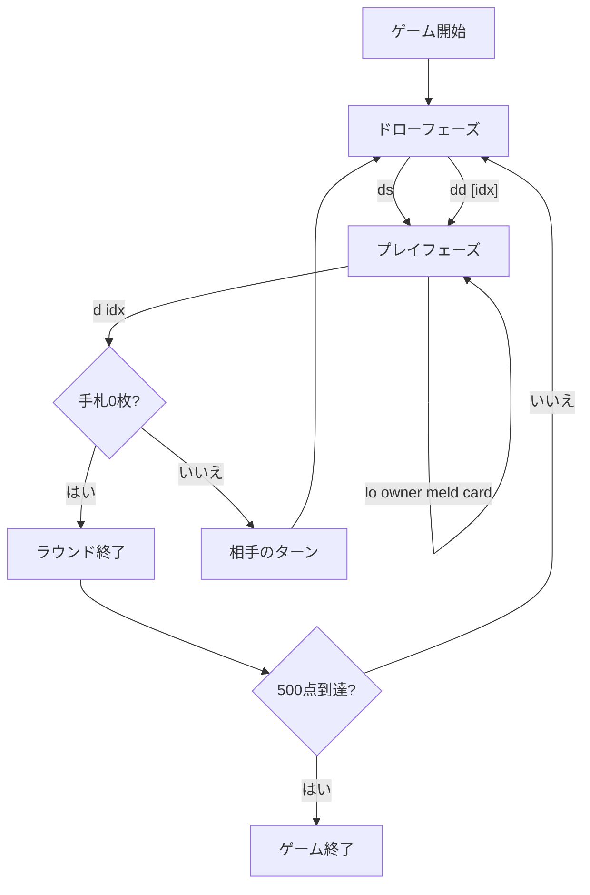

# ラミー 500（CUI版）遊び方

## ゲーム概要

Rummy 500（500ラム）は2人で対戦するラミー系カードゲームです。手札からセット（同ランク3枚以上）またはラン（同スート連続3枚以上）のメルドを場に出し、累積得点を競います。先に500点に到達したプレイヤーが勝利です。

## 起動方法

```sh
go run ./cmd/trumpcards rummy500       # 日本語
go run ./cmd/trumpcards --lang en rummy500  # 英語
go run ./cmd/trumpcards 500           # エイリアス（rummy, 500, r500 も可）
```

## ルール

- プレイヤー数: 2人（あなた vs CPU）
- 配布枚数: 各プレイヤー13枚、デッキは52枚
- 1ターンの流れ: ドロー → メルド/レイオフ（任意） → ディスカード
- 捨て札の山は積まれた順を保持しており、任意の位置を引き取れます（指定したカード以上をすべて手札に追加します）
- ラウンド終了条件: 手札を使い切る、または山札が空になる
- スコアリング: 出したメルドの合計点（プラス） − 手札に残ったカードの合計点（マイナス）
- A = 1点、`Q-K-A` ランに含まれる場合のみ 15点、J/Q/K = 10点、その他 = 数札の値
- 既定の目標スコアは 500 点

## ゲームの流れ



## コマンド一覧


| コマンド | 短縮形 | 説明 |
|----------|--------|------|
| `drawstock` | `ds` | 山札から引く |
| `drawdiscard [idx]` | `dd` | 捨て札から引く（指定インデックス以上すべて） |
| `meld <idx,idx,...>` | `m` | メルドを場に出す |
| `layoff <owner,meld,card> 既存メルドにレイオフ` | `lo` |  |
| `discard <idx>` | `d` | カードを捨ててターン終了 |
| `nextround` | `nr` | 次のラウンドへ |
| `log` | `l` | action log |
| `setdifficulty [0-2]` | `sd` | CPU難易度 (0=Easy, 1=Normal, 2=Hard) |
| `setlimit <n>` | `sl` | ポイント上限 |
| `hint` | `h` | ヒントを表示 |
| `reset` | `r` | 新しいゲームを開始 |
| `quit` | `q` | ゲーム終了（`exit` も同じ） |
| `help` | `?` | コマンド一覧を表示 |

## 画面の見方

```
ラウンド: 1  山札: 25枚
捨て札: [0]HEART 5 [1]CLOVER 7 [2]SPADE J
あなた: 累積120点 ラウンド0点 13枚
[0]SPADE 2 [1]HEART 3 [2]CLOVER 7 ...
  メルド[0]: SPADE 7,HEART 7,CLOVER 7
CPU 1: 累積80点 ラウンド0点 13枚
----------
手番: あなた (プレイフェーズ)
m <idx,idx,...>・・・メルドを場に出す
lo <owner> <meld> <card>・・・既存メルドにレイオフ
d <idx>・・・カードを捨ててターン終了
```

- `捨て札` 行のカード前の `[n]` がインデックスです。`dd n` で n 以上のカードをすべて引き取れます。
- 自分の手札の各カード前にもインデックスが付き、`m`/`d`/`lo` で参照します。
- `メルド[i]` は場に出したメルドの一覧です。`lo` の `meld` 引数で参照します。

## 遊び方のコツ

- セットは同ランクの最大4枚を狙うとレイオフ余地が広がります。
- ランは Ace を高（Q-K-A）か低（A-2-3）のどちらで使うか決め打ちしておくと管理が楽です。
- 高得点カード（A/K/Q/J/10）は手札に残すと大きな減点になります。早めにメルドかディスカードで処理しましょう。

### CPU難易度で変わること

| 難易度 | 引き方 | 捨て方 |
|--------|--------|--------|
| Easy | 常に山札から | **一番安い札**を捨てる（高得点札を抱えたまま終盤を迎えがち） |
| Normal | 常に山札から | 一番高得点の札を捨てる |
| Hard | 捨て札のトップがその場でメルド／レイオフになるなら拾う | メルド材料（ペア・同スート隣接・レイオフ可）を残し、**残りのうち一番重い札**を捨てる |

## ヒント

`hint` はメルド候補に加えて、既存メルドへ置ける札を `レイオフ候補: [2]SPADE 8 -> CPU 1 の [0]` の形で並べます。
