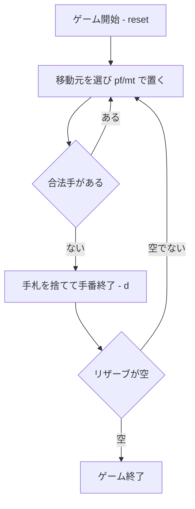

# ロシアンバンク（CUI版）遊び方

## ゲーム概要

ロシアンバンク（Russian Bank / クラペット, Crapette）は、CPU と 1 対 1 で競う 2 デッキ（104枚）の対戦型ソリティアです。各プレイヤーは自分の **13 枚のリザーブ（ストック）** を、共有の **8 本のファウンデーション**（A→K 同スート昇順）と **4 列の共有タブロー**（交互色・降順）へ吐き出していきます。先にリザーブを空にしたプレイヤーが勝利します。

## 起動方法

```sh
go run ./cmd/trumpcards russianbank
go run ./cmd/trumpcards --lang en russianbank  # 英語モード
```

## ルール

### 基本の流れ

1. **手番**: 自分の手番では、合法手が続く限り何手でも指せます。
2. **移動元の指定**: コマンドの `<src>` には次を指定します。
   - `r` … 自分のリザーブ、`w` … 自分の廃札
   - `or` … 相手のリザーブ、`ow` … 相手の廃札
   - `t0`〜`t3` … 共有タブローの各列
3. **移動先**:
   - `pf <src>` … 移動元を **ファウンデーション** へ（空の本は A、以降は同スート昇順）。
   - `mt <src> <col>` … 移動元を **共有タブロー列** へ（空の列は任意、以降は交互色で降順）。
4. **手番終了**: `d`（discard）で手札を 1 枚廃札に送り手番を終えます。
5. **ストップ**: 相手（CPU）が強制ファウンデーション手を取りこぼしたら `s`（stop）で咎められます。

### CPU難易度

`sd` コマンドで CPU の難易度（0=Easy, 1=Normal, 2=Hard）を設定できます。難易度が低いほど CPU は強制手を取りこぼしやすくなります。

### ゲーム終了

先に自分のリザーブを空にしたプレイヤーが勝者です。両者とも手詰まりなら、残りリザーブの少ない方が勝ち（同数なら引き分け）。

## ゲームの流れ



## コマンド一覧

| コマンド | 短縮形 | 説明 |
|----------|--------|------|
| `pf <src>` |  | 移動元をファウンデーションへ（src: r/w/or/ow/t0..t3） |
| `mt <src> <col>` |  | 移動元を共有タブロー列へ |
| `discard` | `d` | 手札を1枚捨てて手番終了 |
| `stop` | `s` | CPU の取りこぼしを咎める |
| `undo` | `u` | 直近の手を取り消す |
| `setdifficulty <0-2>` | `sd` | CPU難易度を設定 |
| `hint` | `h` | ヒントを表示 |
| `log` | `l` | 棋譜を表示 |
| `reset` | `r` | 新しいゲームを開始 |
| `quit` | `q` | ゲーム終了 |
| `help` | `?` | コマンド一覧を表示 |

## 画面の見方

```
==========
ロシアンバンク / クラペット (Russian Bank / Crapette)
==========
ファウンデーション: [♠A] [-] [-] [-] [-] [-] [-] [-]
タブロー: [♠8] [♥5] [-] [♣K]
あなた: リザーブ ♣9(11)  手札 27  廃札 ♠6(2)  stop 0
CPU: リザーブ ♦7(12)  手札 28  廃札 ♥4(3)  stop 0
==========
```

- `ファウンデーション` … 8本のトップカード
- `タブロー` … 共有4列のトップカード
- 各プレイヤー行 … リザーブ／手札／廃札の残枚数とトップ、stop 得点

## 遊び方のコツ

- 自分のリザーブのトップを出すことを最優先に。リザーブを空にした方が勝ちです。
- `t0`〜`t3` のタブロー列を経由して、リザーブのトップが出せる形を作りましょう。
- CPU の取りこぼしを見たら `s` で咎め、テンポを奪いましょう。
