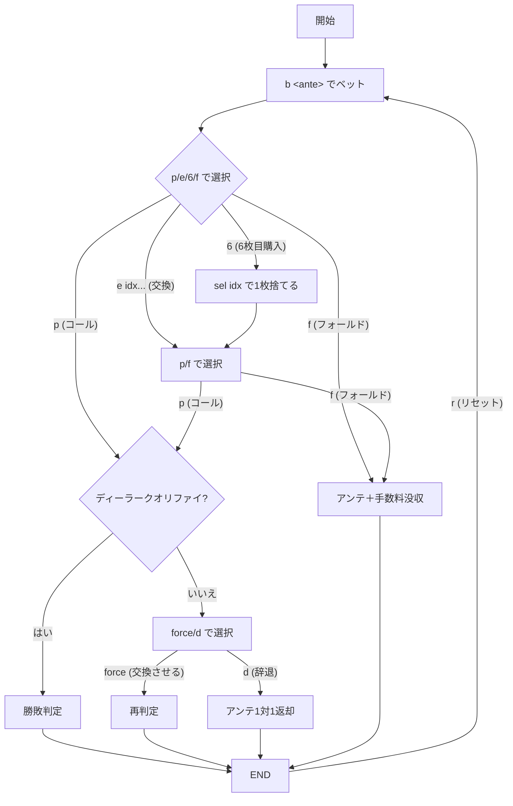

# ロシアンポーカー（CUI版）遊び方

## ゲーム概要

オアシスポーカーの発展形で、カード交換に加え6枚目のカード購入やディーラーカードの強制交換など、プレイヤーの判断機会が極めて多いカジノポーカーです。

## 起動方法

```sh
go run ./cmd/trumpcards russianpoker          # 日本語で起動
go run ./cmd/trumpcards --lang en russianpoker # 英語で起動
```

## ルール

- 52 枚のトランプ（ジョーカーなし）を使用
- プレイヤーとディーラーにそれぞれ 5 枚ずつ配る（ディーラーは 1 枚だけ表向き）
- プレイヤーは「コール」「フォールド」「カード交換」「6枚目購入」から選択
- 交換手数料はアンテ × 交換枚数、6枚目購入手数料はアンテ同額
- ディーラーは「A と K を含む」または「ペア以上」でクオリファイ
- ディーラー未クオリファイ時、アンテ同額を払ってディーラーの最高カードを交換させることができる

## ゲームの流れ



## コマンド一覧

| コマンド | 短縮形 | 説明 |
|----------|--------|------|
| `bet <ante>` | `b` | アンテをベット |
| `exchange <idx ...>` | `e` | 指定インデックス（0〜4）のカードを交換 |
| `buy6th` | `6` | 6枚目のカードを購入（手数料 = アンテ） |
| `select <idx>` | `sel` | 6枚の手札から指定インデックス（0〜5）を捨てる |
| `play` | `p` | コール（プレイベット = アンテ × 2） |
| `fold` | `f` | フォールド |
| `force` | `fe` | ディーラーの最高カードを交換させる（手数料 = アンテ） |
| `decline` | `d` | 強制クオリファイを辞退 |
| `log` | `l` | 棋譜を表示 |
| `reset` | `r` | リセット |
| `quit` | `q` | 終了 |
| `help` | `?` | コマンド一覧を表示 |

## 画面の見方

```
----------
チップ: 1000
フェーズ: ACTION
--- PLAYER ---
♠A,♥K,♦Q,♣J,♠10
--- DEALER ---
♥7,??,??,??,??
----------
```

- `??` はディーラーの伏せカード
- フェーズ名で現在の操作が分かる

## 遊び方のコツ

- ペア以上ならコールが基本。A-K ハイもコール推奨
- フラッシュ/ストレートにあと 1 枚の時は 6 枚目購入が有効
- 強い手（フルハウス以上）で未クオリファイの場合は `force` で配当倍率を狙う
- 交換は 1〜2 枚が費用対効果が良い
