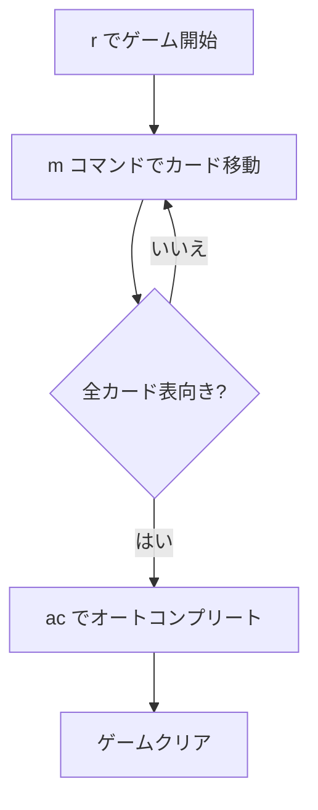

# ロシアンソリティア（CUI版）遊び方

## ゲーム概要

ロシアンソリティアは1人用のソリティアカードゲームで、Yukonの派生版です。配り方や「順序に関係なくまとめてカードを移動できる」特徴はYukonと同じですが、タブロー間の移動条件が「同スートで降順」に厳しくなっており難易度が高いゲームです。

## 起動方法

```sh
go run ./cmd/trumpcards russiansolitaire           # 日本語
go run ./cmd/trumpcards --lang en russiansolitaire # 英語
```

## ルール

### 配り方

- 7列のタブローにすべてのカード（52枚）を配ります（Yukonと同一）
- 列0: 1枚（表向き）
- 列1〜6: 基本配り + 追加4枚（表向き）

### 移動ルール

- タブロー → タブロー: 表向きカードとその上のカード全てをまとめて移動可能（**同スートで降順** — Yukonとの唯一の違い）
- タブロー → ファンデーション: 列最上段のみ（同スート・昇順）
- 空の列にはKのみ配置可能

## ゲームの流れ



## コマンド一覧

| コマンド | 説明 |
|---------|------|
| `m <列> <列>` | 列間の最上段カード移動（ショートハンド） |
| `m t <列> f` | タブローからファンデーションへ移動 |
| `m t <列> <ID> t <列>` | タブローからタブローへ（カードID指定） |
| `g` | ギブアップ |
| `h` | ヒント |
| `ac` | オートコンプリート |
| `u` | 元に戻す |
| `l` | 棋譜表示 |
| `r` | リセット |
| `q` | 終了 |

## 画面の見方

```
=== Russian Solitaire (ロシアンソリティア) ===
Foundation: [空] | [空] | [空] | [空]
----------
列0: [0]♠A
列1: [0]?? [1]♥5 [2]♣8 [3]♦3 [4]♠7 [5]♥2
列2: [0]?? [1]?? [2]♦J [3]♠4 [4]♥K [5]♣6 [6]♦9
...
----------
手数: 0
```

## 遊び方のコツ

- Yukonと違い**同スート降順**の繋ぎしか効かないため、難易度は格段に上がります
- 裏向きカードの列を優先的に解放しましょう
- `h` コマンドでヒントを活用しましょう
- 手詰まりになったら `u` で戻ってやり直しましょう
