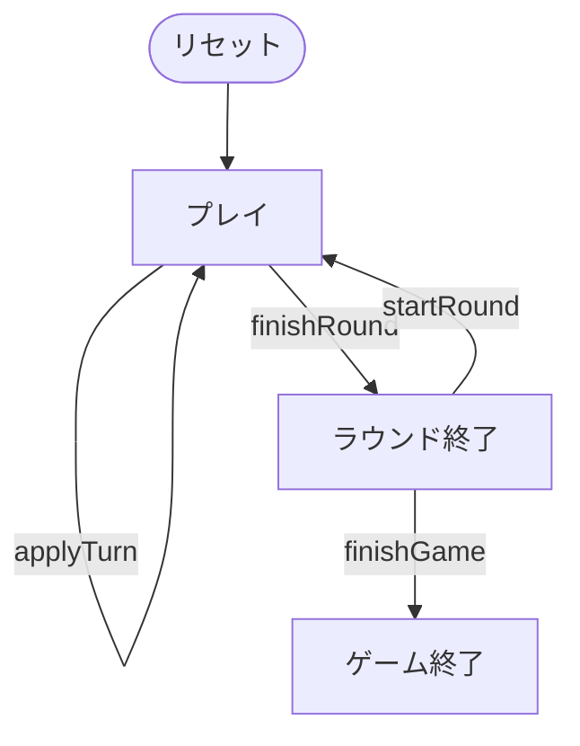

# さくら（CUI版）遊び方

## ゲーム概要

さくら（肥後花）は、熊本地方に伝わる**花札（48枚）**の合わせゲームです（2〜4人）。こいこいや八八が「**役ができたか**」で勝負するのに対し、さくらは**取った札の点数の合計**で競います ── 役を一つも覚えなくても遊べる一方で、どの札が何点かを数えながら打つゲームです。規定ラウンドを終えた時点で通算点の最も高い人が勝ちです。

## 起動方法

```sh
go run ./cmd/trumpcards sakura
go run ./cmd/trumpcards --lang en sakura  # 英語モード
```

## ルール

### デッキと配布

- **デッキ**: 花札48枚（12か月 × 各4枚：光・タネ・短冊・カス）。こいこいと同じ札を使います。
- **プレイヤー**: 2〜4人（席0 = あなた、残りは CPU）。
- **配布**: 各席に **7枚**、場に **6枚**を表向きに置き、残りが山札になります。

### 手番

1. 手札から1枚を出し、場にある**同じ月**の札を取ります。合う札が無ければその札は場に残ります（捨て札）。
2. 続けて山札から1枚めくり、同じ月の札があれば取ります。
3. 同じ月の札が場に**2枚**あるときは、取る場札のインデックスを指定します。指定しなければ点数の高いほうを取ります。場に同じ月が**3枚**あるときは4枚まとめて取ります。
4. 親から順に手番が回り、全員の手札が尽きるとラウンドが終わります。

**4人でプレイすると山（14枚）が手札（28枚）より先に尽きます。** そのときはめくりだけを飛ばし、手札を出す手番はそのまま続きます。

### 点数

| 札 | 点数 | 枚数 |
|----|------|------|
| 光 | 20点 | 5枚 |
| タネ | 10点 | 9枚 |
| 短冊 | 5点 | 10枚 |
| カス | 1点 | 24枚 |

48枚の合計は264点です。

### 追加役

| 役 | 点数 | 条件 |
|----|------|------|
| 桜酒 | 30点 | 「桜に幕」と「芒に月」を両方取る |
| 五光 | 100点 | 光札5枚すべてを取る |

追加役は素点に**加算**されます（役ができたら終わり、ではありません）。

### 勝敗

- ラウンドの最高点の席がそのラウンドの勝ちです（同点なら勝者なし）。
- 規定ラウンド（1〜12、既定3）を終えた時点で**通算点**の最も高い席が勝ちです。通算点が同じなら勝ちラウンド数で決め、それも同じなら引き分けです。

## ゲームの流れ

ゲームの進行は `internal/domain/Sakura.go` のフェーズ機械そのものです。各ノードは同ファイルの `SakuraPhase` 定数、矢印ラベルはその遷移を行うメソッド名です。



## コマンド一覧

| コマンド | 短縮形 | 説明 |
|----------|--------|------|
| `play <h> [f]` | `p` | 手札 h を出す。場札 f を指定（2枚一致時のみ必要） |
| `nextround` | `nr` | 次のラウンドを配る |
| `setseats <2-4>` | `ss` | 席数を変更して開始 |
| `setrounds <1-12>` | `sr` | ラウンド数を変更して開始 |
| `hint` | `h` | ヒントを表示 |
| `log` | `l` | 棋譜を表示 |
| `reset` | `r` | ゲームをリセット |
| `quit` | `q` | 終了 |
| `help` | `?` | コマンド一覧を表示 |

## 画面の見方

```
==========
さくら（肥後花 / 花札）
==========
ラウンド: 1/3  山札: 21  親: あなた
場: [0]梅·カス(1) [1]桐·カス(1) [2]牡·カス(1) [3]菖·カス(1) [4]紅·カス(1) [5]柳·タネ(10)
あなた: 手札7枚  取り札0枚  今局0点  追加役: -  通算0点  勝0
手札: [0]柳·短(5) [1]牡·カス(1) [2]菊·タネ(10) ...
CPU 1: 手札7枚  取り札0枚  今局0点  追加役: -  通算0点  勝0
----------
手番: あなた
```

- **札の後ろの括弧が点数**です。合計で競うゲームなので、点数が読めれば取るべき札が分かります。
- `場:` と `手札:` の `[n]` がコマンドで指定するインデックスです。
- `今局` はそのラウンドで取った札の点数（追加役込み）、`通算` は全ラウンドの合計です。

## 遊び方のコツ

- **光札（20点）は1枚で短冊4枚ぶん。** 同じ月に光札があるなら、他を捨ててでも取りにいく価値があります。
- **「桜に幕」と「芒に月」は桜酒30点。** どちらか一方を持っているなら、もう一方の月（3月・8月）の札を優先します。
- 合う札が無い手番では、いちばん安い札を捨てます。捨てた札は相手に取られる可能性があるので、高い札を場に置かないのが基本です。
