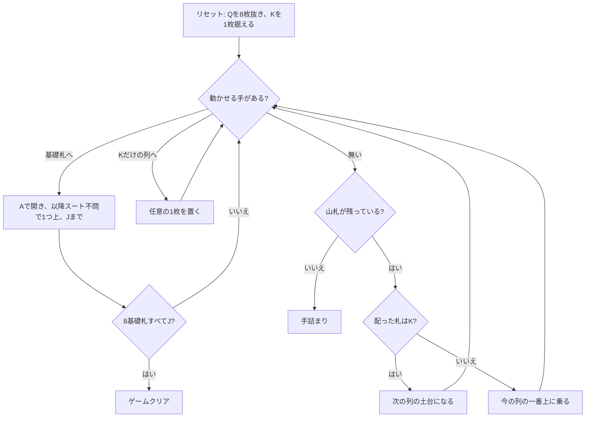

# サリカ法典（CUI版）遊び方

## ゲーム概要

52 枚 2 組から**クイーン 8 枚を抜いた 96 枚**で遊ぶソリティア。名前は女子の王位継承を認めないサリカ法典に由来し、抜いた Q は盤の脇に飾るだけで最後まで場に出ない。

まず K を 1 枚据えてそれを列の土台とし、以降 1 枚ずつ配って今の列に積む。**K が出たらそれが次の列の土台**になり、96 枚を配り切ると 8 列になる。基礎札は 8 つで、A を置いて **スートを問わず** J まで積む。K 8 枚を除く 88 枚すべてを積み切ればクリア。

## 起動方法

```sh
go run ./cmd/trumpcards saliclaw
go run ./cmd/trumpcards --lang en saliclaw   # 英語
```

## ルール

- 52 枚 2 組から **Q 8 枚を抜いた 96 枚**。Q は飾りで、動かせない
- **配り**: K を 1 枚据えて開始。`d` で 1 枚ずつ配り、**今の列の一番上に乗る**。**K が出たら次の列の土台**になる。捨て札は無い
- **基礎札**: 8 つ。A を置いて **スートを問わず** 1 つずつ上げ、**J で完成（11 枚）**。Q は場に無く K は土台なので、12 枚目は存在しない
- **基礎札は列が開いてから**。組札 i は列 i と対なので、その列の K が出るまで使えない
- **タブロー同士は積めない**。唯一の例外が「**K だけの列**」で、そこには任意の 1 枚を置ける
- **土台の K は動かせない**。列の底に据わったまま最後まで残る
- 8 × 11 = 88 枚すべてを基礎札へ積めばクリア。手が尽きれば手詰まり

> 補足: issue #5447 の仕様案とは 3 点異なるが、いずれも実際の規則（PySolFC / Wikipedia）に合わせた。
> (1) **Q は「K の上部スロットへ移す」のではなく、配る前に場から抜く**。移す規則にすると 104 枚のままになり、基礎札 88 枚 + K 8 枚の勘定が合わない。
> (2) 基礎札は同スート昇順ではなく **スート不問**。同スートに縛ると 2 組 8 スート分の並びが必要になり、K を土台に使う配りと両立しない。
> (3) **残り 96 枚を最初にタブローへ配り切るのではない**。1 枚ずつ配り、K で列が区切られてできる ── この「配りながら遊ぶ」ところがこのゲームの骨格。

## ゲームの流れ



## コマンド一覧

| コマンド | 短縮形 | 説明 |
|----------|--------|------|
| `draw` | `d` | 山札から 1 枚配る（K なら次の列が開く。めくり直しなし） |
| `move t <col> f` | `m` | 列の一番上を基礎札へ |
| `move t <from> t <to>` | `m` | 「K だけの列」へ 1 枚移動 |
| `hint` | `h` | ヒントを表示する |
| `autocomplete` | `ac` | 基礎札へ送れる札がなくなるまで自動で送る |
| `undo` | `u` | 1 手戻す |
| `giveup` | `g` | ギブアップ |
| `log` | `l` | 棋譜（アクションログ）を表示する |
| `reset` | `r` | 最初からやり直す |
| `quit` | `q` | 終了する |
| `help` | `?` | コマンド一覧を表示 |

## 画面の見方

```
基礎札: SPADE 1 | [空] | [空] | [空] | [空] | [空] | [空] | [空]
退場したクイーン: SPADE 12 HEART 12 CLOVER 12 DIAMOND 12 SPADE 12 HEART 12 CLOVER 12 DIAMOND 12
山札: 78枚
----------
列0: [0]SPADE 13 [1]SPADE 9 [2]HEART 8
列1: [0]HEART 13 (Kのみ - 任意の札を置けます)
列2: [未開放] (Kが出ると開きます)
...
列7: [未開放] (Kが出ると開きます)
----------
手数: 12
```

- **`[未開放]` と `(Kのみ)` は別物。** 前者はまだ K が出ていない列で置き場所ではなく、後者はこのゲーム唯一の置き場所
- 各列の `[n]` は列内のインデックス。動かせるのは常に一番上の 1 枚だけで、`[0]` の K は動かせない
- 「退場したクイーン」は飾り。ここに 8 枚あるので、場に出る札は 96 枚

## 遊び方のコツ

- **「K だけの列」は使い切りの逃げ場。** 1 枚置いた時点でその列はもう空きではなくなる。何を逃がすかで局面が決まる
- **配ると列は伸びる一方。** 捨て札が無いので、配った札は必ずどこかの列の上に乗る。基礎札へ送れる手を先に消化してから配る
- **K が出るまでその列の基礎札は使えない。** 序盤に A が出ても、対応する列が開いていなければ置けない。焦らず配る
- A は出たらすぐ基礎札へ。8 つあるので序盤の 1 枚が後半を大きく変える
- 詰まったら `undo` で分岐をやり直す
