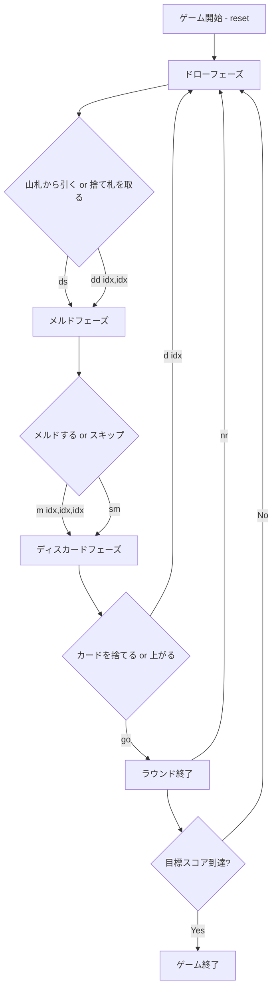

# サンバ（CUI版）遊び方

## ゲーム概要

サンバ（Samba）はカナスタを拡張した4人2チーム制のラミー系カードゲームです。標準52枚×3デッキ＋ジョーカー6枚（計162枚）を使用し、同ランクの「セット」に加え、カナスタにはない**同スート7枚の連続「サンバ（シーケンス）」**を作れるのが特徴です。座席0・2 対 1・3 のパートナー戦で、先に目標スコア（デフォルト10000点）に到達したチームが勝利します。あなたは座席0（チーム0）です。

## 起動方法

```sh
go run ./cmd/trumpcards samba
go run ./cmd/trumpcards --lang en samba
```

## ルール

### 基本ルール

- **デッキ**: 標準52枚×3デッキ＋ジョーカー6枚＝162枚
- **配布**: 各プレイヤーに13枚
- **チーム**: 座席0・2 対 1・3 の2チーム
- **ワイルドカード**: 2とジョーカーはワイルド
- **赤3**: ハート3・ダイヤ3は自動的に場に出し、山札から補充
- **黒3**: スペード3・クローバー3は捨てるだけ（メルド不可、相手のピックアップをブロック）

### メルド

- **セット（同ランク）**: 同ランク3枚以上。ナチュラル最低2枚、ワイルド最大3枚。
- **シーケンス（同スート連続）**: 同スートの連続する3枚以上。**ワイルド不可**（ナチュラルのみ）。
- **カナスタ**: 7枚のセット（ナチュラル=ワイルドなし、ミックス=ワイルドあり）
- **サンバ**: 7枚のシーケンス（すべてナチュラル）

### 初回メルド最低点（チーム累積スコア基準）

| 累積スコア | 最低点 |
|-----------|--------|
| マイナス | 15点 |
| 0〜1499 | 50点 |
| 1500〜2999 | 90点 |
| 3000以上 | 120点 |

初回メルドがまだのプレイヤーの手番では、メルドフェーズの案内に `初回メルドの最低点: N 点` が出ます（済んだ席には出ません）。

### 捨て札の山を取る

- トップカードと同ランクのナチュラルカード2枚（ペア）が必要
- 山全体を手札に加える
- フリーズ状態（ワイルドが捨てられた場合）でも同条件

### 得点

| カード | 点数 |
|--------|------|
| ジョーカー | 50点 |
| 2、A | 20点 |
| K〜8 | 10点 |
| 7〜4 | 5点 |
| 黒3 | 5点 |

| ボーナス | 点数 |
|----------|------|
| ナチュラルカナスタ | 500点 |
| ミックスカナスタ | 300点 |
| サンバ（7枚シーケンス） | 1500点 |
| 上がりボーナス | 100点 |
| 赤3（1枚あたり） | 100点 |

### 上がり

- チームが**2つ以上の完成メルド（カナスタまたはサンバ）**を持っていると上がれます。

### CPU難易度

- Easy: ランダムプレイ
- Normal: 基本戦略（ペアがあれば山を取る）
- Hard: 戦略的プレイ（山のサイズを考慮）

## ゲームの流れ



## コマンド一覧

| コマンド | 短縮形 | 説明 |
|----------|--------|------|
| reset | r | ゲームをリセット |
| drawstock | ds | 山札から引く |
| drawdiscard idx,idx | dd idx,idx | 捨て札の山を取る（ナチュラルペアのインデックス） |
| meld idx,idx,idx;idx,idx,idx | m idx,...;idx,... | メルドを出す（;でグループ区切り） |
| skipmeld | sm | メルドせずにスキップ |
| discard idx | d idx | カードを捨てる |
| goout | go | 上がる（完成メルド2つ以上が必要） |
| nextround | nr | 次のラウンドへ |
| setdifficulty n | sd n | CPU難易度変更 (0=Easy, 1=Normal, 2=Hard) |
| setlimit n | sl n | 目標スコア変更 |
| log | l | 棋譜を表示 |
| quit | q | 終了 |
| help | ? | ヘルプを表示 |
| `reset` | `r` | 新しいゲームを開始 |
| `quit` | `q` | ゲーム終了（`exit` も同じ） |
| `help` | `?` | コマンド一覧を表示 |

## 画面の見方

```
==============================
Samba (サンバ)
==============================
ラウンド: 1  山札: 90枚  捨て札: 1枚
チーム0: 0  チーム1: 0
捨て札: ♠5
You (team 0): 累積0点 ラウンド0点 13枚
  メルド[natural]: ♠K, ♥K, ♦K
  [0]♣2 [1]♠4 [2]♥5 [3]♦6 [4]♣7 ...
CPU 1 (team 1): 累積0点 ラウンド0点 13枚
----------
手番: You (ドローフェーズ)
ds・・・山札から引く
dd <idx,idx>・・・捨て札の山を取る
==============================
```

## 遊び方のコツ

- サンバ（同スート7枚）は1500点の大ボーナス。連続を意識して集めましょう
- ナチュラルカナスタ（ワイルドなし）は500点
- シーケンスにはワイルドを使えないので、ワイルドはセットに回しましょう
- 捨て札の山が大きい時は積極的に取りましょう
- ワイルドカードを捨てると山がフリーズするので注意
- 黒3を捨てると相手の山取りをブロックできます
- パートナー（座席2）のメルドを意識して連携しましょう
