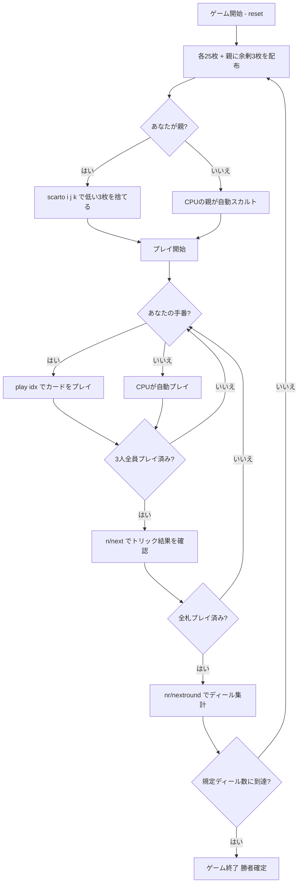

# スカルト（CUI版）遊び方

## ゲーム概要

Scarto（スカルト）はイタリア・ピエモンテ発祥の3人用**タロッキ・トリックテイキングゲーム**です。78枚のタロットデッキ（4スート×14枚、切り札21枚、エクスキューズ）を使い、あなた（プレイヤー0）はCPU2人と対戦します。ビッド・シアン・パートナーはなく、親（ディーラー）が余剰の3枚を伏せて捨てる「スカルト」を行い、残り札でトリックを戦います。各ディールは取り札点数を平均と比較したゼロサム精算で採点します。

## 起動方法

```sh
go run ./cmd/trumpcards scarto
go run ./cmd/trumpcards --lang en scarto  # 英語モード
```

## ルール

### デッキと配布

- **デッキ**: 78枚（4スート×14枚＝1〜10・V・C・D・R、切り札1〜21、エクスキューズ）。
- **プレイヤー**: 3人（プレイヤー0 = あなた、プレイヤー1〜2 = CPU）。
- **配布**: 各プレイヤー25枚＋親に余剰3枚。

### スカルト（捨て札）

親は手札から**低点のピップ札3枚を伏せて捨てます（scarto）**。捨てた3枚は親の得点札に加算されます。切り札・エクスキューズ・得点札（キング・コート札）は捨てられません。

### フォロー義務とカードの強さ

- リードスートを持っていれば**必ず従わなければなりません（must-follow）**。ボイド時は切り札を含む任意の札を出せます。切り札はすべてのスート札に勝ちます。
- 最も高い切り札、なければリードスートの最も高い札がトリックを取ります。

### 得点と勝利条件

- 各ディールの取り札点数を3人の平均と比較し、ゼロサム精算でディール得点を計算します（合計は常に0）。
- **マッチ勝利**: 規定ディール数（既定 **5**）を配り終えた時点で、累計得点が最上位のプレイヤーが勝者です。同点は引き分け。

## ゲームの流れ



## コマンド一覧

| コマンド | 短縮形 | 説明 |
|----------|--------|------|
| `scarto <i> <j> <k>` | `discard` | 親のとき低点の3枚を伏せて捨てる |
| `play <idx>` |  | 手札のidx番目のカードを出す |
| `next` | `n` | 次のトリックへ進む |
| `nextround` | `nr` | 次のディールへ進む |
| `hint` | `h` | 推奨アクションを表示 |
| `log` | `l` | アクションログを表示 |
| `reset` | `r` | 新しいゲームを開始（設定保持） |
| `quit` | `q` | ゲーム終了 |
| `help` | `?` | コマンド一覧を表示 |

## 画面の見方

- **手札**: プレイ可能な札（フォロー義務でフィルタ済み）が表示されます。
- **プレイヤー情報**: 各プレイヤーの累計得点・親表示・獲得トリック数・取り札点数。
- **現在のトリック**: 場に出ている札とリードプレイヤー。
- **ディール結果**: 各プレイヤーの平均との差（ゼロサム精算）。

## 遊び方のコツ

- **スカルトで弱点を消す**: 点数の低い短いスートを捨て、切り札やコート札を温存しましょう。
- **得点札は捨てられない**: 切り札・エクスキューズ・キング・コート札はスカルトに出せません。
- **フォロー義務を意識する**: リードスートを持っていれば必ず従う必要があります。ボイド時に切り札を切って主導権を握りましょう。
