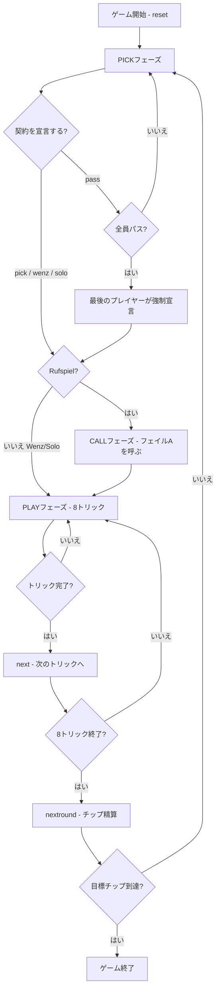

# シャーフコップ（CUI版）遊び方

## ゲーム概要

Schafkopf（シャーフコップ）はバイエルンの国民的トリックテイキングゲームです。32枚デッキ（A,7,8,9,10,J,Q,K × 4スート）を4人（1人の人間 + 3人のCPU）でプレイし、各プレイヤーに8枚を配り切ります。**ブラインドも埋め札もありません** — デッキの120点すべてが誰かの手札にあります。

このゲームの中心は**契約**です。宣言したプレイヤーは Rufspiel / Wenz / Solo の3つから選び、**何が切り札かは契約が決めます**。同じ8枚でも、宣言次第でカードの強さの順序そのものが入れ替わります。

## 起動方法

```sh
go run ./cmd/trumpcards schafkopf
go run ./cmd/trumpcards --lang en schafkopf  # 英語モード
```

## ルール

### デッキと配布

- **デッキ**: 32枚（A,7,8,9,10,J,Q,K × ♠♣♥♦）
- **プレイヤー**: 4人（プレイヤー0 = あなた、プレイヤー1〜3 = CPU）
- **配布**: 各プレイヤー8枚（32 ÷ 4 = 8 で配り切り、伏せ札は残りません）

### 3つの契約

| 契約 | コマンド | 切り札 | 味方 |
|------|----------|--------|------|
| Rufspiel | `pick` / `p` | Q全4枚 + J全4枚 + ♥全6枚（14枚） | フェイルAを呼んで隠れた相棒を作る |
| Wenz | `wenz` / `w` | **J全4枚のみ**（4枚） | なし（単独） |
| Solo | `solo <suit>` / `so <suit>` | 指定スート + Q全4枚 + J全4枚 | なし（単独） |

**契約が切り札の構成そのものです。** Wenz では Q が切り札でなくなり、各スートは A,10,K,Q,9,8,7 の7枚に増えます。Solo では指定したスートが♥の位置に入ります。

### 固定切り札（Rufspiel、14枚）

強い順:

| 順位 | カード | 順位 | カード |
|------|--------|------|--------|
| 1 | Q♣ | 8 | J♦ |
| 2 | Q♠ | 9 | A♥ |
| 3 | Q♥ | 10 | 10♥ |
| 4 | Q♦ | 11 | K♥ |
| 5 | J♣ | 12 | 9♥ |
| 6 | J♠ | 13 | 8♥ |
| 7 | J♥ | 14 | 7♥ |

※ Q・Jはスートに関わらずすべて切り札。♥のQ・J以外は切り札の下位に入ります。

### Wenz の切り札（4枚）

強い順: **J♣ > J♠ > J♥ > J♦**。Q は切り札から外れ、各フェイルスートの中で A > 10 > K > Q > 9 > 8 > 7 の位置に戻ります。

### フェイルスート

Rufspiel/Solo では Q・J を除く6枚（A,10,K,9,8,7）、Wenz では J のみを除く7枚（A,10,K,Q,9,8,7）で構成されます。同スート内の強さ: **A > 10 > K > (Q) > 9 > 8 > 7**

### 呼べるスート（Rufspiel のみ）

Rufspiel では**自分が持っていないフェイルスートのA**を呼びます。そのAを持つプレイヤーが隠れた相棒となり、呼んだスートがリードされた瞬間に正体が公開されます。呼べるスートが1つも無ければ、宣言者は単独で戦います。

### カード点数

| カード | 点数 |
|--------|------|
| A | 11点 |
| 10 | 10点 |
| K | 4点 |
| Q | 3点 |
| J | 2点 |
| 9・8・7 | 0点 |

全カードの合計は **120点**。宣言側は **61点以上** で勝利します。

### シュナイダー・シュバルツ

| 条件 | 効果 |
|------|------|
| 負けた側が30点以下（シュナイダー） | チップ賭け金 × 2 |
| 負けた側がトリックを1枚も取れない（シュバルツ） | チップ賭け金 × 3 |

### チップ精算

各ラウンド終了時にチップをゼロサムで精算します。守備側の人数ぶんが宣言側へ動くため、卓の総チップ数は変わりません。Rufspiel で相棒がいる場合は、宣言者と相棒で取り分を分け合います。いずれかのプレイヤーが目標チップ数に達した時点でゲーム終了です。

## ゲームの流れ



## コマンド一覧

| コマンド | 短縮形 | 説明 |
|----------|--------|------|
| `pick` | `p` | Rufspiel（A呼び）を宣言する（PICKフェーズ） |
| `wenz` | `w` | Wenz（Unterのみ切り札）を宣言する（PICKフェーズ） |
| `solo <suit>` | `so <suit>` | Solo を宣言する（1=♠ 2=♣ 3=♥ 4=♦）（PICKフェーズ） |
| `pass` | — | 宣言せずパスする（PICKフェーズ） |
| `call <suit>` | `c <suit>` | 相棒のフェイルAを呼ぶ（1=♠ 2=♣ 3=♥）（CALLフェーズ） |
| `play <idx>` | — | 手札のidx番目のカードを出す（PLAYフェーズ） |
| `next` | `n` | 次のトリックへ進む（トリック終了後） |
| `nextround` | `nr` | チップ精算して次のラウンドへ |
| `setdifficulty <0-2>` | `sd <0-2>` | CPU難易度設定（0=Easy, 1=Normal, 2=Hard） |
| `setchips <n>` | `sb <n>` | ベースチップ数設定 |
| `hint` | `h` | 助言を表示 |
| `log` | `l` | アクションログを表示 |
| `reset` | `r` | 新しいゲームを開始（設定保持） |
| `quit` | `q` | ゲーム終了 |
| `help` | `?` | コマンド一覧を表示 |

`solo` は切り札スートを引数に取ります。省略や範囲外の指定は受け付けません — 既定値に落ちると、指定を忘れた宣言が黙って別のスートの Solo になってしまうためです。

## 画面の見方

```
==========
Schafkopf (シャーフコップ)
==========
ラウンド: 1  トリック: 1
パス人数: 0
You: 8枚  チップ: 100  トリック: 0
[0]Q♣ [1]J♦ [2]A♠ [3]10♥ [4]K♣ [5]7♥ [6]9♠ [7]8♣
CPU 1: 8枚  CPU 2: 8枚  CPU 3: 8枚
----------
Youの手番 ― 契約を宣言しますか？
p・・・Rufspiel   w・・・Wenz   so <suit>・・・Solo   pass・・・パス
```

宣言が決まると、パス人数行が次の2行に変わります。

```
ピッカー: You  相棒: （未公開）  呼びスート: ♠
契約: Rufspiel（A呼び）
```

- **契約行**: 採用された契約。**これが切り札の構成そのものです** — Wenz で Q が切り札にならない理由はここに出ます。Solo では切り札スートまで表示されます
- **`[n]`付き行**: あなたの手札（インデックス付き）。契約に合わせて強い順にソートされます
- **パス人数行**: まだ誰も宣言していない間だけ表示されます
- 相棒は呼ばれたAが出た瞬間に正体が公開されます

## 遊び方のコツ

- **契約の選び方**: Q・Jが3枚以上あれば Rufspiel が有利。Jを3枚以上握っているなら Wenz、1スートに5枚以上偏っているなら Solo が候補です。
- **Wenz の落とし穴**: 切り札が4枚しか無いぶん、フェイルスートの A・10 が直接勝負を決めます。Qは切り札ではなく3点のフェイル札になります。
- **コール（CALL）**: 持っていないフェイルスートのAを呼びましょう。呼べるスートは画面に番号付きで表示されます。
- **切り札の温存**: 強いQ・J系はラストトリック狙いや重要な高得点カードの奪取に使いましょう。
- **フェイルスートのリード**: 相手に切り札を使わせて枯らすのが基本戦術です。
- **シュナイダー狙い**: 相手を30点以下に抑えるとチップが2倍になります。序盤から積極的に高得点カードを狙いましょう。
- **相棒の見抜き方**: 呼ばれたスートのAが出た瞬間に相棒が判明します。それまでは全員が敵の可能性があるため、切り札を慎重に使いましょう。Wenz と Solo には相棒がいないので、宣言者以外は全員味方です。
