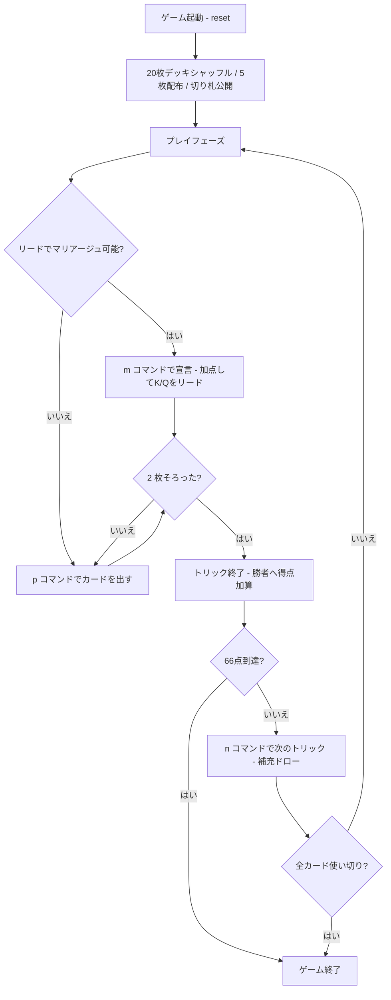

# シュナプセン（CUI版）遊び方

## ゲーム概要

ドイツ・オーストリアで絶大な人気を誇る、2人用の高度なトリックテイキングゲームです。20枚デッキ (A, 10, K, Q, J × 4スート) を使い、山札がある間はマストフォローなしの第1フェーズ、山札が尽きるとマストフォローの第2フェーズに移行します。同スートの K と Q を揃えて「マリアージュ」を宣言するとボーナス点が入り、**先に 66 点に達した側がラウンド勝利**します。

## 起動方法

```sh
go run ./cmd/trumpcards schnapsen          # 日本語で起動
go run ./cmd/trumpcards --lang en schnapsen # 英語で起動
```

## ルール

### 基本ルール

- 20枚のデッキ (A, 10, J, Q, K × 4スート) を使用
- 各プレイヤーに 5 枚ずつ配り、次の 1 枚を表向きで山札の底に置きます (この札の**スートが切り札**)
- **第1フェーズ (山札あり)**: リードスートに従う義務はなし — どのカードでも出せます
- 1 トリックが終わるごとに、勝者が先に 1 枚、敗者が 1 枚を山札から補充
- 山札が尽きると **第2フェーズ** に移行: フォローできるなら同スート、勝てるなら勝つ、無ければ切り札を出す義務が生じます

### カードの強さ (スート内)

A > 10 > K > Q > J

### カードの得点

| カード | 点数 |
|-------|------|
| A (エース) | 11 |
| 10 (テン) | 10 |
| K (キング) | 4 |
| Q (クイーン) | 3 |
| J (ジャック) | 2 |

合計 120点。

### マリアージュ (Marriage)

- 自分のリード番で **同スートの K と Q を両方** 持っていれば `m <idx>` で「マリアージュ」を宣言できます
- 宣言すると **ボーナス点 20 点** (切り札スートなら **40 点 = ロイヤルマリアージュ**) を獲得し、その K か Q をリードします
- 同じスートのマリアージュは 1 ラウンドにつき 1 回のみ

### トリックの勝者

1. **両者が切り札**: 上記スート内強さの大きい方が勝つ
2. **片方だけ切り札**: 切り札の方が勝つ
3. **両者非切り札**: リードスートで返したカード同士で強さ比べ。リードスートを切らないとそもそも勝てない

### ゲーム終了

- カード点 + マリアージュボーナスの合計が **66 点に達した側が即勝利**
- 誰も 66 点に届かないまま全カードを使い切った場合は、**最後のトリックを取った側** の勝ち

## ゲームの流れ



## コマンド一覧

| コマンド | 短縮形 | 説明 |
|----------|--------|------|
| `play <idx>` | `p` | 手札のカードを出す (インデックス指定) |
| `marriage <idx>` | `m` | マリアージュを宣言してその K/Q をリード |
| `next` | `n` | 次のトリックへ進む |
| `hint` | `h` | ヒント表示 |
| `log` | `l` | 棋譜表示 |
| `reset` | `r` | ゲームリセット |
| `quit` | `q` | ゲーム終了 |
| `help` | `?` | ヘルプ表示 |

## 画面の見方

```
=== Schnapsen / Sixty-Six (シュナプセン / 66) ===
トリック: 3  山札: 5枚  (第1フェーズ: フォロー自由)
切り札表示カード: ♠K
得点: あなた=18  CPU=15  (66点で勝利)
あなた: 獲得2トリック 18点 5枚
  [0]♠12  [1]♠13  [2]♣1  [3]♥10  [4]♦11
CPU 1: 獲得1トリック 15点 5枚
マリアージュ宣言可能: m <idx> (候補: 0, 1)
----------
手番: あなた
play <idx>・・・カードを出す / marriage <idx>・・・マリアージュ宣言
```

- 上部: 現在のトリック番号、山札残数、フェーズ、表向きの切り札、両者の得点合計
- プレイヤー行: トリック獲得数、得点、手札枚数。あなたの手札はインデックス付きで全表示
- `マリアージュ宣言可能:` 行: 宣言を開始できるカードのインデックス候補
- `Trick:` 行: 現在進行中のトリックに既に出されたカード
- `手番:` 行: 次に出すプレイヤー (人間 or CPU)

## 遊び方のコツ

- **マリアージュは大きな得点源** — K と Q が揃ったら積極的に宣言しましょう。特に切り札マリアージュ (40点) は一気に勝利を引き寄せます
- 第1フェーズでは相手が高得点 (A=11, 10=10) を出してきたら切り札で取りに行きましょう
- 自分から切り札を出すのは控えめに。切り札マリアージュを狙うなら K・Q を温存します
- **山札が空になる第2フェーズ** はマストフォロー — 相手の残り札を読み切り、確実に 66 点に到達させない立ち回りが重要です
