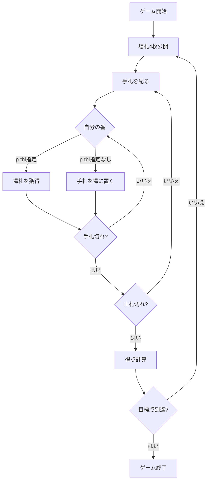

# スコパ（CUI版）遊び方

## ゲーム概要

手札を1枚出して場札を取り合う、イタリア発祥の数合わせゲームです。獲得したカードで得点を競い、先に目標点に到達したプレイヤーの勝ちです。

## 起動方法

```sh
go run ./cmd/trumpcards scopa
```

英語表示で起動する場合は `go run ./cmd/trumpcards --lang en scopa` を実行します。

## ゲームの流れ



## コマンド一覧

| コマンド | 短縮形 | 説明 |
|----------|--------|------|
| `play <hand> [tbl...]` | `p` | 手札を出す（場札を指定すると取る、指定なしで場に置く） |
| `next` | `n` | 次のラウンド |
| `reset` | `r` | ゲームをリセット |
| `log` | `l` | アクションログを表示 |
| `quit` | `q` | ゲームを終了 |
| `help` | `?` | コマンド一覧を表示 |

## 4. 操作の例

```
> p 0 2 3      # 手札0で場札2と3を取る（合計一致）
> p 0 1        # 手札0で場札1を取る（単札一致）
> p 0          # 手札0を場に置く
```

カードの値: A=1、2〜7はそのまま、J=8、Q=9、K=10。同じ値の単札があるときは必ずその単札を取ります。

## 画面の見方

```
Phase: playerTurn / Turn: Player 0
You: hand=3 captured=0 scopas=0 score=0
CPU1: hand=3 captured=0 scopas=0 score=0
Table: 2♠ 5♥ 7♦ K♣
```

## 6. 困ったときは

- **コマンドが効かない**: 形式を確認してください。手札番号と場札番号は0始まりです。
- **ゲームをやり直したい**: `r` または `reset` と入力してください。
