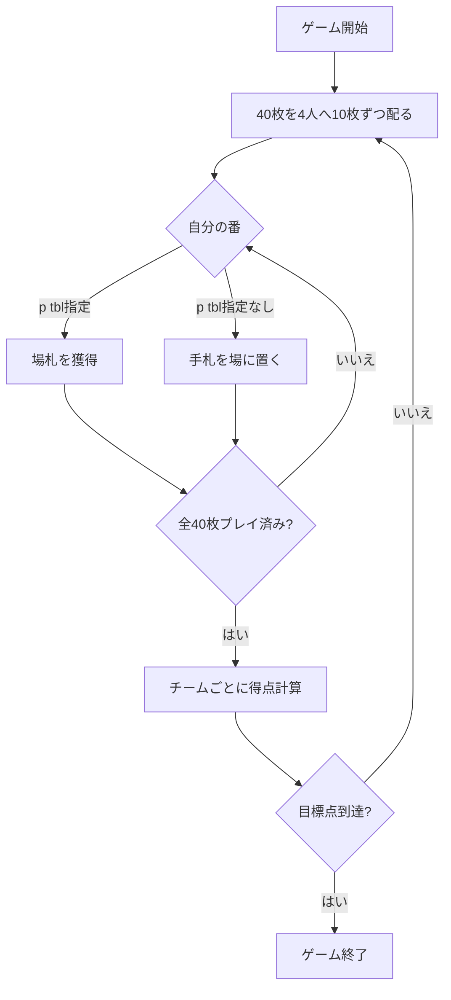

# スコポーネ（CUI版）遊び方

## ゲーム概要

スコパ (Scopa) を4人2チームで行うイタリア発祥の数合わせゲームです。座席0+2 対 座席1+3 の2チームに分かれ、手札を1枚ずつ出して場札を取り合います。獲得したカードでチーム単位の得点を競い、先に目標点に到達したチームの勝ちです。

スコパとの主な違いは次の2点です。

- **4人2チーム制**: 個人戦ではなく、向かい合った2人がチームを組みます。得点はチームごとに集計します。
- **全札を配り切る**: 40枚すべてを各プレイヤーへ10枚ずつ配ります。スコパと違って最初の場札も山札（引き札）もなく、最初の手番からスタートします。

## 起動方法

```sh
go run ./cmd/trumpcards scopone
```

英語表示で起動する場合は `go run ./cmd/trumpcards --lang en scopone` を実行します。

## ゲームの流れ



## コマンド一覧

| コマンド | 短縮形 | 説明 |
|----------|--------|------|
| `play <hand> [tbl...]` | `p` | 手札を1枚出す（場札インデックスを指定すると取る、指定なしで場に置く） |
| `next` / `nextround` | `n` | 次のラウンドへ進む |
| `reset` | `r` | ゲームをリセット |
| `setdifficulty <0-2>` | `sd` | CPU難易度を設定（0=easy / 1=normal / 2=hard） |
| `settarget <n>` | `st` | 目標スコアを設定（既定11） |
| `log` | `l` | アクションログを表示 |
| `quit` | `q` | ゲームを終了 |
| `help` | `?` | コマンド一覧を表示 |

## 4. 操作の例

```
> p 0 2 3      # 手札0で場札2と3を取る（合計一致）
> p 0 1        # 手札0で場札1を取る（単札一致）
> p 0          # 手札0を場に置く（取れる場札がないとき）
```

カードの値: A=1、2〜7はそのまま、J=8、Q=9、K=10。同じ値の単札があるときは必ずその単札を取ります（取れる場札があるのに置くことはできません）。場札をすべて取り切ると「スコパ」で+1点になります（ただし最後の1手は対象外）。

## 画面の見方

```
Phase: playerTurn / Turn: Player 0
P0 (You) team0: hand=10 captured=0 scopas=0
P1 team1: hand=10 captured=0 scopas=0
P2 team0: hand=10 captured=0 scopas=0
P3 team1: hand=10 captured=0 scopas=0
Table: (empty)
Team0: 0  Team1: 0
```

- **Phase**: 現在のフェーズ（`playerTurn` / `roundEnd` / `gameEnd`）。
- **P0〜P3**: 各プレイヤーの所属チーム・手札枚数（hand）・獲得枚数（captured）・スコパ数（scopas）。あなたは P0（team0）です。
- **Table**: 場札。手番ではこのカードを取る対象にします（初手は `(empty)`）。
- **Team0 / Team1**: チームごとの累計得点。

## 遊び方のコツ

- **7とダイヤを意識する**: 最多の7・最多ダイヤ（denari）・7♦（セッテベッロ）はいずれも1点です。特に 7♦ は単独で1点になるため、出させない・取り返す意識が大切です。
- **パートナーと協調する**: 得点はチーム集計です。自分が取れない局面でも、次のパートナーが取りやすい場札を残すと有利になります。
- **スコパを狙う/防ぐ**: 場札を払い切ると1点ですが、自分が払い切った直後は相手が場に置きやすくなります。相手にスコパを与えない配慮も重要です。

## 7. 困ったときは

- **コマンドが効かない**: 形式を確認してください。手札番号と場札番号は0始まりです。
- **場に置けない**: 取れる場札があるときは必ず取る必要があります。`p <hand>` だけでは置けません。
- **ゲームをやり直したい**: `r` または `reset` と入力してください。
