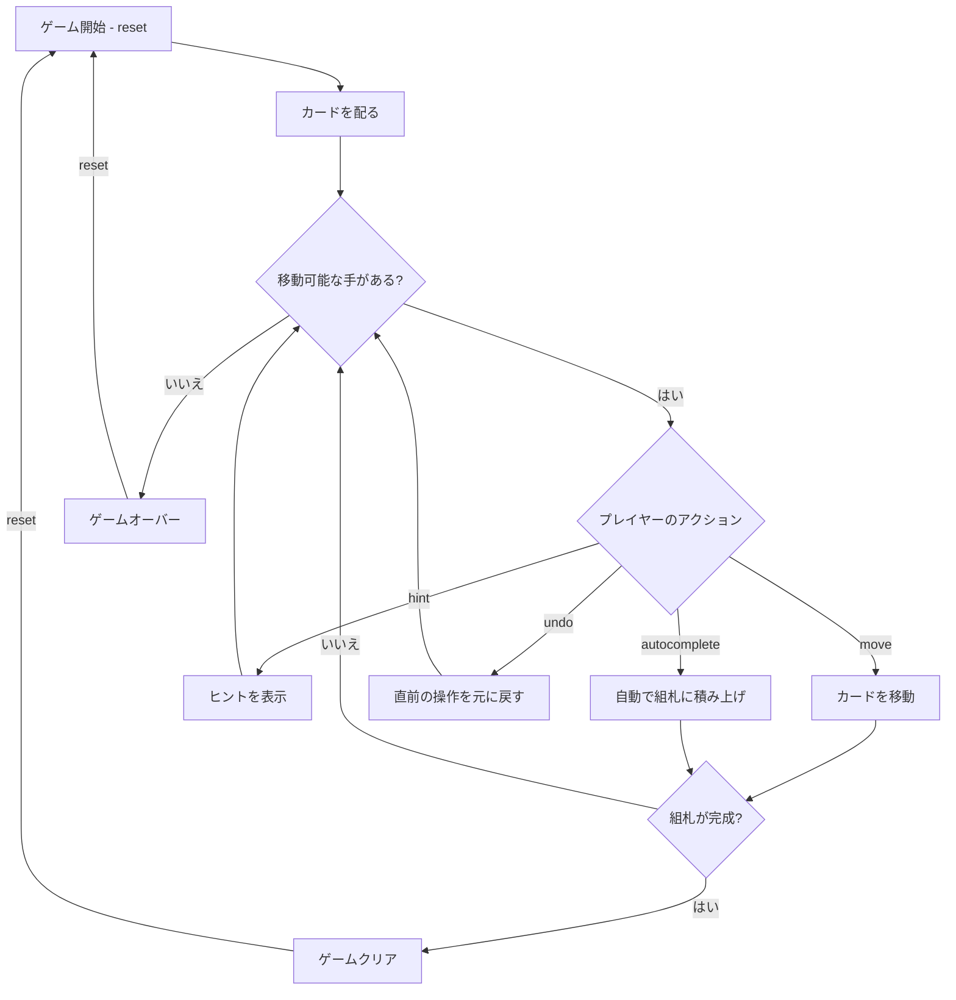

# シーヘイブンタワーズ（CUI版）遊び方

## ゲーム概要

1人用のソリティアカードゲームです。フリーセルと同じ枠組みを持ちつつも、より高難度の派生ルールを採用しています。52枚のカードを使い、10列のタブロー、2つの上部リザーブセル（タワー）、4つの組札で構成されます。すべてのカードが表向きに配られ、組札に A→K までスート別に積み上げればクリアです。

## 起動方法

```sh
go run ./cmd/trumpcards seahaventowers
```

## ルール

### 基本ルール

- 52枚のトランプ（ジョーカーなし）を使用
- 10列のタブローに 5 枚ずつ配る（合計 50 枚）、すべて表向き
- 上部リザーブセル 2 枚: 残りの 2 枚を最初から置いた状態でスタート
- 4つの組札（ファンデーション）はスート別に A→K の順に積み上げる
- タブローでは「**同じスート**で 1 つ小さいランク」のみ重ねられる（例: ♠Q の上に ♠J）
- **空いた列にはキング（K）のみ置くことができる**（フリーセルとは違い任意のカードは不可）

### スーパームーブ

一度に移動できるカード数の上限は:

```
最大移動枚数 = 1 + 空きリザーブセル数
```

空タブロー列を中継してカード数を倍化することはできません（空列はキングのみ受け付けるため）。

### ゲームクリア

- 4 つの組札すべてに A→K まで 13 枚ずつ積み上げるとゲームクリア

### ゲームオーバー

- これ以上移動可能な手がない場合はゲームオーバー

### 手詰まり検出

- 各操作の後、ソルバー（A* + メモ化）がボード全体を解析し、解法が存在しないと判定された場合「手詰まりです」と表示します
- 手詰まり状態では「元に戻す」またはギブアップを選択できます
- ソルバーの探索上限（100,000 状態）を超えた場合は手詰まりとは判定しません

## ゲームの流れ



## コマンド一覧

| コマンド | 短縮形 | 説明 |
|----------|--------|------|
| `reset` | `r` | 新しいゲームを開始 |
| `move` | `m` | カードを移動する（サブ引数で移動元・移動先を指定） |
| `undo` | `u` | 直前の操作を元に戻す |
| `giveup` | `g` | ギブアップしてゲームを終了 |
| `hint` | `h` | 次の一手のヒントを表示 |
| `autocomplete` | `ac` | 自動的に組札へ積み上げ可能なカードを移動 |
| `log` | `l` | アクションログ（棋譜）を表示 |
| `quit` | `q` | ゲーム終了 |
| `help` | `?` | コマンド一覧を表示 |

### 移動コマンドの構文

移動元・移動先にはゾーン名とインデックスを指定します:

- `tableau <列番号>` — タブローの列（0〜9）
- `reserved <セル番号>` — 上部リザーブセル（0〜1）
- `foundation <列番号>` — 組札（0〜3）

### コマンド例

- `m` → 移動コマンド（移動元・移動先の入力を求められる）
- `m t 0 t 1` → タブロー列 0 のトップカードを列 1 へ移動
- `m t 0 c 0` → タブロー列 0 のトップカードをリザーブセル 0 へ移動
- `m c 1 f` → リザーブセル 1 のカードを組札へ移動
- `f 3` → タブロー列 3 のトップカードを組札へ移動（省略形）
- `u` → 直前の操作を元に戻す
- `h` → ヒントを表示
- `ac` → オートコンプリート

## 画面の見方

```
==========
Seahaven Towers (シーヘイブンタワーズ)
==========
Reserved: [♠K] | [♥7]
Foundation: [空] | [空] | [空] | [空]
----------
列0: [0]♠A
列1: [0]♠2
列2: [0]♥A
...
列9: [0]♣K [1]♣Q [2]♣J [3]♣10 [4]♣9
----------
手数: 0
==========
```

- `Reserved: [♠K] | [♥7]`: 上部リザーブセル 2 つの状態
- `Foundation`: 各スートの組札の状態（`[空]` は空）
- `列N`: タブロー列（すべて表向き）
- `手数: N`: 現在の手数

## 遊び方のコツ

- リザーブセルは 2 つしかないため、いつ何を退避するかが勝負を分けます
- 空列にはキングしか置けないので、序盤からキングを意識的に活用しましょう
- A が出たらすぐに組札へ移動するのが安全策です
- 同スート縛りのためタブロー間移動は限定的。組札を進めるのが優先
- ヒントコマンドで詰まった時のアドバイスを得られます
- オートコンプリートは終盤の片付けに便利です
