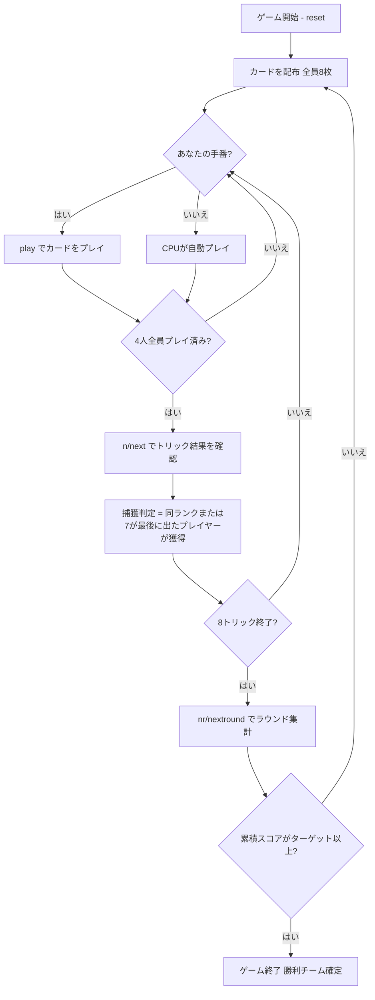

# セドマ（CUI版）遊び方

## ゲーム概要

Sedma（セドマ）はチェコ・スロバキア地方で親しまれているトリックテイキングゲームです。32枚のデッキを4人（2チーム制、席0&2 対 席1&3）でプレイします。**切り札なし**、**マスト・フォロー義務なし**で、リードカードと同じランク、または **7（ワイルド）** でのみトリックを奪えるというシンプルながら奥深い捕獲ルールが特徴です。カード点数（A=10点、10=10点）をラウンドをまたいで累積し、先にターゲット（デフォルト101点）に達したチームが勝ちます。

## 起動方法

```sh
go run ./cmd/trumpcards sedma
go run ./cmd/trumpcards --lang en sedma  # 英語モード
```

## ルール

### デッキと配布

- **デッキ**: 32枚（7,8,9,10,J,Q,K,A × 4スート）
- **プレイヤー**: 4人（プレイヤー0 = あなた、プレイヤー1〜3 = CPU）
- **チーム**: 席0&2（あなたのチーム）対 席1&3
- **配布**: 各プレイヤー8枚
- **切り札**: なし（切り札スートは存在しない）

### 捕獲ルール（Sedmaの核心）

各トリックは4枚のカード（各プレイヤー1枚ずつ）で構成されます。

- カードを出す順番に制約はなく、**任意のカードを出せる**（マスト・フォロー義務なし）
- 出したカードがトリックを**捕獲できる**条件は以下のいずれか:
  1. **リードカードと同じランク**（例: リードが K♠ なら K♥、K♦、K♣ は捕獲可）
  2. **7（ワイルド）**: スートに関わらずトリックを捕獲できる
- トリックリード後、プレイ順で**最後に捕獲したプレイヤー**がトリックを獲得する
  - リード後に誰も捕獲しなかった場合は、リードプレイヤーがトリックを獲得する
- トリック獲得者が次のトリックをリードする

### カード点数

| カード | 点数 |
|--------|------|
| A（エース） | 10点 |
| 10 | 10点 |
| 9, 8, 7, J, Q, K | 0点 |

4スート合計 = **80点**（A×4枚＋10×4枚）

### 最終トリックボーナス

8枚目（最終）トリックの獲得チームに **+10ボーナス点** が加算されます。

### 得点計算と勝利条件

各ラウンド終了時:

- **チームスコア** = そのラウンドで取ったトリックのカード点数の合計（+ 最終トリックボーナス）
- スコアはラウンドをまたいで累積される
- 先にターゲット（デフォルト **101点**）に達したチームがマッチ勝利

## ゲームの流れ



## コマンド一覧

| コマンド | 短縮形 | 説明 |
|----------|--------|------|
| `play <idx>` | — | 手札のidx番目のカードを出す |
| `next` | `n` | 次のトリックへ進む（トリック終了後） |
| `nextround` | `nr` | 次のラウンドへ進む（8トリック終了後） |
| `setdifficulty <0-2>` | `sd <0-2>` | CPU難易度設定（0=Easy, 1=Normal, 2=Hard） |
| `log` | `l` | アクションログを表示 |
| `reset` | `r` | 新しいゲームを開始（設定保持） |
| `quit` | `q` | ゲーム終了 |
| `help` | `?` | コマンド一覧を表示 |

## 画面の見方

```
==========
Sedma (セドマ)
==========
ラウンド: 1  トリック: 1
チームスコア: あなた=0 相手=0
You: 8枚 0トリック [チームA]
[0]A♠ [1]10♠ [2]K♥ [3]J♠ [4]Q♣ [5]9♦ [6]7♣ [7]8♦
CPU 1: 8枚  CPU 2: 8枚  CPU 3: 8枚
----------
フェーズ: PLAY
あなたの手番です。カードを出してください。
play <idx>
```

- **チームスコア行**: 各チームの累積スコア（カード点数の合算）
- **`[n]`付き行**: あなたの手札（インデックス付き）
- **トリック表示**: 現在場に出ているカードと出したプレイヤー
- **フェーズ表示**: 現在のフェーズ（PLAY）
- **捕獲情報**: トリック結果確認時にどのカードが捕獲したかを確認できる

## 遊び方のコツ

- **7（ワイルド）は切り札代わりの切り札**: 7はどのリードに対しても捕獲できます。AやK，10などの高得点トリックが場に出たときに7を温存しておき、プレイ順で最後に出すことで確実に奪えます。
- **最後の捕獲が勝負**: Sedmaは「最後に捕獲したプレイヤー」がトリックを獲得します。パートナーがすでに同ランクを出していても、さらに同ランクや7を後から出せば自分（またはパートナー）のチームが確定的に勝てます。
- **高得点カード（A・10）を狙う**: デッキの点数のすべてはAと10に集中しています。対戦相手がAや10をリードしたときに7または同ランクで奪うのが基本戦略です。
- **プレイ順を活かす**: 後手番（プレイ順が遅い）は選択の幅が広がります。場のカードを見てから出すカードを決められるため、不必要な7を使わずに済む場合があります。
- **7の温存と使いどころ**: 7はデッキに4枚あります（各スート1枚）。全局通して高得点トリックが出る場面で使うよう計画しましょう。
- **パートナーと連携**: 席0&2が同じチームです。パートナーが高得点カードをリードしたら、そこに7や同ランクを出してチームでトリックを確保しましょう。パートナーがすでにトリックを取っている状況なら7を温存するのも有効です。
- **101点目標の長期戦**: セドマは複数ラウンド続く長期戦です。序盤からスコアの累積を意識し、7の使用タイミングを慎重に管理しましょう。
