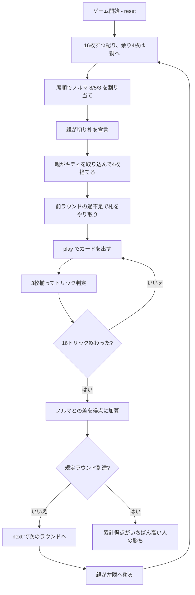

# サージェントメジャー（CUI版）遊び方

## ゲーム概要

イギリス軍隊に由来するとされる**3人専用**のトリックテイキング。**ノルマは席順で決まり、宣言しません**——親が8、左隣が5、右隣が3で、名前の「8-5-3」がそのままこの3つの数です。合計16がトリック数と一致します。52枚を16枚ずつ配り、**余った4枚（キティ）は親が取り込んで4枚捨てます**。

## 起動方法

```sh
go run ./cmd/trumpcards sergeantmajor
go run ./cmd/trumpcards --lang en sergeantmajor  # 英語モード
```

## ルール

### 配りとキティ

**52枚は3人で割り切れません。** 16枚ずつ配ると4枚余り、その4枚が**キティ**です。

1. 全員に**16枚ずつ**配る（48枚）
2. **余った4枚は親が取り込む**（親は20枚になる）
3. 親が**切り札を宣言し、4枚捨てて**16枚に戻す

### ノルマ（席順で固定）

| 席 | ノルマ |
|----|-------|
| **親** | **8トリック** |
| 親の左隣 | **5トリック** |
| さらに左隣 | **3トリック** |

8 + 5 + 3 = 16 で、トリックが余りも不足もしません。**親はラウンドごとに交代し、ノルマも一緒に回ります。**

### 得点と札のやり取り

**ノルマとの差がそのまま得点**です。多く取れば取っただけ得点になり、届かなければマイナスになります。

さらに、**届かなかった人は次のラウンドで良い札を召し上げられます**——不足ぶんだけ最強札を超過した人に渡し、代わりに相手の最弱札を受け取ります。

### 札の強さ

切り札 > リードのスート > その他。同じスートなら A > K > Q > J > 10 > … > 2。**フォロー義務があります**。

### 勝敗

規定ラウンド（既定3、**3の倍数**）を終えた時点で、**累計得点がいちばん高い人の勝ち**です。同点なら引き分け。

## ゲームの流れ



## コマンド一覧

| コマンド | 短縮形 | 説明 |
|----------|--------|------|
| `trump <suit>` | `t` | 切り札スートを宣言する（1:♠ 2:♣ 3:♥ 4:♦、親のみ） |
| `discard <i> <i> <i> <i>` | `d` | キティのぶん4枚を捨てる（親のみ） |
| `play <idx>` | `p` | 手札の `<idx>` 番目のカードを出す |
| `next` | `n` | 次のラウンドを開始する |
| `hint` | `h` | 宣言すべきスート、捨てる札、打つべき札を提示する |
| `giveup` | `g` | 投了する |
| `log` | `l` | 棋譜（アクションログ）を表示する |
| `reset` | `r` | 最初からやり直す |
| `quit` | `q` | 終了する |
| `help` | `?` | コマンド一覧を表示 |

**ノルマを宣言するコマンドはありません。** 8・5・3 は席順で決まります。

## 画面の見方

```
==========
Sergeant Major (サージェントメジャー 8-5-3)
==========
ラウンド: 2/3  トリック: 5/16
ノルマは席順で決まります。親が8、左隣が5、右隣が3——合計16がトリック数と一致し、宣言する余地はありません。多く取ればノルマとの差がそのまま得点になり、届かなかったぶんは次のラウンドで良い札を召し上げられます。
切り札: ハート（CPU1 が宣言）
前ラウンドの過不足で 2 枚を移しました。
 あなた: ノルマ5 獲得3 累計1 手札11枚
  [0]♠2 [1]♠7 [2]♠K [3]♣4 [4]♥A [5]♥K [6]♦10 [7]♦3 [8]♣9 [9]♣A [10]♥2
>CPU1[親/ノルマ8]: ノルマ8 獲得5 累計-1 手札11枚
 CPU2: ノルマ3 獲得0 累計0 手札11枚
----------
手番: CPU1
play <idx>・・・カードを出す
```

- **ノルマ行**: 自分に割り当てられた数と、いま取った数。**あと何トリック要るか**がここで読めます
- **`[親/ノルマ8]`**: 切り札を決め、ノルマ8を負う席
- **累計**: ノルマとの差の合計。**勝敗はこれで決まります**
- **やり取り行**: 前ラウンドの過不足で動いた枚数。**盤面には痕跡が残らない**ので明示します
- **`[n]`**: `play <n>` で指定する手札の番号

## 遊び方のコツ

- **親のノルマ8は重い。** そのかわりキティで4枚入れ替えられるので、切り札を厚くできます
- **ノルマ3の席が狙い目。** 3つ取れば達成、それ以上はまるごと得点になります
- **届いたあとも取りにいく。** このゲームは多く取れば取っただけ得点なので、降りる理由がありません
- **不足すると次が苦しい。** 良い札を召し上げられるので、届かないラウンドを続けると立て直せなくなります
- **捨て札は切り札にならない弱い札から。** 短いスートを切ってしまうと、そのスートで切り札を使えます
- **相手のノルマを見る。** ノルマ8の親を8未満に抑えれば、こちらは楽に達成できます
