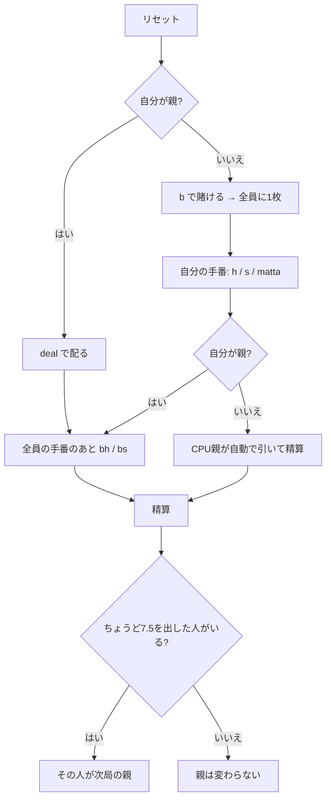

# セッテ・エ・メッツォ（CUI版）遊び方

## ゲーム概要

**7 と 1/2** を目指すイタリアのバンキングゲーム。**40 枚**（8・9・10 を抜いた構成）で遊び、人間 1 人 + CPU 2 人の 3 席のうち 1 席が親（バンカー）を務めます。

ブラックジャックとの一番の違いは**絵札が 0.5 点**であることです。「もう 1 枚引けば必ず大きく動く」ことがないので、半端点をどう埋めるかがそのまま駆け引きになります。

## 起動方法

```sh
go run ./cmd/trumpcards settemezzo
go run ./cmd/trumpcards --lang en settemezzo   # 英語
```

## ルール

### 点数

| 札 | 点数 |
|---|---|
| A | 1 点 |
| 2〜7 | 数どおり |
| 絵札（J・Q・K） | **0.5 点** |
| **コインの K（マッタ）** | **0.5 点、または 1〜7 点のどれでも**（ワイルド） |

**マッタは「コインの K」だけ**です。他の 3 枚の K はただの 0.5 点札です。フレンチスートではダイヤの K がこれにあたります。

**マッタの値は引いた瞬間に決まりません。** 手を止めるまで何度でも付け替えられます。これがマッタを持つ意味です。

### 進行

1. 親以外が賭け、全員に **1 枚ずつ**配られる
2. 各プレイヤーが順に引く（`h`）か止める（`s`）かを選ぶ
3. **合計が 7.5 を超えたらバースト**
4. 全員の手番が終わったら、親も同じように引く／止める
5. **同点は親の勝ち**。親より高ければ賭け金と同額を得る

### 親の交代

**ちょうど 7.5 を出したプレイヤーが次の局の親になります。** 毎局まわるのではありません。7.5 に届いた時点でその手番は終わりますが、**親も 7.5 なら同点で親の勝ち**なので、7.5 は「負けない手」ではありません。

> 補足: issue #4388 の仕様案とは 2 点異なるが、いずれも実際の規則（pagat.com）に合わせた。
> (1) 親は「次のディールで交代」ではなく、**ちょうど 7.5 を出した者だけ**が取る。
> (2) 7.5 は「即座に勝利」ではない。手番は終わって公開されるが、**親も 7.5 なら同点で親の勝ち**。

## ゲームの流れ



## コマンド一覧

| コマンド | 説明 |
|---------|------|
| `b <額>` | ベットして配る（親のときは使えない） |
| `deal` | 自分が親の局を配る |
| `h`, `hit` | 1 枚引く |
| `s`, `stand` | 引き止める |
| `matta <値>` | マッタの値を決める（`0.5` または `1`〜`7`） |
| `bh` | 親として 1 枚引く |
| `bs` | 親として引き止めて精算する |
| `l` | 棋譜（アクションログ）を表示する |
| `r`, `reset` | 次の局を始める |
| `q`, `quit` | 終了する |

## 画面の見方

```
----------
チップ: 900
親: CPU1
親: [伏]
----------
> あなた 賭け100 SPADE 4 DIAMOND 13 (合計7) [マッタ=3]
  CPU2 賭け20 [伏]
----------
打てる手: h=引く / s=止める / matta=マッタの値
```

- 親と CPU の手は局が終わるまで `[伏]` で伏せられる（**サーバーが中身を返さない**ため、API を直接叩いても読めない）
- マッタを持っていると `[マッタ=3]` のように**いま何点として数えているか**が併記される
- 「打てる手」には**今その手で合法な宣言だけ**が並ぶ

## 遊び方のコツ

- **絵札は 0.5 点なので、7 点から引いてもバーストしない。** 7 点で止まるか、絵札を狙って 7.5 にいくかが最初の判断
- **マッタは最後まで付け替えられる。** 引くたびに最適値が変わるので、止める直前に見直す
- **7.5 を出せば次の局の親になる。** 配当だけでなく立場が変わるので、際どい場面で狙う価値がある
- **同点は親の勝ち。** 親と同じ点で止まっても負ける
