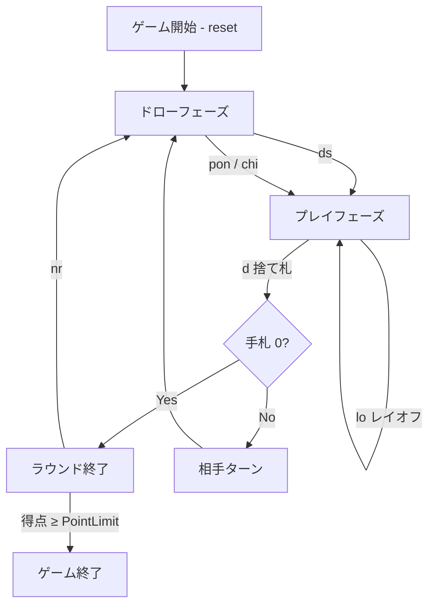

# セブンブリッジ（CUI版）遊び方

## ゲーム概要

セブンブリッジは日本で広く遊ばれているラミー系ゲームです。2 人用（人間 1 / CPU 1）で、7 を場のピボットとしてメルドを作り、先に 100 点に到達したプレイヤーが勝利します。麻雀のように、相手の捨て札を「ポン」「チー」で取得できます。

## 起動方法

```sh
go run ./cmd/trumpcards sevenbridge
go run ./cmd/trumpcards --lang en sevenbridge  # 英語モード
```

## ルール

### 基本ルール

- 2 人用（人間 1 / CPU 1）、52 枚のトランプを 1 組使用
- 各プレイヤーに 7 枚配布。山札の最初の 7 を捨て札に置く
- 手番: ドローフェーズ → プレイフェーズ → 次プレイヤーへ
- ドローフェーズでは、山札から 1 枚引くか、相手の直前の捨て札を「ポン」または「チー」で取得できる
  - ポン: 手札 2 枚が捨て札と同ランクのとき（セット 3 枚でメルド）
  - チー: 手札 2 枚が同じスートで、捨て札と連続するとき（ラン 3 枚でメルド）
- プレイフェーズでは、メルド（3 枚以上のセット／ラン）を場に出す、既存メルドにカードを追加する（レイオフ）、カードを捨てる、のいずれかを行う
- 捨て札制約: 7 は常に合法。そうでない場合は、捨て札トップと同ランク、もしくはランクが ±1 のカードのみ捨てられる

### 得点

- ラウンド終了は、いずれかのプレイヤーの手札が 0 になったとき
- 勝者の得点 = 敗者の手札の合計ペナルティ
  - A = 1, 2–6 = 数字通り, 8–9 = 数字通り, 10 / J / Q / K = 10, 7 = 50（特別ペナルティ）
- 累計得点が `PointLimit`（既定 100）に到達したら勝利

### CPU 難易度

| 難易度 | 振る舞い |
|--------|---------|
| Easy | 半々でポン／チーを見送る。メルドとディスカードはランダム寄り。 |
| Normal | 多くの場面でポン／チーを狙う。7 を捨てることもある。 |
| Hard | 常にポン／チーを狙い、7 を温存する。 |

## ゲームの流れ



## コマンド一覧

| コマンド | 短縮形 | 説明 |
|----------|--------|------|
| `reset` | `r` | 新しいゲームを開始 |
| `quit` | `q` | ゲーム終了 |
| `drawstock` | `ds` | 山札から 1 枚引く |
| `pon <i,j>` |  | 手札の i, j 番のカードで捨て札をポン |
| `chi <i,j>` |  | 手札の i, j 番のカードで捨て札をチー |
| `meld <i,j,k[,...]>` | `m` | 手札からメルド（3 枚以上）を場に出す |
| `layoff <pIdx> <mIdx> <cIdx>` | `lo` | 対象プレイヤーのメルドにカードを 1 枚追加する |
| `discard <i>` | `d` | 手札の i 番のカードを捨てる |
| `nextround` | `nr` | 次のラウンドへ進む |
| `setdifficulty <0-2>` | `sd` | CPU 難易度を Easy / Normal / Hard に変更 |
| `setlimit <n>` | `sl` | 目標得点を変更 |
| `log` | `l` | 直近の棋譜を出力 |

## 画面の見方

```
==========
Seven Bridge (セブンブリッジ)
==========
ラウンド: 1  山札: 37枚
捨て札: HEART 7
あなた: 累積0点 ラウンド0点 6枚
[0]SPADE 3 [1]SPADE 4 [2]SPADE 5 [3]HEART 9 [4]CLOVER 10 [5]DIAMOND 13
CPU 1: 累積0点 ラウンド0点 7枚
----------
手番: あなた (ドローフェーズ)
ds・・・山札から引く
pon <idx,idx>・・・ポンで捨て札を取得
chi <idx,idx>・・・チーで捨て札を取得
```

- **山札 / 捨て札**: 現在の枚数と捨て札トップ
- **あなた**: 自分の手札とインデックス、累計スコアとラウンドスコア
- **CPU**: 手番中は手札を非表示、ラウンド終了以降は公開
- **手番**: 現在の手番プレイヤーと期待される操作

## 遊び方のコツ

- 7 は常に捨てられるワイルドカードのような存在。終盤まで温存しておくと詰みを回避しやすい
- セットが揃いそうなら早めに場に出す（ラウンド終了時のペナルティ削減）
- 相手の捨て札でランが作れるとき、チーは有効な攻めの手段
- Hard CPU 相手では、相手が欲しそうな 7 を安易に捨てないよう注意
