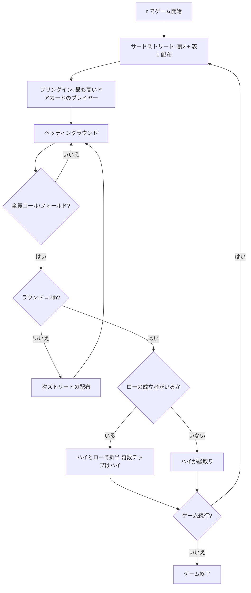

# セブンカードスタッド・ハイロー（CUI版）遊び方

## ゲーム概要

セブンカードスタッド・ハイロー（8 or Better）は、セブンカード・スタッドのポット分割版です。**ハイ**の最強役とローの最強役でポットを折半します。

ローは **8 以下のランク 5 枚（重複なし）** が揃ったときだけ成立します（ストレートとフラッシュは無視、エースは常にロー）。最強のローは A-2-3-4-5（ホイール）です。

**ローが誰にも成立しなければ、ポットはハイの総取り**です。ここが 8 or Better の肝で、ローを狙って空振りすると半分どころか何も残りません。ハイとローの 5 枚は**同じ 7 枚から別々に選べます**。A-2-3-4-5 のスペードならストレートフラッシュとローを同時に取れます（スクープ）。

## 起動方法

```sh
go run ./cmd/trumpcards sevencardstudhilo
go run ./cmd/trumpcards --lang en sevencardstudhilo  # 英語モード
```

## ルール

### 基本ルール

- 52枚のトランプを使用
- コミュニティカードなし — 各プレイヤーに個別にカードが配られる
- 合計7枚（裏向き3枚 + 表向き4枚）から、**ハイの最強5枚**と**ローの最強5枚**を別々に選ぶ
- **ローの成立条件**: 5枚すべてが8以下、かつランクの重複なし
- ローの比較ではストレートとフラッシュは無視し、エースは常にロー（1）
- 最強のローハンド: A-2-3-4-5（ホイール）
- **ローの成立者がいなければハイがポットを総取り**
- ポットを折半するとき、**奇数チップはハイ側**に付く（ポーカー慣例）
- ブリングインは最も低いドアカードのプレイヤーが支払う（通常のスタッドと同じ）

### ゲームの進行

1. **アンティ**: 全プレイヤーがアンティを支払う
2. **サードストリート**: 裏向き2枚 + 表向き1枚配布。最も高いドアカードのプレイヤーがブリングインを投入
3. **フォースストリート**: 表向き1枚追加。最弱の表向きハンドから開始
4. **フィフスストリート**: 表向き1枚追加。最弱の表向きハンドから開始
5. **シックスストリート**: 表向き1枚追加。最弱の表向きハンドから開始
6. **セブンスストリート**: 裏向き1枚追加。最後のベッティングラウンド
7. **ショーダウン**: ハイの最強者とロー（8 or Better）の最強者でポットを折半。ロー不成立ならハイの総取り

### ベッティングアクション

| アクション | 説明 |
|-----------|------|
| フォールド | 手札を捨ててラウンドから降りる |
| チェック | ベットせずにパスする（未ベット時のみ） |
| コール | 現在のベット額に合わせる |
| ベット | 新たにベットする（未ベット時のみ） |
| レイズ | 現在のベット額を上げる |
| オールイン | 全チップを賭ける |

## ゲームの流れ



## コマンド一覧

| コマンド | 短縮形 | 説明 |
|----------|--------|------|
| `reset` | `r` | 新しいゲームを開始 |
| `fold` | `f` | フォールド（降りる） |
| `check` | `ck` | チェック（パス） |
| `call` | `c` | コール（ベット額に合わせる） |
| `bet <額>` | `b <額>` | ベットする |
| `raise <額>` | `ra <額>` | レイズする |
| `allin` | `a` | オールイン |
| `rebuy` | `rb` | リバイ（チップを再購入） |
| `skiprebuy` | `sr` | リバイをスキップ |
| `addon` | `ad` | アドオン（チップを追加購入） |
| `skipaddon` | `sa` | アドオンをスキップ |
| `muck` | `m` | マック（手札を伏せる） |
| `show` | `sh` | ショー（手札を公開する） |
| `log` | `l` | アクションログを表示 |
| `quit` | `q` | ゲーム終了 |
| `help` | `?` | コマンド一覧を表示 |

## 画面の見方

```
=== Seven Card Stud Hi-Lo ===
Pot: 150 | Ante: 10 | Bring-in: 20
----------
[You]     chips=1000  bet=20   hole: A♣ 2♦ | door: 4♠
[CPU 1]   chips=980   bet=20   door: 9♥
[CPU 2]   chips=1020  bet=20   door: K♠ (bring-in)
[CPU 3]   chips=970   bet=20   door: 3♦
----------
Your turn (3rd street): call / raise / fold
```

- `hole:` は自分だけに見える裏向きカードです。
- `door:` は全員に公開されている表向きカードです。
- ショーダウンでは、ハイの役名に加えて**ローが成立した人とその5枚**が表示されます。ポットが折半された理由がそこで分かります。

## 遊び方のコツ

- **スクープ（ハイとローの両取り）が最大の利益**です。A-2-3-4-5 のような手はストレートにもローにもなります
- サードストリートで3枚ともローカード（8以下）なら、ローの目とスクープの目が同時に立ちます
- **ローを狙うときは「8 以下が5種類」揃うかを数えましょう。**4種類で止まるとローは不成立で、賭けた分がそのままハイ側へ行きます
- ハイ一本で行くなら、相手のドアカードに 8 以下が並んでいないかを見ます。ローが不成立の卓ではハイが総取りです
- ペアはローを殺します。低い札でもペアになった時点でその2枚のうち1枚は数えられません
