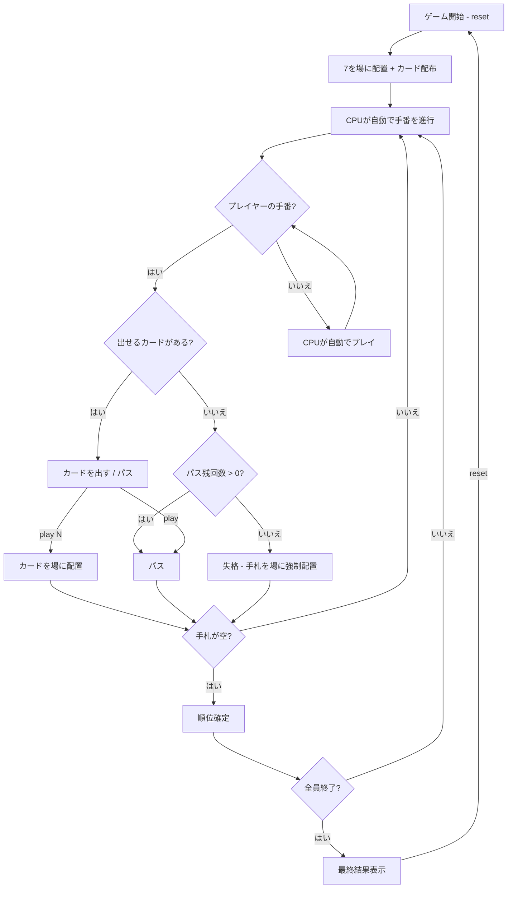

# 7並べ（CUI版）遊び方

## ゲーム概要

4人（プレイヤー1人 + CPU 3人）で遊ぶカードゲームです。場の7を起点に、隣接する数字のカードを順番に並べていきます。手札を最初になくしたプレイヤーが1位です。

## 起動方法

```sh
go run ./cmd/cli sevens
```

## ルール

### 基本ルール

- 52枚のトランプを使用（オプションでジョーカー0〜2枚追加）
- 各スートの7が最初に場に置かれ、プレイヤーの手札から除去される
- 場に出ているカードの隣接値（±1）のカードのみ出せる
- カードが出せない場合はパス（デフォルト最大5回、`passes=N` で変更可能、0で無制限）
- パスを使い切り、出せるカードもない場合は失格（残りの手札が場に強制配置される）
- 最初に手札をなくしたプレイヤーが1位

### オプションルール

| オプション | 説明 |
|------------|------|
| トンネル | AとKが循環して繋がる（A↔K） |
| ジョーカー | ジョーカーを場の任意の有効位置に配置できる（0〜2枚） |
| CPU戦略 | CPUが戦略的にカードを選択する（自分に有利な手を評価、相手のパス残数を考慮） |
| パス回数 | 最大パス回数を変更（デフォルト5回、0で無制限） |
| ジョーカー上がり禁止 | 最後のカードがジョーカーの場合、出せない（パスまたは失格） |

## ゲームの流れ



## コマンド一覧

| コマンド | 短縮形 | 説明 |
|----------|--------|------|
| `reset` | `r` | デフォルト設定で新しいゲームを開始 |
| `reset tunnel joker=N strategy passes=N nojokerfinish` | `r tunnel joker=N strategy passes=N nojokerfinish` | オプション指定で開始（例: `r tunnel joker=1 strategy passes=0 nojokerfinish`） |
| `play N` | `p N` | インデックスNのカードを場に出す（例: `p 3`） |
| `play` | `p` | パス（パス回数を1消費） |
| `j cardIdx suitInt valueInt` | - | ジョーカーを配置（例: `j 0 1 6`） |
| `quit` | `q` | ゲーム終了 |

### ジョーカーコマンドの詳細

`j cardIdx suitInt valueInt` の各引数:

| 引数 | 説明 |
|------|------|
| `cardIdx` | 手札のジョーカーのインデックス |
| `suitInt` | 配置先のスート（1=SPADE, 2=CLOVER, 3=HEART, 4=DIAMOND） |
| `valueInt` | 配置先の数字（1〜13） |

例: `j 0 1 6` → 手札のインデックス0のジョーカーをSPADE 6の位置に配置

## 画面の見方

```
==========
Sevens (7並べ)
ルール: [トンネル] [ジョーカー×1] [CPU戦略] [ジョーカー上がり禁止]
==========
[You]: 12枚 (パス: 0/5)
[0]SPADE 2  [1]SPADE 3  [2]HEART 10  ...
CPU 1: 12枚 (パス: 1/5)
CPU 2: 13枚 (パス: 0/5)
CPU 3: 上がり (ランク: 1位)
----------
ボード:
  SPADE: 5〜9
  CLOVER: 7〜7
  HEART: 7〜10
  DIAMOND: 4〜7
----------
```

- `[You]: N枚 (パス: M/5)`: プレイヤーの手札枚数とパス使用回数（無制限の場合は `パス: M/∞`）
- `CPU N: M枚 (パス: X/5)`: CPUの手札枚数とパス使用回数
- `上がり (ランク: N位)`: 順位確定済みプレイヤー
- `失格`: パスを使い切ったプレイヤー
- `(出せるカードなし)`: 出せるカードがない強制パスの場合に表示
- `ボード`: 各スートの配置状況（最小値〜最大値）
- `[0]`, `[1]`...: カードのインデックス（`play` で指定）

## 遊び方のコツ

- パスはデフォルト5回まで（設定で変更可能）なので、計画的に使いましょう
- 相手が出せないカードを温存して、相手のパスを消費させる戦略も有効です
- トンネルルールを有効にすると、AとKが循環するため戦略の幅が広がります
