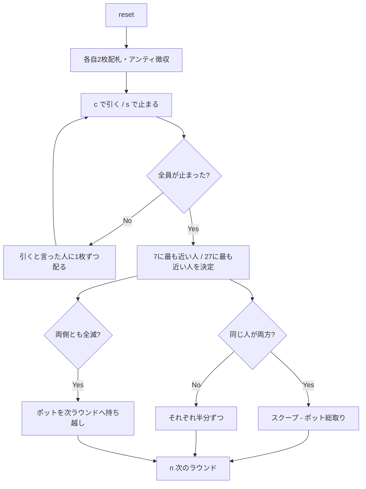

# セブン・トゥエンティセブン（CUI版）遊び方

## ゲーム概要

セブン・トゥエンティセブンはアメリカの「dealer's choice」ホームゲームの定番です。**ポットは2つに割れます** —— **7 に最も近い（超えていない）手**と **27 に最も近い（超えていない）手**が半分ずつ取り、**同じ人が両方を制したら総取り（スクープ）** です。

**カードの点数がこのゲームの肝です。**

- **絵札（J・Q・K）= 0.5点**
- **エース = 1点 または 11点**（1枚ごとに好きなほうを選べます）
- それ以外は数字どおり

全員がアンティを払って2枚ずつ配られ、そこから「もう1枚引く」か「止まる」かを繰り返します。**止まったらそのラウンドはもう配られません。** 全員が止まった時点で勝負です。

**超えた側だけが失格になります。** 19点の手は7側では死んでいますが、27側ではまだ十分に生きています。両側とも超えた人ばかりになったら、ポットは次のラウンドへ持ち越されます。

## 起動方法

```sh
go run ./cmd/trumpcards seventwentyseven
go run ./cmd/trumpcards --lang en seventwentyseven  # 英語モード
```

## ルール

### 基本ルール

1. 全員がアンティを支払い、標準52枚デッキから各自2枚の手札が配られます。
2. 各巡、「カードを引く」か「止まる」かを選びます。CPU も同時に選びます。
3. **止まると、そのラウンドはもうカードが配られません。** 引くと宣言した人にだけ1枚ずつ配られます。
4. 全員が止まった時点でショーダウン。
5. **7 に最も近い（超えていない）人**と **27 に最も近い（超えていない）人**がポットを半分ずつ取ります。
6. **同じ人が両方を制したら総取り（スクープ）** です。
7. 片側に生存者がいなければ、もう片方が総取りします。
8. **両側とも生存者がいなければ**、ポットは丸ごと次のラウンドへ持ち越されます。
9. 同点は分け合います。

### カードの点数

| カード | 点数 |
|--------|------|
| A | **1 または 11**（1枚ごとに選択） |
| 2〜10 | 数字どおり |
| J・Q・K | **0.5** |

A-A-5 は **7 ちょうど**にも **27 ちょうど**にもできます。両取りを狙える、このゲームでいちばん美味しい形です。

### 停止条件

規定ラウンド数を消化するか、アンティを払えるプレイヤーが2人未満になるとゲーム終了。最終的にチップが最も多いプレイヤーが勝者です。

## ゲームの流れ



## コマンド一覧

| コマンド | 短縮形 | 説明 |
|----------|--------|------|
| `card` | `c` | カードを1枚引く |
| `stand` | `s` | 止まる（このラウンドはもう配られません） |
| `nextround` | `n` / `nr` | 次のラウンドへ |
| `setplayers <n>` | `sp <n>` | プレイヤー数を設定（2-7） |
| `setante <n>` | `sa <n>` | アンティ額を設定 |
| `setchips <n>` | `sc <n>` | 初期チップを設定 |
| `setrounds <n>` | `st <n>` | 実施ラウンド数を設定 |
| `hint` | `h` | ヒントを表示 |
| `log` | `l` | 棋譜を表示 |
| `reset` | `r` | ゲームをリセット（設定は保持） |
| `quit` | `q` | ゲーム終了 |
| `help` | `?` | コマンド一覧を表示 |

## 画面の見方

```
==========
セブン・トゥエンティセブン（7と27の二方向）
==========
ラウンド: 1  ポット: 40  アンティ: 10
あなた  チップ 190  賭け 10  [まだ引く]
[0]DIAMOND 7  [1]HEART 4  (- / 11)
CPU 1  チップ 190  賭け 10  [まだ引く]
CPU 2  チップ 190  賭け 10  [止まった]
CPU 3  チップ 190  賭け 10  [止まった]
----------
目標は2つ: 7 と 27。**超えたらその側は失格**、超えずに近いほうが勝ち。絵札=0.5点、A=1点または11点。
あなたの得点  7側 / 27側 = - / 11
c で1枚引く / s で止まる
help でコマンド一覧
==========
```

- `ラウンド / ポット / アンティ` — 現在のラウンド番号、積まれているポット、参加費
- `[まだ引く] / [止まった] / [脱落]` — 各プレイヤーの状態。**止まった人にはもう配られません**
- `(- / 11)` — **7側 / 27側の得点**。`-` はその側が超過して失格という意味です
  - 上の例は 7 + 4 = 11点。7 側は超えていて、27 側だけが生きています
- `目標は2つ:` の行 — カードの点数と勝ち方。**毎回出ます**
- `あなたの得点` — 自分の両側の得点（手札行と同じ値を、探さなくていいように再掲）

## 遊び方のコツ

- **絵札は0.5点。** K・Q・J ばかりの手は 7 側に非常に強く、しかも1枚引いても壊れにくい優秀な形です。
- **エースは両にらみ。** A-A-5 は 7 ちょうどにも 27 ちょうどにもできます。両取り（スクープ）を狙える最高の形です。
- **7 側は1枚で壊れます。** 6.5点まで来たら、引くのは絵札を期待するときだけ。止まる判断が効きます。
- **27 側は逆に引き続けます。** 20点あたりからが勝負どころ。ただし10を引けば一発で超えます。
- **片側が超えても諦めない。** 19点の手は 7 側では死んでいますが、27 側では十分に戦えます。表示の `-` はその側だけの話です。
- **全員が両側とも超えたらポットは持ち越し。** 膨らんだポットは、次のラウンドで手堅く 7 側を取るだけでも大きな利益になります。
