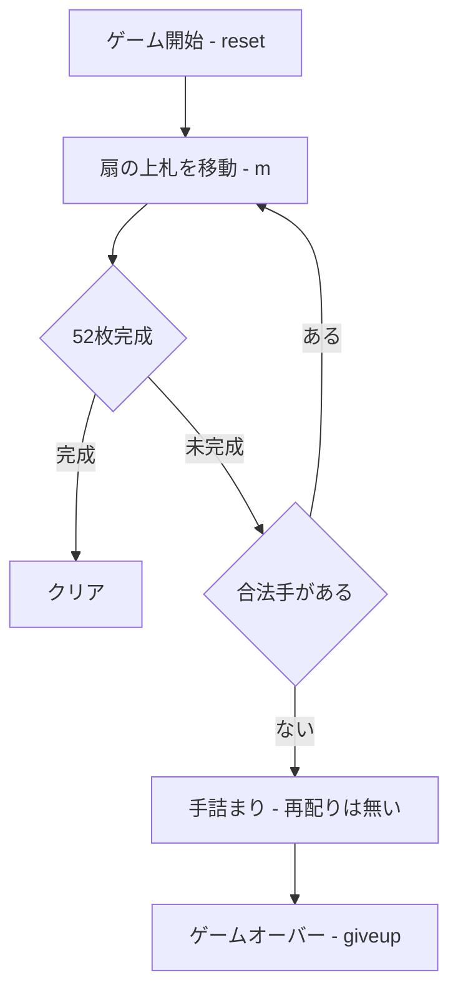

# シャムロックス（CUI版）遊び方

## ゲーム概要

シャムロックス（Shamrocks）は、標準52枚デッキを **17 の 3 枚扇（fan）と 1 枚の孤立カード＝計 18 扇** に配る **ファン・ソリティア** です。各扇の **最上位カードだけ** を操作し、4 つの **ファウンデーション** に A から K まで積み上げます。同じファン系統のラ・ベル・リュシーとは 2 点が決定的に違います。**扇の上では「スート不問・ランク 1 つ違い」でどちらの向きにも重ねられる**代わりに、**1 つの扇は 3 枚までしか持てず、再配り（リディール）は一度もできません**。

## 起動方法

```sh
go run ./cmd/trumpcards shamrocks
go run ./cmd/trumpcards --lang en shamrocks  # 英語モード
```

## ルール

1. **扇**: 各扇の最上位カードのみ操作可能。**スートは問わず**、移動先の扇の最上位カードと **ランクが 1 つ違い**（1 つ上でも 1 つ下でもよい）なら重ねられます。
2. **扇の上限**: 1 つの扇は **3 枚まで**。すでに 3 枚ある扇へは重ねられません。
3. **空の扇**: 札を出し切って空になった扇には、**どのカードでも 1 枚置けます**。
4. **ファウンデーション**: A を最上位に出したらファウンデーションへ移し、以降は同スート昇順（A→K）で積み上げます。
5. **再配りはありません**: 合法手が尽きたらそれが詰みです。`giveup` で投了してください。
6. **勝敗**: 52 枚すべてファウンデーションに揃えればクリア、動かせる手が無くなれば失敗です。

## ゲームの流れ



## コマンド一覧

| コマンド | 短縮形 | 説明 |
|----------|--------|------|
| `m <from> <to>` | | 扇 from の上札を扇 to へ |
| `m <from> f` | | 扇 from の上札をファウンデーションへ |
| `autocomplete` | `ac` | 出せる札を自動で出し切る |
| `undo` | `u` | 直近の手を取り消す |
| `giveup` | `g` | 投了する |
| `hint` | `h` | ヒントを表示 |
| `log` | `l` | 棋譜を表示 |
| `reset` | `r` | 新しいゲームを開始 |
| `quit` | `q` | ゲーム終了 |
| `help` | `?` | コマンド一覧を表示 |

## 画面の見方

```
==========
シャムロックス (Shamrocks)
==========
ファウンデーション0: [空]
...
扇0: ♠K ♥4 ♣7
扇1: ♦2 ♠9 ...
手数: 0 （戻せる手はありません）
==========
```

- `ファウンデーション0〜3` … 各組札の状態
- `扇0〜17` … 各扇のカード（右端が最上位・最大 3 枚）
- `手数` … これまでに指した手の数と、`undo` で戻せるかどうか
- 合法手が 1 つも無くなると「これ以上動かせる手がありません」と表示されます

## 遊び方のコツ

- A・2 を早めに掘り出してファウンデーションを伸ばしましょう。
- **3 枚の上限が効く**ので、深い扇へ積むより浅い扇を使うほうが手が続きます。
- 配り直せないぶん、**扇を 1 つ空にできると価値が高い**です。空の扇はどのカードでも受けられる自由枠になります。
- スートを無視してランク ±1 で繋げられるので、同スートに縛られるラ・ベル・リュシーの感覚のまま探すと合法手を見落とします。
