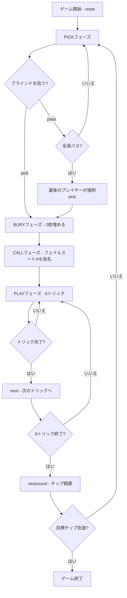

# シープスヘッド（CUI版）遊び方

## ゲーム概要

Sheepshead（シープスヘッド）はアメリカ・ウィスコンシン州で生まれたドイツ系トリックテイキングゲームです。32枚デッキ（A,7,8,9,10,J,Q,K × 4スート）を5人（1人の人間 + 4人のCPU）でプレイし、各プレイヤーに6枚を配り残り2枚がブラインドになります。切り札が14枚と豊富で、ピッカーがパートナーを秘密裏に指名するチップ賭け形式です。

## 起動方法

```sh
go run ./cmd/trumpcards sheepshead
go run ./cmd/trumpcards --lang en sheepshead  # 英語モード
```

## ルール

### デッキと配布

- **デッキ**: 32枚（A,7,8,9,10,J,Q,K × ♠♣♥♦）
- **プレイヤー**: 5人（プレイヤー0 = あなた、プレイヤー1〜4 = CPU）
- **配布**: 各プレイヤー6枚 + ブラインド2枚

### 固定切り札（14枚）

強い順:

| 順位 | カード |
|------|--------|
| 1 | Q♣ |
| 2 | Q♠ |
| 3 | Q♥ |
| 4 | Q♦ |
| 5 | J♣ |
| 6 | J♠ |
| 7 | J♥ |
| 8 | J♦ |
| 9 | A♦ |
| 10 | 10♦ |
| 11 | K♦ |
| 12 | 9♦ |
| 13 | 8♦ |
| 14 | 7♦ |

※ Q・Jはスートに関わらずすべて切り札。♦のQ・J以外は切り札の下位に入ります。

### フェイルスート（♣♠♥）

フェイルスートはQ・Jを除く6枚（A,10,K,9,8,7）で構成されます。同スート内の強さ: **A > 10 > K > 9 > 8 > 7**

### カード点数

| カード | 点数 |
|--------|------|
| A | 11点 |
| 10 | 10点 |
| K | 4点 |
| Q | 3点 |
| J | 2点 |
| 9・8・7 | 0点 |

全カードの合計は **120点**。ピッカーチームは **61点以上** で勝利します。

### シュナイダー・シュバルツ

| 条件 | 効果 |
|------|------|
| 負けた側が30点以下（シュナイダー） | チップ賭け金 × 2 |
| 負けた側がトリックを1枚も取れない（シュバルツ） | チップ賭け金 × 3 |

### チップ精算

各ラウンド終了時にチップをゼロサムで精算します。いずれかのプレイヤーが目標チップ数に達した時点でゲーム終了です。

## ゲームの流れ



## コマンド一覧

| コマンド | 短縮形 | 説明 |
|----------|--------|------|
| `pick` | `p` | ブラインドを拾ってピッカーになる（PICKフェーズ） |
| `pass` | — | ブラインドをパスする（PICKフェーズ） |
| `bury <i> <j>` | `b <i> <j>` | 手札のi番目とj番目を埋める（BURYフェーズ） |
| `call <suit>` | `c <suit>` | パートナーのフェイルスートAを指名（1=♠ 2=♣ 3=♥）（CALLフェーズ） |
| `play <idx>` | — | 手札のidx番目のカードを出す（PLAYフェーズ） |
| `next` | `n` | 次のトリックへ進む（トリック終了後） |
| `nextround` | `nr` | チップ精算して次のラウンドへ |
| `setdifficulty <0-2>` | `sd <0-2>` | CPU難易度設定（0=Easy, 1=Normal, 2=Hard） |
| `setbasechips <n>` | `sb <n>` | ベースチップ数設定 |
| `log` | `l` | アクションログを表示 |
| `reset` | `r` | 新しいゲームを開始（設定保持） |
| `quit` | `q` | ゲーム終了 |
| `help` | `?` | コマンド一覧を表示 |

## 画面の見方

```
==========
Sheepshead (シープスヘッド)
==========
ラウンド: 1  トリック: 1
チップ: You=0 CPU1=0 CPU2=0 CPU3=0 CPU4=0
You: 6枚 0トリック
[0]Q♣ [1]J♦ [2]A♠ [3]10♥ [4]K♣ [5]7♦
CPU 1: 6枚  CPU 2: 6枚  CPU 3: 6枚  CPU 4: 6枚
ブラインド: 2枚
----------
フェーズ: PICK
あなたの手番です。ブラインドを拾いますか？
pick (p) = 拾う / pass = パス
```

- **チップ行**: 各プレイヤーの現在のチップ枚数
- **`[n]`付き行**: あなたの手札（インデックス付き）。切り札は強い順に表示されます
- **フェーズ表示**: 現在のフェーズ（PICK / BURY / CALL / PLAY）
- **ブラインド行**: 未開示のブラインドカード枚数
- ピッカーになると埋めたカードの点数もピッカーチームの得点に加算されます
- パートナーはコールされたAを出した瞬間に正体が公開されます

## 遊び方のコツ

- **ピック判断**: Q・Jが3枚以上あればピックに有利。A・10が多いほど得点獲得が期待できます。
- **埋め方（BURY）**: 得点の低いカード（9・8・7）を埋めるのが基本ですが、高得点カード（A・10）を戦略的に埋めて確実に取ることも有効です。
- **コール（CALL）**: 持っていないフェイルスートAをコールしましょう。自分が持っているAをコールすると一人チームになります。
- **切り札の温存**: 強いQ・J系はラストトリック狙いや重要な高得点カードの奪取に使いましょう。
- **フェイルスートのリード**: 相手に切り札を使わせてトランプを枯らすのが基本戦術です。
- **シュナイダー狙い**: 相手を30点以下に抑えるとチップが2倍になります。序盤から積極的に高得点カードを狙いましょう。
- **パートナーの見抜き方**: コールされたスートのAが出た瞬間にパートナーが判明します。それまでは全員が敵の可能性があるため、切り札を慎重に使いましょう。
