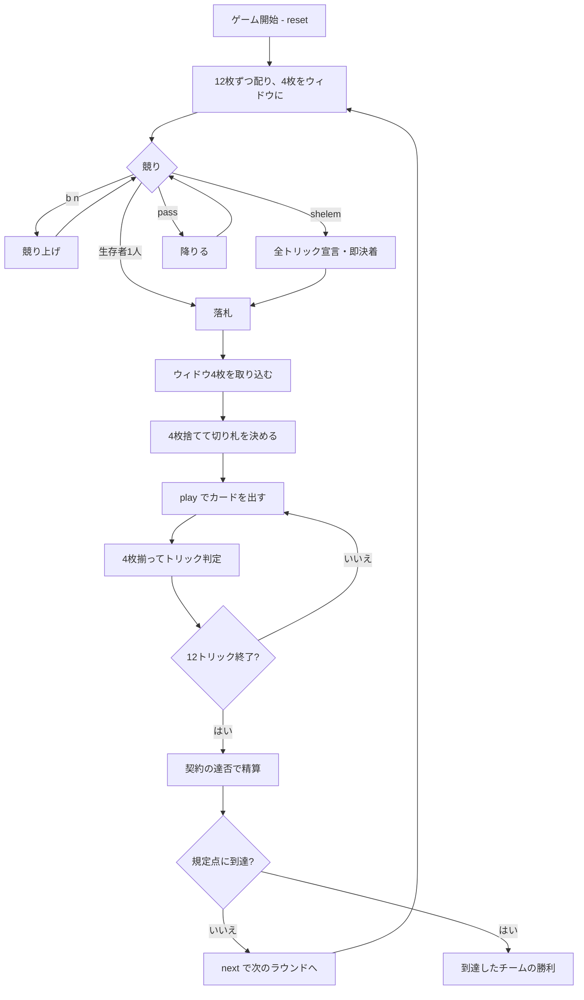

# シェレム（CUI版）遊び方

## ゲーム概要

イランで遊ばれるコントラクトブリッジ系の競り型トリックテイキング。52枚を**12枚ずつ配り、余った4枚をウィドウ**として伏せます（12×4 + 4 = 52）。**競るのはトリック数ではなく点数そのもの**で、落札者はウィドウを取り込んで4枚捨て、切り札を決めます。

## 起動方法

```sh
go run ./cmd/trumpcards shelem
go run ./cmd/trumpcards --lang en shelem  # 英語モード
```

## ルール

### 配り

各プレイヤーに**12枚**、残り**4枚**をウィドウとして伏せます。トリックは**12回**です。

### 点になる札

| 札 | 点 |
|----|----|
| A | **10** |
| 10 | **10** |
| 5 | **5** |
| その他 | 0 |

**1ラウンドの合計はちょうど100点。** これが入札の**上限**が100点である理由です——100点を超える契約はカード点では絶対に達成できません。

### 競り

親の左隣から順に、**55点から5刻み**で競り上げます（**上限100点**＝1ラウンドの全カード点）。

- 一度降りたら戻れません
- **誰も入札しないまま最後の1人になったら降りられません**（契約が決まらないため）
- **Shelem** は点数の代わりに**全トリック独占**を宣言するもので、どんな点数入札にも勝ち、その場で競りが決着します

### ウィドウ交換

落札者はウィドウ4枚を手札に加え（16枚）、**4枚捨てて12枚に戻し**、切り札スートを決めます。点にならない札を落とすのが基本です。

### 得点

| 契約 | 達成 | 未達 |
|------|------|------|
| 通常（n点） | **+n** | **-n** |
| Shelem | **+200** | **-200** |

通常契約では、**相手チームは取ったカード点をそのまま得ます**。Shelem はカード点を見ず、全トリック取れたかどうかだけで決まり、**1つ落とした時点でその場で終了**します。

先に規定点（既定500点）に達したチームの勝ちです。

## ゲームの流れ



## コマンド一覧

| コマンド | 短縮形 | 説明 |
|----------|--------|------|
| `bid <n>` | `b` | n 点で入札する（55..100、5刻み） |
| `shelem` |  | Shelem（全トリック独占）を宣言する |
| `pass` |  | 競りを降りる |
| `discard <i> <i> <i> <i> <suit>` | `d` | 4枚捨てて切り札を決める（1:♠ 2:♣ 3:♥ 4:♦） |
| `play <idx>` | `p` | 手札の `<idx>` 番目のカードを出す |
| `next` | `n` | 次のラウンドを開始する |
| `hint` | `h` | 入札額・捨て札・打つべき札を提示する |
| `giveup` | `g` | 投了する |
| `log` | `l` | 棋譜（アクションログ）を表示する |
| `reset` | `r` | 最初からやり直す |
| `quit` | `q` | 終了する |
| `help` | `?` | コマンド一覧を表示 |

## 画面の見方

```
==========
Shelem (シェレム)
==========
ラウンド: 1  トリック: 1/12  (500点先取)
点になる札: A と 10 が10点、5 が5点。1ラウンドの合計はちょうど100点。
累計: あなたのチーム=0  相手=0
契約: 90点（あなた が落札・現在 45 点）
切り札: ハート
あなた[T0]: 落札 90 獲得3 手札9枚
  [0]♠2 [1]♠7 [2]♠K [3]♣4 [4]♥A [5]♥5 ...
CPU1[T1]: 降り 獲得1 手札9枚
CPU2[T0]: 入札 85 獲得0 手札9枚
CPU3[T1]: 競り中 獲得0 手札9枚
----------
手番: あなた
play <idx>・・・カードを出す
```

- **点数表**: 点になるのは A・10・5 だけ。盤面からは読めません
- **契約行**: 落札額と、**現在までに取ったカード点**。この2つの差が勝負です
- **立場欄**: 落札／入札／降り／競り中／Shelem宣言
- **`[n]`**: `play <n>` で指定する手札の番号

## 遊び方のコツ

- **競り落とすのは「100点のうち何点を取るか」の約束。** 手札の A・10・5 の枚数がそのまま見積もりになります
- **ウィドウで4枚捨てるとき、点にならない札から落とす。** 短いスートを空にできれば切り札が効きます
- **相手の落札は失点のチャンス。** 通常契約なら、相手に届かせなければ相手が同額を失い、こちらは取ったカード点をそのまま得ます
- **味方が勝っているトリックには点札を乗せる。** A・10・5 がそのまま契約の達否になります
- **Shelem は12トリック全部。** 1つ落とした瞬間に -200 が確定します。切り札が長く、A が揃っているときだけ
- **自分が最後の1人で誰も入札していなければ、降りられません。** 最低55点を引き受けることになります
