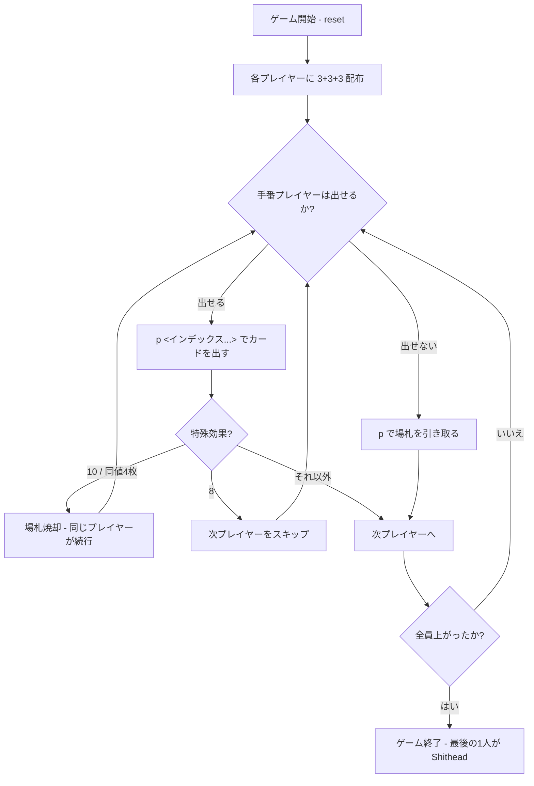

# シットヘッド（CUI版）遊び方

## ゲーム概要

Shithead（別名: Karma, Palace）は、4人で遊ぶシェディング（手札を早くなくす）系のゲームです。各プレイヤーは「裏向きの場札3枚」「表向きの場札3枚」「手札3枚」の3層を持ち、手札 → 表札 → 裏札 の順にカードを出し切ります。最後まで残ったプレイヤーが Shithead（敗者）となります。

## 起動方法

```sh
go run ./cmd/trumpcards shithead
go run ./cmd/trumpcards --lang en shithead  # 英語モード
```

## ルール

### 基本ルール

- 標準52枚のデッキ（ジョーカーなし）。
- 各プレイヤーに「裏向き3枚」「表向き3枚」「手札3枚」を配り、残りは山札になります。
- 自分のターンには、場札の一番上のカードと「同等以上」の値のカードを出します。
- 同じ値のカードは複数枚同時に出すことができます。
- 手札を3枚に保つため、出した分だけ山札から補充します（山札が尽きるまで）。
- 出せない場合は **場札を引き取り**、手札に加えます。

### マジックカード

| カード | 効果 |
|--------|------|
| 2 | リセット。次のプレイヤーは何でも出せます。 |
| 7 | 次のプレイヤーは7以下のカードしか出せません。 |
| 8 | 次のプレイヤーをスキップします。 |
| 10 | 場札を焼却（ゲームから除外）し、同じプレイヤーが続けて出します。 |
| 同値4枚連続 | 場札を焼却します。 |

### ゲーム終了

- 手札・表札・裏札のすべてを出し切ったプレイヤーから上がりとなり、順位がつきます。
- 最後に残った1人が Shithead（敗者）です。

### CPU難易度

- Easy: 常に最弱を出します。
- Normal: 通常戦略（マジックカード以外を優先）。
- Hard: マジックカードを温存します。

## ゲームの流れ



## コマンド一覧

| コマンド | 短縮形 | 説明 |
|----------|--------|------|
| `reset` | `r` | 新しいゲームを開始 |
| `play <indices...>` | `p <indices...>` | 指定インデックスのカードを出す（同値のみ複数可） |
| `play` | `p` | 場札を引き取る |
| `setdifficulty <0-2>` | `sd <0-2>` | CPU難易度を設定 |
| `setrule <name> <0\|1>` | `sr <name> <0\|1>` | ルールを切替（two/seven/eight/ten/fourburn） |
| `setrule list` | `sr list` | 現在のルール一覧を表示 |
| `log` | `l` | 棋譜を表示 |
| `help` | `?` | コマンド一覧を表示 |
| `quit` | `q` | ゲーム終了 |

## 画面の見方

```
==========
Shithead (シットヘッド / カーマ)
==========
あなた ← turn: 手札3 / 表3 / 裏3
  hand:    [0]SPADE 5  [1]HEART 9  [2]DIAMOND 2
  faceup:  CLOVER 11, CLOVER 12, CLOVER 13
CPU 1: 手札3 / 表3 / 裏3
CPU 2: 手札3 / 表3 / 裏3
CPU 3: 手札3 / 表3 / 裏3
----------
場札: HEART 5
山札: 16 枚
手番: あなた (出すソース: hand)
p [インデックス...] でカードを出す / p で場札を引き取る
```

- `← turn` 表示が現在の手番です。
- `出すソース` は `hand` / `faceup` / `facedown` のいずれかで、上から順にカードがなくなったら次の層に進みます。
- `【7発動中】` `【次プレイヤースキップ】` などの状態通知が表示されることがあります。
- **設定で有効にした特殊札には `*` が付き**、先頭にその効果の一覧（`特殊札(*): 2=…`）が出ます。どのランクが特殊かは設定次第なので、無効にした効果は一覧にも印にも出ません。

## 遊び方のコツ

- 高い値のカード（K, A）は終盤まで温存し、表札・裏札に強いカードを残しておくと有利です。
- 10は焼却＋連続行動なので、不利な場面で逆転手段として機能します。
- 7は自分の番のあとに弱いカードしか持っていない相手を引き取りに追い込めます。
- 裏札（facedown）はブラインドプレイなので運要素が大きく、序盤の入れ替え（実装次第）が重要です。
