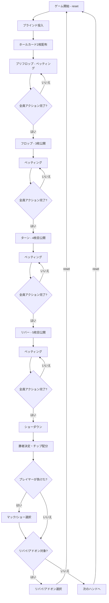

# ショートデック（CUI版）遊び方

## ゲーム概要

ショートデック（6+ホールデム）は、テキサスホールデムの変種で、36枚のデッキ（各スートの2〜5を除去）を使用します。テーブルサイズは4-max（デフォルト、1人+CPU 3人）、6-max（1人+CPU 5人）、9-max（1人+CPU 8人）から選択できます。各CPUは異なるプレイスタイル（TAG/LAP/TAP/LAG/GTO）を持ち、ブラフを含む戦略的なプレイをします。GTOスタイルはボードテクスチャ分析に基づく混合戦略で意思決定します。サイドポットにも対応しています。

HUD統計（VPIP%/PFR%）が全プレイヤーに表示され、CPUのベットサイズはポット相対（半額〜全額）で決定されます。トーナメントモードでは、指定ハンド数ごとにブラインドが自動的に上昇します。リバイ（チップ再購入）とアドオン（一回限りのチップ追加購入）にも対応しています。

## 起動方法

```sh
go run ./cmd/trumpcards shortdeck
go run ./cmd/trumpcards --lang en shortdeck  # 英語モード
```

## ルール

### 基本ルール

- **36枚**のトランプを使用（各スートの2・3・4・5を除去）
- 各プレイヤーに2枚のホールカード（手札）が配られる
- 場にコミュニティカード（共有カード）が最大5枚公開される
- ホールカード2枚 + コミュニティカード5枚の計7枚から、最強の5枚の組み合わせで役を作る
- 最も強い役を持つプレイヤーがポットを獲得する

### テキサスホールデムとの違い

| 項目 | テキサスホールデム | ショートデック |
|------|-------------------|---------------|
| デッキ枚数 | 52枚 | 36枚（2〜5除去） |
| フラッシュ vs フルハウス | フルハウス > フラッシュ | **フラッシュ > フルハウス** |
| 最低ストレート | A-2-3-4-5 | **A-6-7-8-9** |

### ゲームの進行

1. **ブラインド**: ディーラーの左隣がスモールブラインド（デフォルト5）、その左隣がビッグブラインド（デフォルト10）を強制ベット
2. **プリフロップ**: ホールカード2枚配布後、最初のベッティングラウンド
3. **フロップ**: コミュニティカード3枚公開後、ベッティングラウンド
4. **ターン**: コミュニティカード4枚目公開後、ベッティングラウンド
5. **リバー**: コミュニティカード5枚目公開後、最後のベッティングラウンド
6. **ショーダウン**: 残っているプレイヤーの手札を公開し、勝者を決定
7. **マック/ショー**: ショーダウンで負けた場合、手札をマック（伏せる）またはショー（公開）を選択
8. **リバイ/アドオン**: リバイ・アドオンが有効な場合、該当条件を満たすとチップの再購入・追加購入が可能

### ベッティングアクション

| アクション | 説明 |
|-----------|------|
| フォールド | 手札を捨ててラウンドから降りる |
| チェック | ベットせずにパスする（未ベット時のみ） |
| コール | 現在のベット額に合わせる |
| ベット | 新たにベットする（未ベット時のみ） |
| レイズ | 現在のベット額を上げる |
| オールイン | 全チップを賭ける |

### 役一覧（強い順）

| 役 | 説明 |
|----|------|
| Royal Flush | 同じスートの10・J・Q・K・A |
| Straight Flush | 同じスートの5枚連番 |
| Four of a Kind | 同じ数字4枚 |
| **Flush** | **同じスート5枚（通常のホールデムより上位）** |
| **Full House** | **同じ数字3枚 + 同じ数字2枚（通常のホールデムより下位）** |
| Straight | 5枚連番 |
| Three of a Kind | 同じ数字3枚 |
| Two Pair | ペア2組 |
| One Pair | ペア1組 |
| High Card | 上記に該当しない最も高いカード |

### CPUプレイスタイル

| スタイル | 略称 | 特徴 |
|---------|------|------|
| Tight-Aggressive | TAG | 強い手のみ参加し、積極的にレイズ。ブラフ率15% |
| Loose-Passive | LAP | 多くの手に参加するが、主にコール。ブラフ率5% |
| Tight-Passive | TAP | 厳選した手のみ参加し、主にコール。ブラフ率5% |
| Loose-Aggressive | LAG | 多くの手に参加し、頻繁にレイズ。ブラフ率30% |
| Game Theory Optimal | GTO | ハンド強度とボードテクスチャに基づく確率的混合戦略。ドライボードでは2/3ポット、ウェットボードでは3/4ポットのベットサイズ |

## ゲームの流れ



## コマンド一覧

| コマンド | 短縮形 | 説明 |
|----------|--------|------|
| `reset` | `r` | 新しいゲームを開始 |
| `fold` | `f` | フォールド（降りる） |
| `check` | `ck` | チェック（パス） |
| `call` | `c` | コール（ベット額に合わせる） |
| `bet <額>` | `b <額>` | ベットする |
| `raise <額>` | `ra <額>` | レイズする |
| `allin` | `a` | オールイン |
| `bl [0-2]` | | ベッティングリミット変更（0=Fixed, 1=PotLimit, 2=NoLimit） |
| `ts [4\|6\|9]` | `tablesize` | テーブルサイズ変更（4-max, 6-max, 9-max） |
| `rebuy` | `rb` | リバイ（チップを再購入） |
| `skiprebuy` | `sr` | リバイをスキップ |
| `addon` | `ad` | アドオン（チップを追加購入） |
| `skipaddon` | `sa` | アドオンをスキップ |
| `muck` | `m` | マック（手札を伏せる） |
| `show` | `sh` | ショー（手札を公開する） |
| `metaai` | `mai` | メタAIの ON/OFF を切り替え（CPUが人間のプレイスタイルを学習） |
| `quit` | `q` | ゲーム終了 |
| `help` | `?` | コマンド一覧を表示 |

例:
- `b 40` → 40チップをベット
- `ra 80` → 80チップにレイズ
- `c` → コール

## 画面の見方

```
==========
Short Deck (6+ Hold'em)
==========
ディーラー: Player 0
コミュニティ: ♠7  ♣10  ♥9
ポット: 60
----------
[You] チップ:970 ベット:20
  手札: ♠A  ♥K
CPU 1 (TAG) チップ:980 ベット:20
CPU 2 (LAP) チップ:990 ベット:10 [フォールド]
CPU 3 (GTO) チップ:960 ベット:10
----------
[CPU行動]
  Player 1: コール
  Player 2: フォールド
  Player 3: チェック
==========
```

- `[You]`: プレイヤーのチップ残高とベット額
- `手札`: あなたのホールカード
- `CPU N (スタイル)`: CPUのチップ残高、ベット額、状態
- `[フォールド]`: フォールド済み
- `[オールイン]`: オールイン状態
- `コミュニティ`: 場に公開されたコミュニティカード
- `ポット`: 現在のポット額
- `[CPU行動]`: CPUが行ったアクションの記録

## HUD統計

各プレイヤーにはHUD（ヘッズアップディスプレイ）統計が表示されます：

- **VPIP** (Voluntarily Put $ In Pot): プリフロップで自発的にチップを入れた割合（コール/ベット/レイズ/オールイン）
- **PFR** (Pre-Flop Raise): プリフロップでレイズした割合（ベット/レイズ/オールイン）

## トーナメントモード

トーナメントモードを有効にすると、指定ハンド数ごとにブラインドが自動的に上昇します。

- **BlindLevelHands**: ブラインドレベルアップまでのハンド数（デフォルト10）
- **BlindMultiplier**: ブラインド倍率（デフォルト200 = 2倍）

例: BlindLevelHands=10, BlindMultiplier=200 の場合、10ハンドごとにSB/BBが2倍になります。

## リバイ/アドオン

リバイとアドオンを有効にすると、チップが不足した際や特定のハンド数経過後にチップを追加購入できます。

### リバイ

- リバイ期間内（デフォルト: 最初の10ハンド）にチップが0になった場合、リバイが可能
- 最大リバイ回数（デフォルト3回）まで繰り返しリバイ可能
- リバイで得られるチップ数はデフォルト1000
- CPUは自動的にリバイを実行

### アドオン

- 指定ハンド数（デフォルト: 10ハンド目）経過後に1回だけアドオン可能
- アドオンで得られるチップ数はデフォルト1500
- CPUは自動的にアドオンを実行

## 遊び方のコツ

- ショートデックでは36枚のデッキのため、フラッシュがフルハウスより強いです（フラッシュが成立しにくいため）
- 最低ストレートはA-6-7-8-9です（2〜5が存在しないため）
- デッキが小さいため、ペアやセットが通常のホールデムより成立しやすいです
- ポジション（ディーラーからの距離）は重要です。後ろのポジションほど有利です
- 強い手（ペア、高いカード）はプリフロップでレイズして主導権を握りましょう
- LAGスタイルのCPUはブラフが多いので、良い手を持っているときはコールやレイズで対抗しましょう
- GTOスタイルのCPUは確率的な混合戦略を使うため、行動パターンが読みにくいです。ボードテクスチャに注意して対応しましょう
- TAGスタイルのCPUがレイズしてきたら、本当に強い手を持っている可能性が高いので注意しましょう
- HUD統計を活用して、CPUのプレイスタイルの傾向を把握しましょう
- トーナメントモードではブラインドが上がるため、早めにチップを稼ぐ戦略が重要です
- オールインは最後の手段として使いましょう。全チップを失うリスクがあります
