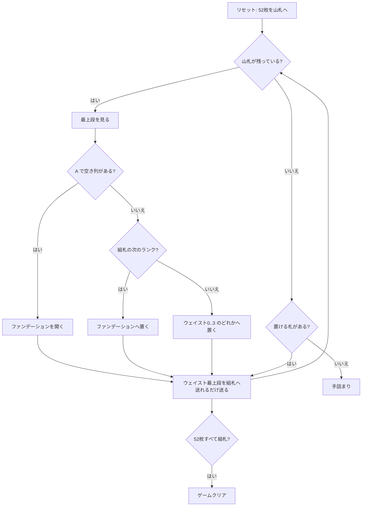

# サー・トミー（CUI版）遊び方

## ゲーム概要

現存する記録の中で最古級とされるイギリス発祥の一人用ペイシェンス。「ソリティアの祖父」とも呼ばれる。山札を 1 枚ずつめくり、4 つのウェイスト（捨て札列）に振り分けながら、4 つのファンデーション（組札）を A から K まで積み上げる。

ルールは極めて単純だが、**一度ウェイストに置いたカードは二度と動かせない**（最上段が組札へ行くときだけ）。どの列に捨てるかという一手ごとの判断がそのまま勝敗になる。

## 起動方法

```sh
go run ./cmd/trumpcards sirtommy
go run ./cmd/trumpcards --lang en sirtommy   # 英語
```

## ルール

- 52 枚 1 組。すべて山札に伏せて開始する（組札の種は最初から置かれていない）
- 山札を 1 枚ずつめくり、次のいずれかを行う
  - **A なら**空いているファンデーションに置いて新しい列を開く
  - 4 つのウェイストのいずれかの一番上に置く
- ファンデーションは**スートを問わず** A→2→3→…→K の順に 1 ずつ積み上げる
- ウェイストは**最上段のみ**ファンデーションへ移せる。列内の入れ替えも、ウェイスト同士の移動もできない
- 52 枚すべてがファンデーションに乗れば勝ち。山札を使い切り、どのウェイスト最上段も置けなくなれば手詰まり

## ゲームの流れ



## コマンド一覧

| コマンド | 説明 |
|---------|------|
| `s f <idx>` | 山札の最上段をファンデーション `<idx>` (0..3) に置く |
| `s w <idx>` | 山札の最上段をウェイスト `<idx>` (0..3) に置く |
| `w <wIdx> f <fIdx>` | ウェイスト `<wIdx>` の最上段をファンデーション `<fIdx>` に置く |
| `h`, `hint` | ヒントを表示する |
| `ac`, `autocomplete` | 置けるカードを自動で組札へ送る |
| `u`, `undo` | 1 手戻す |
| `g`, `giveup` | ギブアップ |
| `l` | 棋譜（アクションログ）を表示する |
| `r`, `reset` | 最初からやり直す |
| `q`, `quit` | 終了する |

## 画面の見方

```
[F0] ♠A (1/13) → 次: 2   ← ファンデーション0: 最上段と積み上げ枚数、次に必要なランク
[F1] (空) → 次: A
[F2] (空) → 次: A
[F3] (空) → 次: A
----------
[W0] ♥9 (3枚)       ← ウェイスト0: 最上段と枚数
[W1] (空)
[W2] ♣K (1枚)
[W3] (空)
----------
ストック: 47枚 次のカード: ♦5
```

- `F0`〜`F3` がファンデーション。`(n/13)` は積み上がった枚数
- `→ 次: R` はその山が次に必要とするランク。スートは問わず、空の山は A から。13 枚積み上がると `→ 完成` に変わります
- `W0`〜`W3` がウェイスト。動かせるのは表示されている最上段だけ
- 「次のカード」は次にめくられる山札の 1 枚

## 遊び方のコツ

- **ウェイストは降順に積むと後で困らない。** 大きいランクを下に、小さいランクを上に置くと、組札が伸びたときに素直に取り出せる
- 4 列のうち 1 列は「K などの高いランク専用」にして捨て場として割り切ると、他の 3 列が使いやすくなる
- 同じランクが 2 枚続いたら別々の列へ。1 つの列に重ねると下の 1 枚が長く塞がれる
- `hint` は置ける札を 1 つ示すだけで最善手の保証はない。行き詰まったら `undo` で分岐をやり直せる
