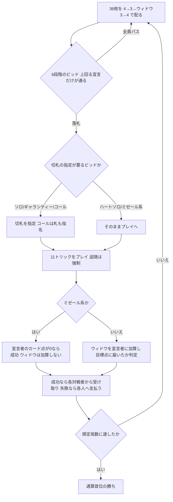

# シックスビッド・ソロ（CUI版）遊び方

## ゲーム概要

ドイツ系移民が持ち込んだスカートを元にアメリカで育った 3 人用トリックテイキング。**36 枚（A-10-K-Q-J-9-8-7-6）を 11 枚ずつ配り、3 枚をウィドウとして伏せます。**6 段階のビッドが、目標点と精算額を同時に切り替えます。

出典: [pagat.com: Crazy Solo, Frog, Six-Bid Solo](https://www.pagat.com/aceten/solo.html) ／ [Wikipedia: Six-bid solo](https://en.wikipedia.org/wiki/Six-bid_solo)

## 起動方法

```sh
go run ./cmd/trumpcards sixbidsolo
go run ./cmd/trumpcards --lang en sixbidsolo   # 英語表示
```

## ルール

### 配り方（**11 枚ずつ＋ウィドウ 3 枚**）

**4 枚 → 3 枚 → ウィドウ 3 枚（伏せ） → 4 枚**の順に配ります。1 人 11 枚です。

算術で確かめられます: **11 × 3 + 3 = 36** ✓ 。12 枚ずつだとウィドウの 3 枚が入る余地がありません。

ウィドウは飾りではなく、**最後に宣言者の得点へ加算されます**（ミゼール系を除く）。

### 札の序列とカード点

序列は **A > 10 > K > Q > J > 9 > 8 > 7 > 6**。**10 が K より強い**スカート系の並びです。

| 札 | 点 |
|---|---|
| A | 11 |
| 10 | 10 |
| K | 4 |
| Q | 3 |
| J | 2 |
| 9・8・7・6 | 0 |

1 スートあたり 30 点、**場に出るカード点は合計 120 点**です。

### 6 段階のビッド

低い順に並びます。**上回る宣言だけが通ります。**

| # | ビッド | 目標 | 精算額 |
|---|---|---|---|
| 1 | ソロ | **61 点以上**（切札は ♠♣♦） | 60 点との差 **× 2** |
| 2 | ハート・ソロ | **61 点以上**（切札は ♥ 固定） | 60 点との差 **× 3** |
| 3 | ミゼール | **カード点 0**（切札なし） | 30 |
| 4 | ギャランティー・ソロ | **♥ なら 74 点以上、他スートなら 80 点以上** | 40 |
| 5 | スプレッド・ミゼール | カード点 0（**手札を公開**） | 60 |
| 6 | コール・ソロ | **全 120 点**（＋札の指名交換） | 100（**♥ なら 150**） |

### 「60 点」ではなく「60 点を超えること」

通常ビッドの目標は **61 点以上**です。120 点の過半なので、60 ちょうどでは足りません。しかも勝敗が○×ではなく、**精算は「60 点との差」に倍率を掛けた額**になります。75 点なら差 15 × 2 = 30、40 点なら差 20 × 2 = 40 を逆向きに支払います。

### ミゼールは「0 トリック」ではなく「0 点」

**カード点を 1 点も取らないこと**が条件です。**9・8・7・6 だけのトリックは取っても構いません。**3 人戦なので実際に起こり得ます。ミゼール系では**ウィドウの点も加算されません**（取らないことが目的なので、伏せ札の点まで背負っては成立しません）。

### コール・ソロの指名交換

全 120 点を取る約束に加えて、**宣言者は札を 1 枚指名でき、持っている者は交換に応じる義務があります**。宣言者は代わりに手札から 1 枚渡すので、双方の枚数は変わりません。**指名した札がウィドウにあった場合は交換が起こりません。**

### 精算

成功なら**各対戦者が宣言者にビッド額を支払い**、失敗なら**宣言者が各人に支払います**。3 人戦なので宣言者の増減は対戦者 2 人ぶんです。



## コマンド一覧

| コマンド | 説明 |
|---------|------|
| `b <1-6>` | 宣言する（**1=ソロ 2=ハートソロ 3=ミゼール 4=ギャランティー 5=スプレッド 6=コール**） |
| `ps` / `pass` | 宣言を見送る |
| `d <1-4>` | 切札を指定する（**1=♠ 2=♣ 3=♥ 4=♦**） |
| `d <1-4> <1-4> <1-13>` | コール・ソロ: 切札に続けて**交換を求める札**を指定する |
| `p <i>` | 手札 `i` を出す |
| `n` / `next` | 次の局へ進む |
| `l` / `log` | 棋譜を表示する |
| `r` | ゲームごとリセットする |
| `q` | 終了する |

## 画面の見方

```
局: 1 / 6  場のカード点: 120
契約: ギャランティー・ソロ  切札: ♠  目標: 80点
ウィドウ: 伏せ 3枚
あなた[親]: 点 22 / トリック 2 / 通算 0  手札: [0]♠1 [1]♠13 ...
CPU 1[宣言]: 点 41 / トリック 4 / 通算 0  手札: 非公開 5枚
場: ♠1
----------
手番: あなた
出せる札: 0 1
p <i> ・・・手札 i を出す（追随は強制です）
```

- **ウィドウは精算まで伏せられます。**枚数だけ見えます
- **`出せる札`** を必ず確認してください。追随が強制です
- 精算では**ウィドウ加算の内訳**が出ます。ミゼール系では 0 になります

## 遊び方のコツ

- **60 点ちょうどでは負けです。**61 点以上取ってください
- **差が大きいほど得も損も大きくなります。**通常ビッドは○×ではなく差分精算なので、際どい 61 点より余裕のある 75 点のほうが実入りが大きく、逆に大負けの傷も深くなります
- **ミゼールは 0 点であって 0 トリックではありません。**9 以下ばかりの手なら、トリックを取ること自体は怖くありません
- **ウィドウの 3 枚は宣言者の味方です。**平均で 10 点前後入るので、通常ビッドの見積もりに足して考えてください。ただしミゼール系では入りません
- **ハート・ソロは倍率が 3 倍。**同じ 61 点でも実入りが 1.5 倍になります
- **コール・ソロの指名は、自分の切札を補うのが定石です。**ただしウィドウに入っていると空振りします

## 出典についての注記

pagat と Wikipedia でミゼールの額が食い違います（**30** 対 **40**）。Wikipedia はギャランティーも 40 としており、**両方 40 だとビッドの序列が額の上で崩れます**。本実装は序列と整合する pagat の **30** を採っています。
