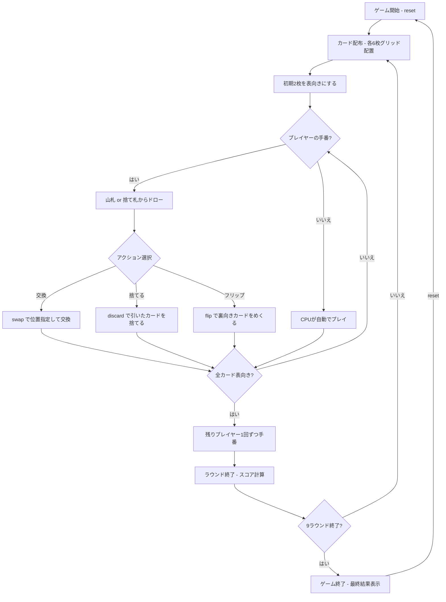

# シックスカードゴルフ（CUI版）遊び方

## ゲーム概要

2〜4人（プレイヤー1人 + CPU 1〜3人）で遊ぶ記憶と交換のカードゲームです。各プレイヤーは3×2のグリッド（6枚）に裏向きのカードを持ち、山札や捨て札から引いたカードと交換して合計点を最小化します。同じ列（縦ペア）に同ランクが揃うと0点に相殺されます。9ラウンドの累計スコアが最も低いプレイヤーが勝利します。

## 起動方法

```sh
go run ./cmd/trumpcards sixcardgolf
go run ./cmd/trumpcards --lang en sixcardgolf  # 英語モード
```

## ルール

### 基本ルール

- 52枚の標準トランプを使用、2〜4人プレイ
- 各プレイヤーに6枚ずつ配り、3×2のグリッドに裏向きで並べる
- ゲーム開始時に2枚だけ表向きにする
- 残りは山札（ストック）、1枚を表向きにして捨て札の山を開始

### カードの点数

| カード | 点数 |
|--------|------|
| K | 0点 |
| A | 1点 |
| 2〜10 | 額面通り |
| J, Q | 10点 |

### 列マッチング（カラムペア）

- グリッドは3列×2行の配置（位置0〜5）
  - 列0 = 位置0（上）と位置3（下）
  - 列1 = 位置1（上）と位置4（下）
  - 列2 = 位置2（上）と位置5（下）
- 同じ列の上下が同ランクの場合、その2枚は0点に相殺される

### 手番の進行

1. **ドロー**: 山札から1枚引く、または捨て札の山のトップを取る
2. **アクション**:
   - 引いたカードをグリッドの任意の位置と交換
   - 山札から引いた場合のみ、そのまま捨てることも可能
   - 裏向きのカードをめくる（フリップ）こともできる

### ラウンド終了

- いずれかのプレイヤーの6枚がすべて表向きになったらトリガー
- 残りの全プレイヤーが1回ずつ手番を行い、ラウンド終了
- 全カードを公開し、スコア計算（列マッチングによる相殺を適用）

### ゲーム終了

- 9ラウンド終了後、累計スコアが最も低いプレイヤーが勝利

## ゲームの流れ



## コマンド一覧

| コマンド | 短縮形 | 説明 |
|----------|--------|------|
| `reset` | `r` | 新しいゲームを開始 |
| `drawstock` | `ds` | 山札から1枚ドロー |
| `drawdiscard` | `dd` | 捨て札の山から1枚ドロー |
| `swap <idx>` | `sw <idx>` | 引いたカードとグリッドの位置を交換（0〜5） |
| `discard` | `di` | 引いたカードを捨て札へ（山札ドロー後のみ） |
| `flip <idx>` | `fl <idx>` | 裏向きカードをめくる（0〜5） |
| `nextround` | `nr` | 次のラウンドへ |
| `log` | `l` | 棋譜表示 |
| `quit` | `q` | ゲーム終了 |
| `help` | `?` | コマンド一覧を表示 |

### コマンド例

- `ds` → 山札から1枚ドロー
- `dd` → 捨て札からトップカードをドロー
- `s 2` → 引いたカードをグリッド位置2（上段右）と交換
- `d` → 引いたカードをそのまま捨てる
- `f 0` → グリッド位置0（上段左）の裏向きカードをめくる

## 画面の見方

```
==========
Six Card Golf (シックスカードゴルフ)
==========
ラウンド: 1/9  山札: 31枚
捨て札: HEART 7
あなた: 累計0点
  [0]🂠     [1]SPADE K  [2]🂠
  [3]HEART 3 [4]🂠      [5]DIAMOND 5
CPU 1: 累計0点
CPU 2: 累計0点
CPU 3: 累計0点
----------
手番: あなた (ドローフェーズ)
ds・・・山札から引く
dd・・・捨て札から引く
==========
```

- `ラウンド: N/9`: 現在のラウンド番号（全9ラウンド）
- `山札: N枚`: 山札の残り枚数
- `捨て札`: 捨て札の山の一番上のカード
- `[0]〜[5]`: グリッドの位置（0=上段左, 1=上段中, 2=上段右, 3=下段左, 4=下段中, 5=下段右）
- `🂠`: 裏向きカード
- `累計N点`: 累計スコア

## 遊び方のコツ

- **Kは0点** なので、Kはグリッドに残しておくのが有利
- **列マッチングを狙う**: 同じ列に同ランクを揃えれば0点になるため、高得点カード（J/Q=10点）でもペアにできれば有利
- **裏向きカードの記憶**: 序盤にめくったカードの位置を覚えておき、交換のタイミングを見計らう
- **捨て札を活用**: 必要なランクが捨て札にあれば積極的に取る
- **ラウンド終了のタイミング**: 自分のスコアが低いときに全カードを表向きにして早めに終わらせる戦略も有効
