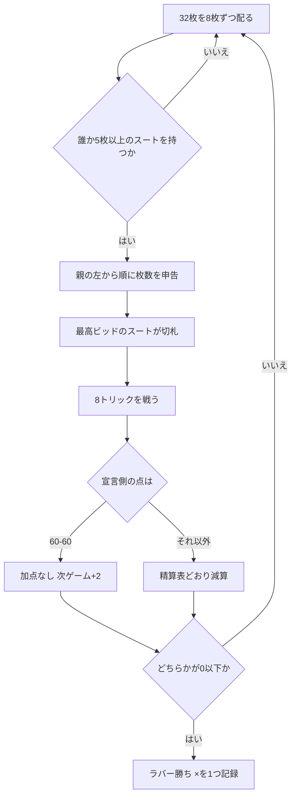

# シャウス（CUI版）遊び方

## ゲーム概要

フェロー諸島の国民的トランプゲーム。32 枚、**2 対 2 の固定チーム**（向かい合わせが味方）でトリックを取り合います。シャフコップ系の**常時切札**を持ち、1 ラバー 24 点を**引き算**して先に 0 以下へ達したチームが勝ちます。

実装は [pagat.com の Sjavs](https://www.pagat.com/schafkopf/sjavs.html) に従います。

## 起動方法

```sh
go run ./cmd/trumpcards sjavs
go run ./cmd/trumpcards --lang en sjavs   # 英語表示
```

## ルール

- **デッキ**: 32 枚（52 枚から 2〜6 を抜いた 7,8,9,10,J,Q,K,A）
- **人数**: 4 人 / 2 対 2。席 0 と 2、席 1 と 3 が味方
- **配札**: 各自 8 枚

### 常時切札（このゲームの骨格）

**切札スートが何であっても、次の 6 枚が最強**です。順序も固定です。

```
♣Q ＞ ♠Q ＞ ♣J ＞ ♠J ＞ ♥J ＞ ♦J
```

その下に**切札スートの残り**が A ＞ K ＞（Q）＞ 10 ＞ 9 ＞ 8 ＞ 7 と続きます。

- **赤が切札**なら切札は 6 + 7 = **13 枚**
- **黒が切札**なら、そのスートの Q と J は既に常時切札なので 6 + 6 = **12 枚**

**切札は独立したスートとして扱います。**♥が切札のとき ♣J は「♣」ではないので、♣がリードされても追随しません。

### ビッド

- 親の左隣から順に、**自分の最長切札スートの枚数**を申告します（**目標点ではありません**）
- **5 枚未満は発声できません。**全員が届かなければ配り直しです
- **長い方が勝ち**、同じ長さなら**♣だけが勝ちます**
- 同じ長さの候補に♣が含まれるなら、**♣として申告しなければなりません**
- 最高ビッドをした人のスートが切札になります

### 点数

| 札 | 点 |
|---|---|
| A | 11 |
| 10 | 10 |
| K | 4 |
| Q | 3 |
| J | 2 |

合計 **120 点**です。

### 精算

宣言側が取った点で決まります。**♣が切札なら倍**ですが、**全トリックだけは 12 → 16**（24 ではありません）。

| 宣言側の獲得点 | 宣言側 | ♣が切札 |
|---|---|---|
| 全トリック | 12 | **16** |
| 90–120 | 4 | 8 |
| 61–89 | 2 | 4 |
| 60–60 | **加点なし。次ゲームの価値が +2** | 同左 |
| 31–59 | 相手が 4 | 相手が 8 |
| 0–30 | 相手が 8 | 相手が 16 |
| 1 トリックも取れず | **相手が 16（スート不問）** | 16 |

### ラバー

両チームとも **24 から始めて引き算**します。先に **0 以下**へ達したチームがラバー勝ちで、そこで **× が 1 つ**記録されます（× は 1 ハンドごとに消すものではありません）。相手が **24 のまま**なら **ダブル勝ち**です。

## ゲームの流れ



## コマンド一覧

| コマンド | 説明 |
|---------|------|
| `b <n>` | 切札スート長 `n` を申告する（`b 0` でパス） |
| `p <i>` | 手札の `i` 番目を出す |
| `n` | 次のハンドへ進む |
| `h` | ヒントを表示する |
| `l` / `log` | 棋譜を表示する |
| `r` | ラバーごとリセットする |
| `q` | 終了する |

## 画面の見方

```
切札未定 · 残り 味方24 / 相手24
常時切札: ♣Q ＞ ♠Q ＞ ♣J ＞ ♠J ＞ ♥J ＞ ♦J（切札スートに関係なく最強）
今ハンドの点: 味方0 / 相手0（合計120）
あなた[チーム0]: 手札8枚
  [0]SPADE 1 [1]HEART 13 [2]CLOVER 12 ...
CPU 1[チーム1]: 手札8枚
CPU 2[チーム0]: 手札8枚 — 6枚を申告
CPU 3[チーム1]: 手札8枚
----------
b <n> で申告（5枚以上、あなたの最長は6枚）／b 0 でパス
```

- **常時切札の並びは毎回表示されます。**切札スートの札しか切札でないと思い込むと、♣Q が飛んでくる理由が分かりません
- **残り**は 24 からの引き算です。0 以下でラバー勝ちです
- 申告した枚数は全員ぶん見えます。味方が何枚持っているかが読みどころです
- CPU の**手札**は枚数のみ表示されます

## 遊び方のコツ

- **申告できる枚数は、実際に持っている切札の枚数です。**♣J は♥を切札にしても切札なので、♥のスート枚数だけを数えると必ず足りません
- **♣は同じ長さで勝てます。**♣が最長候補にあるなら、♣で申告する価値があります（精算も倍になります）
- **60 点は引き分けです。**61 点で初めて 2 点になるので、最後の 1 トリックの 1 点が効きます
- 宣言側にならなかったときは、**相手を 60 点未満に抑える**のが目標です。31 点未満まで抑えれば 8 点（♣なら 16 点）取れます
- **全トリックは 12 点（♣なら 16 点）**で最大です。切札 13 枚の赤で全部取れる形なら狙う価値があります
