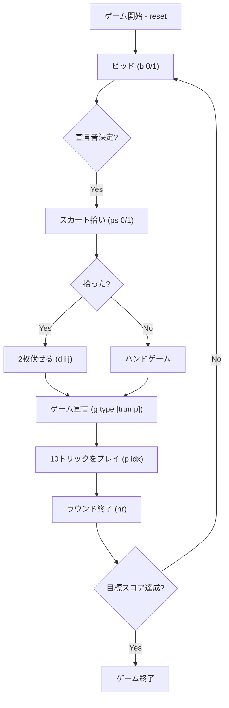

# スカート（CUI版）遊び方

## ゲーム概要

3人で遊ぶドイツ発祥のトリックテイキングゲーム。32枚の手札と「スカート」と呼ばれる伏せ札2枚を使い、ビッド（競り）で宣言者を決め、宣言者は守備側2人を相手に61点以上のカードポイントを稼げば勝ち。

## 起動方法

```sh
go run ./cmd/trumpcards skat
go run ./cmd/trumpcards --lang en skat
```

## ルール

### 基本

- 32枚デッキ（7,8,9,T,J,Q,K,A × 4スート）。
- 各プレイヤーに10枚配り、残り2枚を場札（スカート）に置く。
- カードポイント: A=11、T=10、K=4、Q=3、J=2、9/8/7=0（合計120点）。

### ビッド（簡略化）

ビッドラダー `[18, 20, 22, 24, 27, 30, 33, 36, 40, 44, 48, 50, 60, 72]` を順に上げていく。`b 1` で受け、`b 0` でパス。両者がパスし切ると最後まで残った人が宣言者。

### ゲーム種別

- **Suit (スートゲーム)**: 選んだスートと4枚のジャックが切り札（基本点 ♦9/♥10/♠11/♣12）。
- **Grand**: 4枚のジャックのみが切り札（基本点24）。
- **Null**: 切り札なし。宣言者は1トリックも取らないこと（基本点23）。

### 勝敗

宣言者が61点以上で勝利。90点以上でシュナイダー、全10トリックでシュヴァルツのボーナス。  
ゲーム値 = 基本点 × (マタドール数 + 1 + ハンドボーナス + シュナイダー/シュヴァルツ)。負けた場合は2倍を失点。  
累計スコアが目標点（既定500）に達したプレイヤーがいれば終了。

### CPU難易度

- Easy: 確率的にビッドを受ける。
- Normal: 手札の強さでビッドを判断。
- Hard: 受け閾値が下がり、強い手ではハンドゲームを選ぶこともある。

## ゲームの流れ



## コマンド一覧

| コマンド | 短縮形 | 説明 |
|----------|--------|------|
| `reset` | `r` | 新しいゲームを開始 |
| `quit` | `q` | ゲーム終了 |
| `bid <0\|1>` | `b` | ビッドステップ：0=パス、1=受ける／コール |
| `pickskat <0\|1>` | `ps` | 0=ハンドゲーム、1=スカートを拾う |
| `discard <i> <j>` | `d` | 手札の2枚を伏せ札に戻す |
| `game <type> [trump]` | `g` | 1=Suit / 2=Grand / 3=Null。Suitは1=♠ 2=♣ 3=♥ 4=♦ |
| `play <i>` | `p` | カードを出す |
| `next` | `n` | 次のトリックへ |
| `nextround` | `nr` | 次のラウンドへ |
| `setdifficulty <0-2>` | `sd` | CPU難易度（0=Easy / 1=Normal / 2=Hard） |
| `settarget <n>` | `sl` | 目標スコアを設定 |
| `hint` | `h` | ヒント表示 |
| `log` | `l` | 棋譜表示 |
| `help` | `?` | コマンド一覧を表示 |

## 画面の見方

```
==========
Skat (スカート)
==========
Round: 1  Trick: 0  Dealer: 0 (Fore=1 / Mid=2 / Rear=0)
Game: Suit (trump=♠)
Current bid: 18
You [Declarer]: bid=18 tricks=0 cardPts=0 total=0 round=0 hand=10
  [0]CLOVER 11 [1]SPADE 11 ...
CPU 1: bid=- tricks=0 cardPts=0 total=0 round=0 hand=10
CPU 2: bid=- tricks=0 cardPts=0 total=0 round=0 hand=10
----------
Turn: You
p <idx>
```

## 遊び方のコツ

- ジャックは強力。3枚以上あればGrandを検討。
- 弱い手はパスに徹し、長く続ける。
- 切り札スートは最も枚数の多いスートを選ぶ。
- 守備側はAやTを温存して、宣言者の最後のトリックを奪う。
