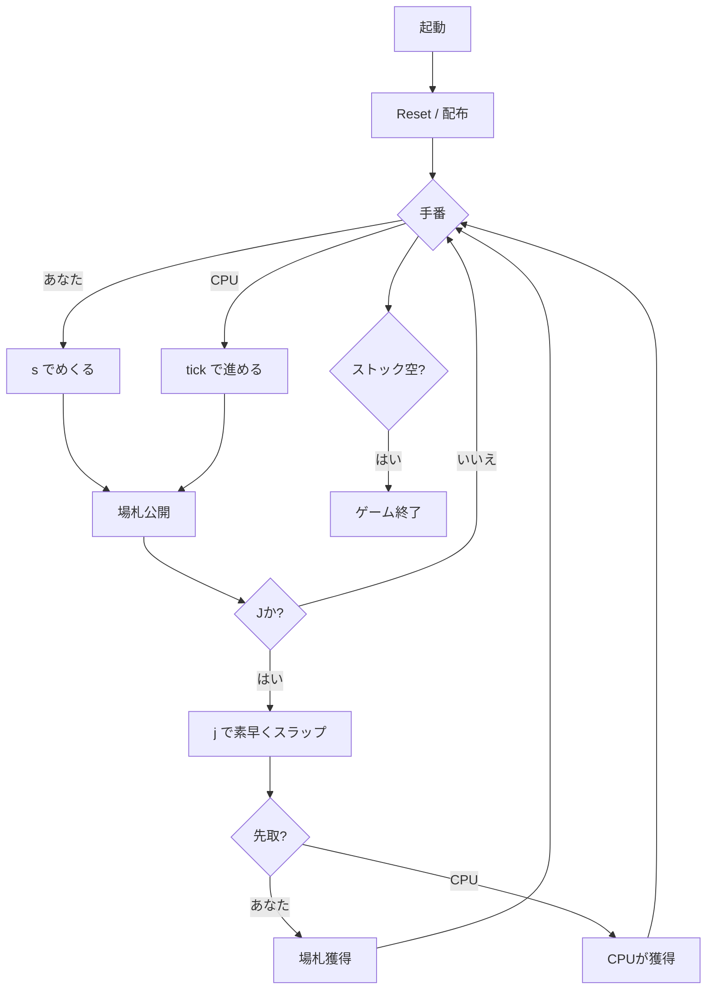

# スラップジャック（CUI版）遊び方

## ゲーム概要

CLI版スラップジャックは、Webと同じ反射神経ゲームをターミナル上で遊ぶモードです。場のトップが J になったら `j` を素早く入力して場札を奪い取りましょう。CPU は Tick ベースで設定難易度に応じた反応速度で動作します。

## 起動方法

```sh
go run ./cmd/trumpcards slapjack          # 日本語
go run ./cmd/trumpcards --lang en slapjack # 英語
```

## ルール

Web版と同じです。詳細は [docs/manual/web/slapjack.md](../web/slapjack.md) を参照してください。

## ゲームの流れ



## リアルタイムモード（推奨）

`go run ./cmd/trumpcards slapjack` で起動した場合、ターミナルが TTY であれば自動的に **リアルタイムモード** に入ります。Raw キーボード入力で 1 文字を即時に受け付け、200 ms ごとに自動で `tick` が呼ばれて CPU が動きます。

| キー | 動作 |
|------|------|
| `Space` | スラップ（最重要キー） |
| `s` / `S` | 自分のストックトップを場に出す |
| `r` / `R` | ゲームをリセット |
| `l` / `L` | 棋譜を表示 |
| `q` / `Q` / `Ctrl+C` / `Ctrl+D` | 終了 |

stdin が TTY でない（パイプ実行・CI など）場合は従来のラインモードに自動フォールバックするため、スクリプトは引き続き動作します。

## コマンド一覧

ラインモード（パイプ実行・WSL2 で stdin が TTY でない場合など）では従来通りコマンドを Enter で実行します。

| コマンド | 短縮形 | 説明 |
|----------|--------|------|
| `step` | `s` | 現手番プレイヤーがストックのトップを場に出す |
| `slap` | `j` | スラップを試みる |
| `tick` |  | CPU の保留アクションを進める（Jを叩く / CPU の番でめくる） |
| `setdifficulty <0-2>` | `sd` | CPU 難易度を設定して再開（0=Easy, 1=Normal, 2=Hard） |
| `reset` | `r` | ゲームをリセット |
| `log` | `l` | 棋譜を表示 |
| `quit` | `q` | 終了 |
| `help` | `?` | コマンド一覧を表示 |

## 画面の見方

- `CPU難易度: Normal` ... 現在の CPU 難易度。`sd` で変えた結果がここに出ます
- `CPU: ストックX枚` ... CPU の残ストック数
- `[場札] <カード>  (場にN枚)` ... 場の top と総枚数
- `あなた: ストックX枚` ... 自分の残ストック
- 状況に応じて「あなたの番」「Jだ！叩け」「誤スラップ」などのメッセージが出力される

## 遊び方のコツ

- リアルタイムモードでは `Space` の連打で素早くスラップできる。`Hard` 難易度では CPU の反応速度がシビアなのでキータイミングを練習すると吉
- ラインモードでは `tick` を 1 回打つたびに 1tick だけ進むので、1 ターンずつじっくり進めて場の top が J になった瞬間に `j` を叩く運用も可能
- Web 版と同じく「J 以外でスラップ」は 1 枚ペナルティ。誤入力に注意
