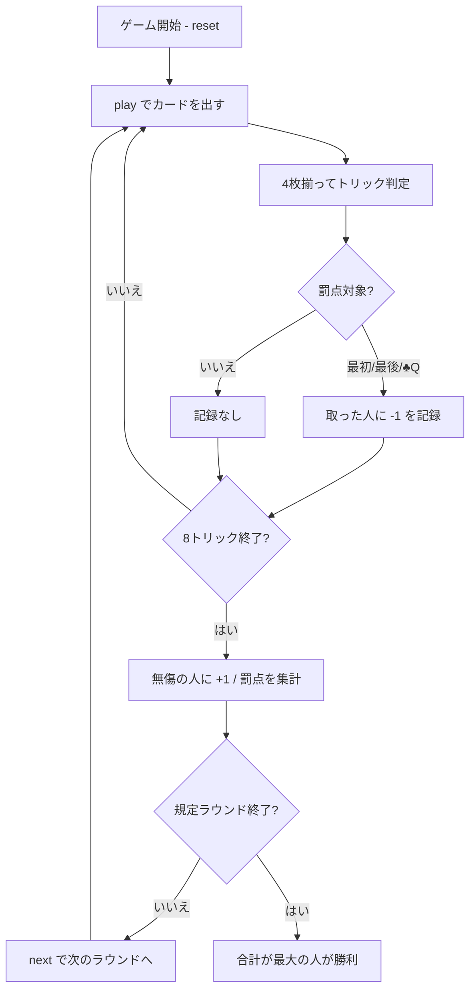

# スロバーハンネス（CUI版）遊び方

## ゲーム概要

ドイツ・低地地方の**回避型**トリックテイキング。4人（あなた＋CPU3人）で、ピケット32枚を使って8トリックを戦う。狙いは取ることではなく**取らないこと**。最初のトリック・最後のトリック・♣Qを含むトリックを取ると失点し、3つとも避けきればボーナスが入る。

## 起動方法

```sh
go run ./cmd/trumpcards slobberhannes
go run ./cmd/trumpcards --lang en slobberhannes  # 英語モード
```

## ルール

### 配り方

- **ピケット32枚**（A・7・8・9・10・J・Q・K × 4スート）
- 4人に**8枚ずつ**配りきる。1ラウンドは8トリック
- 既定は**4ラウンド**（1〜12で変更可）

### トリックの取り方

- **切り札はありません。** リードされたスートの最強札がそのトリックを取る
- 強さは **A > K > Q > J > 10 > 9 > 8 > 7**
- **リードのスートを持っていれば必ず出す**（フォロー義務）。無ければ何を出してもよい
- 他スートの札は、どれだけ強くてもトリックを取れません

### 得点

罰点は3つ。いずれも **-1点**:

| 罰 | 条件 |
|----|------|
| 最初 | **1トリック目**を取る |
| 最後 | **8トリック目**を取る |
| ♣Q | **♣Qを含む**トリックを取る |

3つとも避けたプレイヤーには **+1点**。したがって1ラウンドの得点は **+1 / 0 / -1 / -2 / -3** のいずれかで、**合計が最も大きいプレイヤーが勝ち**。

罰は「その札を出した人」ではなく「**そのトリックを取った人**」に付きます。

## ゲームの流れ



## コマンド一覧

| コマンド | 短縮形 | 説明 |
|----------|--------|------|
| `play <idx>` | `p` | 手札の `<idx>` 番目のカードを出す |
| `next` | `n` | 次のラウンドを開始する |
| `hint` | `h` | 打つべき札とその狙いを表示する |
| `giveup` | `g` | 投了する |
| `log` | `l` | 棋譜（アクションログ）を表示する |
| `reset` | `r` | 最初からやり直す |
| `quit` | `q` | 終了する |
| `help` | `?` | コマンド一覧を表示 |

## 画面の見方

```
==========
Slobberhannes (スロバーハンネス)
==========
ラウンド: 1/4  トリック: 1/8
切り札なし。リードのスートの最強札がトリックを取ります。
！ 最初のトリックです。取ると -1 点。
あなた: 0点 [無傷] 手札8枚
  [0]♠7 [1]♠K [2]♣9 [3]♣Q ...
CPU1: 0点 [初] 手札8枚
CPU2: 0点 [無傷] 手札8枚
CPU3: -1点 [♣Q] 手札8枚
----------
手番: あなた
play <idx>・・・カードを出す
```

- **1行目**: 何ラウンド目の何トリック目か
- **2行目**: 切り札が無いことの明示。強い札が必ず勝つわけではない点に注意
- **警告行**: 最初と最後のトリックでだけ出ます。**中身に関係なく危険**
- **`[...]`**: そのラウンドで受けている罰。`初`=最初のトリック、`終`=最後のトリック、`♣Q`=クラブのクイーン、`無傷`=まだ何も受けていない
- **`[n]`**: `play <n>` で指定する手札の番号

## 遊び方のコツ

- **最初のトリックは低い札で降りる。** 1トリック目は誰も情報を持っていないので、素直に安い札を出すのが安全
- **♣Qは早めに手放す。** 持っていると、クラブがリードされたときフォロー義務で出さざるを得なくなり、しかも自分が取ってしまう場面が来ます
- **クラブの高い札（A・K）が危険。** ♣Qが出ているトリックを、自分のA・Kが取ってしまいます
- **最後のトリックを見越して、低い札を1枚残す。** 8トリック目に高い札しか残っていないと確実に取らされます
- **中間のトリックが高い札の処分どき。** 罰点の絡まないトリックでA・Kを安全に捨てておく
- **+1は大きい。** 4ラウンドで全部無傷なら +4。罰を1つ受けるだけで差が2点開きます
