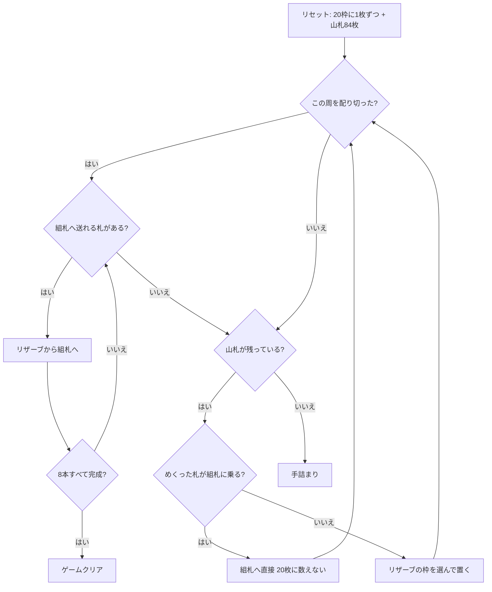

# スライ・フォックス（CUI版）遊び方

## ゲーム概要

52 枚 2 組の 104 枚を、**20 枠のリザーブ**と 8 本の組札で捌く一人用ソリティア。

このゲームの判断は実質ひとつしかない — **めくった札をどの枠に置くか**。置ける枠に制限は無いが、置けばその下の札は掘り出すまで使えない。そして **20 枚配り切るまで、リザーブから組札へは 1 枚も送れない**。置き場所を 20 回先に決めきってから収穫する、この一方通行が「ずる賢い狐」の名の由来になっている駆け引きそのもの。

## 起動方法

```sh
go run ./cmd/trumpcards slyfox
go run ./cmd/trumpcards --lang en slyfox   # 英語
```

## ルール

- 52 枚 2 組（104 枚）。**20 枠のリザーブに 1 枚ずつ**配り、残り 84 枚が山札
- **組札は 8 本**。前半 4 本は各スート A から K への昇順（↑）、後半 4 本は各スート K から A への降順（↓）。8×13 = 104 枚がちょうど収まる。**最初は空**で、A や K が出てきたときにそこから始まる
- **捨て札は無い。**めくった札はその場で行き先を決める ── リザーブの好きな枠へ置くか、置ける組札があればそちらへ直接送る
- **20 枚配り切るまで、リザーブから組札へは送れない。**組札へ直接送った札は 20 枚に数えない（良い引きが罰にならないように）
- **リザーブの札は組札へしか送れない**。リザーブ同士の移動は無い
- **空いた枠は補充されない。**次に配るときの置き場所として使うだけ
- 山札が尽きたら制限は解け、残ったリザーブだけで詰めていく
- 8 本すべてが 13 枚になれば勝ち

> 補足: クローン元のコロラドとは 3 点異なる。両者は資料上しばしば混同され（Wikipedia は一方から他方へリダイレクトする）、PySolFC は別ゲームとして実装している。差は (1) コロラドは捨て札を挟む、(2) コロラドはいつでもリザーブから組札へ送れる、(3) コロラドは空き枠を山札から直接埋められる ── の 3 点。

## ゲームの流れ



## コマンド一覧

| コマンド | 短縮形 | 説明 |
|----------|--------|------|
| `deal <枠>` | `d` | 山札から 1 枚、リザーブ枠 `<枠>` (0..19) へ配る |
| `deal f <組札>` | `d` | 山札の 1 枚をそのまま組札 `<組札>` (0..7) へ（20 枚に数えない） |
| `m t <枠>` |  | リザーブ枠 `<枠>` (0..19) の最上段を組札へ |
| `hint` | `h` | ヒントを表示する |
| `autocomplete` | `ac` | 送れるカードを自動で組札へ送る |
| `undo` | `u` | 1 手戻す |
| `giveup` | `g` | ギブアップ |
| `log` | `l` | 棋譜（アクションログ）を表示する |
| `reset` | `r` | 最初からやり直す |
| `quit` | `q` | 終了する |
| `help` | `?` | コマンド一覧を表示 |

## 画面の見方

```
基礎札(↑=A→K, ↓=K→A): ↑♠A | ↑(空) | ↑(空) | ↑(空) | ↓♠K | ↓(空) | ↓(空) | ↓♦K
山札: 71枚
この周: 13/20 枚配り済み。あと 7 枚配るまでリザーブから組札へは送れません
----------
（各枠は <> の 1 枚だけが動かせます。m t <枠> で基礎札へ送ります）
枠0: <♥12>
枠1: [空]
枠2: ♣3  <♦9>
...
枠19: <♠2>
----------
手数: 13
```

- 先頭の**↑と↓**が組札の向き。↑ は A から K へ、↓ は K から A へ積みます
- **3 行目が周の進み。**「あと何枚配ればリザーブが開くか」がここにしか出ないので、送れないときはまずここを見ます
- `枠0`〜`枠19` がリザーブ。**`<>` で囲まれた一番右（最上段）だけが動かせます。**その下の札は埋まっているので、番号も振りません（`m t <枠>` が取るのは枠番号だけです）
- `[空]` の枠は補充されません。次に配るときの置き場所です

## 遊び方のコツ

- **20 枚は先に払う代金。**配り始めたら、その周のあいだは組札へ送れません。周が明けた直後に何を送れるかを見越して置き場所を選びます
- **組札へ直接送れる札は必ず送る。**20 枚に数えないので、実質ただで 1 枚減らせます
- **どこに埋めるかがすべて。**置く先の枠の一番上を見て、「その札が組札に必要になるまで何枚あるか」が一番遠い枠を選びます。`hint` はこの基準で枠を選んでいます
- **同じ数字の札は 2 枚あります。**1 枚は昇順の組札へ、もう 1 枚は降順の組札へ入るので、K を昇順の 13 枚目に使っても降順の 1 枚目は必ず別の K が回ってきます
- 山札はめくり直しが無いので、周が明けたら送れるものは送っておく
