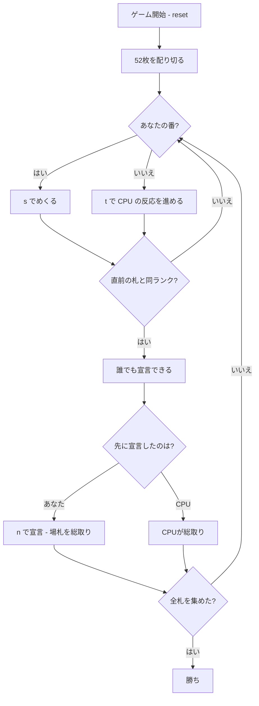

# スナップ（CUI版）遊び方

## ゲーム概要

イギリス発祥の**反射ゲーム**。順番に1枚ずつめくり、**直前に出た札と同じランクが続いた瞬間**に宣言した人が場札を総取りします。**トリガーは固定ではありません**——常に「1つ前の札」との比較なので、場札が1枚のあいだは決して成立しません。全札を1人が集めたら勝ちです。2〜4人で遊べます。

## 起動方法

```sh
go run ./cmd/trumpcards snap
go run ./cmd/trumpcards --lang en snap  # 英語モード
```

## ルール

### 配り

52枚を配り切ります。**3人だと割り切れない**（52 ÷ 3 = 17 余り 1）ので、1枚多い席が出ます。余りを捨てると札が消えてしまうため、1枚ずつ配り切る方式です。

### めくる

手番の人が自分のストックの先頭を1枚、場に表向きで出します。

### 宣言（スナップ）

**場札のいちばん上と、その1つ前が同じランク**になった瞬間、誰でも宣言できます。最初に宣言した人が**場札を総取り**し、その人が次にめくります。

| 場の状態 | 成立する? |
|----------|-----------|
| 空 | いいえ |
| ♠7 のみ | **いいえ**（比べる相手がいない） |
| ♠7 → ♥9 | いいえ |
| ♠7 → ♥7 | **はい**（スートは関係ない） |
| ♠7 → ♥7 → ♣2 | いいえ（**見るのは上2枚だけ**） |

### 誤宣言

成立していないのに宣言すると、**ペナルティとして自分のストックから1枚を場に差し出します**。場札が増えるので、次に取った人の得が大きくなります。

### 脱落と勝敗

ストックが尽きた席は飛ばされます。**全札を1人が集めたら勝ち**です。

### CPU の反応

CPU は「いつ宣言するか」を反応時間つきで予約し、`tick` で時間を進めたときに発火します。**期限より前に宣言できれば人間の勝ち**です。難易度で反応時間の平均が変わります（遅い1400ms／ふつう900ms／速い500ms、下限80ms）。

## ゲームの流れ



## コマンド一覧

| コマンド | 短縮形 | 説明 |
|----------|--------|------|
| `step` | `s` | ストックの先頭を1枚めくる（自分の番のみ） |
| `snap` | `n` | スナップを宣言する（**席は指定しません。常にあなたです**） |
| `tick` | `t` | CPU の反応を進める（予約が期限に達していれば発火） |
| `hint` | `h` | いま宣言すべきかを提示する |
| `giveup` | `g` | 投了する |
| `log` | `l` | 棋譜（アクションログ）を表示する |
| `reset` | `r` | 最初からやり直す |
| `quit` | `q` | 終了する |
| `help` | `?` | コマンド一覧を表示 |

**`snap` はいつでも打てます。** 手番でなくても、成立していなくても——成立していなければペナルティになるだけです。

## 画面の見方

```
==========
Snap (スナップ)
==========
場札: 3枚
順番に1枚ずつめくり、直前に出た札と同じランクが続いた瞬間に「スナップ」と宣言した人が場札を総取りします。トリガーは固定ではなく、常に「1つ前の札」との比較です。場札が1枚のあいだは決して成立しません。誤って宣言すると、ペナルティとして自分のストックから1枚を場に差し出します。
いちばん上: ♥7
*** スナップ成立中！ n で宣言 ***
>あなた: ストック24枚
 CPU1: ストック25枚
----------
CPU1 がめくりました。
めくる番: あなた
s・・・めくる / n・・・スナップ宣言 / t・・・CPUの反応を進める
```

- **場札**: いま積まれている枚数。宣言できれば丸ごともらえます
- **いちばん上**: 直前にめくられた札。**その1つ前と同じランクなら成立**します
- **`*** スナップ成立中！ ***`**: 成立している瞬間だけ出ます。反射ゲームなので一目で分かる必要があります
- **ストック**: 各席の残り枚数。**これが得点そのもの**です
- **イベント行**: 直前に何が起きたか。盤面だけでは、誰が取ったのか読めません

## 遊び方のコツ

- **1枚では絶対に成立しない。** 場が空のときや、めくった直後の1枚目では押さないこと
- **見るのは上2枚だけ。** 下に同ランクが埋まっていても関係ありません
- **誤宣言のコストは二重。** 自分のストックが1枚減り、そのぶん場札が増えて相手の取り分になります
- **`t` を打つまで CPU は動かない。** 落ち着いて場を確認してから進められます。急ぐ必要はありません
- **難易度で勝負が変わる。** 「速い」だと平均500msなので、成立に気付いた瞬間に押す必要があります
