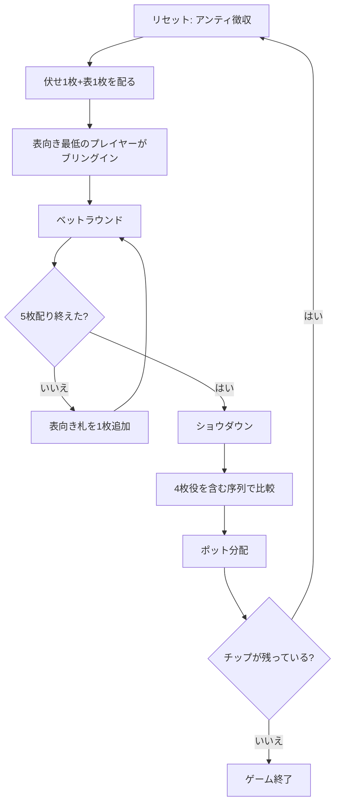

# ソッコ（CUI版）遊び方

## ゲーム概要

フィンランドとカナダで遊ばれるファイブカード・スタッドの派生。カナディアン・スタッドとも呼ばれる。配り方・ブリングイン・ベットラウンドはファイブカード・スタッドとまったく同じで、**違うのはショウダウンの役序列だけ**。

通常の役に加えて「4枚ストレート」と「4枚フラッシュ」の2つが認められ、どちらもワンペアより上・ツーペアより下に入る。5枚全部が揃わなくても中間的な役が成立するため、ワンペアで降りるしかない手が戦える手に変わる。

## 起動方法

```sh
go run ./cmd/trumpcards soko
go run ./cmd/trumpcards --lang en soko   # 英語
```

## ルール

- 52 枚 1 組。1〜5人の CPU と対戦（卓サイズは 2〜6 人で設定可能）
- アンティを支払い、伏せ札1枚＋表向き札1枚を配る。表向き札が最も低いプレイヤーがブリングインを支払う
- 以降 3rd / 4th / 5th ストリートで表向き札を1枚ずつ配り、各ストリートでベットラウンドを行う（計5枚＝伏せ1枚＋表4枚）
- ベットの手番順は、表向き札の見た目の強さで毎ストリート変わる
- ショウダウンで役を比較し、最も強い手がポットを獲得する。**役の序列は下表**
- チップが尽きたプレイヤーは脱落。リバイ／アドオンを有効にすると復帰できる

### 役の序列（強い順）

| 役 | 備考 |
|----|------|
| ロイヤルフラッシュ 〜 スリーカード | 通常のポーカーと同じ |
| **ツーペア** | |
| **4枚フラッシュ** | ちょうど4枚が同じスート |
| **4枚ストレート** | ちょうど4枚が連続ランク（A-2-3-4 と J-Q-K-A の両方が有効） |
| **ワンペア** | |
| ハイカード | |

- 4枚役はワンペアと**同時に成立しうる**（ペアがあると残りのランクが4種になるため）。その場合は上位の4枚役として扱う。例: ♠2 ♠5 ♠9 ♠K ♥K はキングのペアではなく4枚フラッシュ
- 5枚すべて同スートなら本物のフラッシュ、5枚連続なら本物のストレートで、4枚役より上

## ゲームの流れ



## コマンド一覧

| コマンド | 短縮形 | 説明 |
|----------|--------|------|
| `fold` | `f` | フォールド |
| `check` | `ck` | チェック |
| `call` | `c` | コール |
| `bet <額>` | `b` | ベット |
| `raise <額>` | `ra` | レイズ |
| `allin` | `a` | オールイン |
| `rebuy` |  | チップを買い直す |
| `skiprebuy` |  | リバイを見送る |
| `addon` |  | アドオンでチップを追加する |
| `skipaddon` |  | アドオンを見送る |
| `muck` |  | ショウダウンで手を見せずに降りる |
| `show` |  | ショウダウンで手を見せる |
| `log` | `l` | 棋譜（アクションログ）を表示する |
| `reset` | `r` | 最初からやり直す |
| `quit` | `q` | 終了する |
| `help` | `?` | コマンド一覧を表示 |

## 画面の見方

```
Phase: 5th Street  Pot: 240
--- CPU 1 (chips 860) ---
  伏せ: [??]  表: ♦7 ♠7 ♥2 ♣11
--- You (chips 780) ---
  伏せ: ♠2   表: ♠5 ♠9 ♠13 ♥13
  役: Four-Card Flush
```

- 「伏せ」は自分だけ見える1枚。CPU の伏せ札はショウダウンまで `[??]`
- 「表」は全員に見える4枚。ベットの手番順はこの見た目で決まる。**末尾の `<` 印**はそのストリートで新しく公開された1枚
- 「役」は現在の手の役名。**Soko の序列で表示される**ので、同じ5枚でもファイブカード・スタッドとは違う名前になることがある（上の例は標準ポーカーなら One Pair）
- `Pot` は現在のポット総額。サイドポットがある場合は精算時に内訳が表示される

## 遊び方のコツ

- **4枚フラッシュ狙いは降りにくくなる。** 同スートが3枚見えている時点で、残り2枚のどちらかが同スートなら役になる。ファイブカード・スタッドなら捨てる手が戦える
- 4枚ストレートは**内側の抜け（5-6-_-8）でも上下どちらかが埋まれば成立**するので、連続3枚が見えたら追う価値がある
- ただし**4枚役はツーペアに負ける**。相手の表向き札にペアが見えているときは、4枚役でも降り時
- 相手の表向き札の同スートが4枚見えたら、その相手は4枚フラッシュ以上が確定に近い
- ワンペア同士の勝負が減るので、ファイブカード・スタッドよりショウダウンまで進む頻度が上がる。序盤のベットは控えめに
