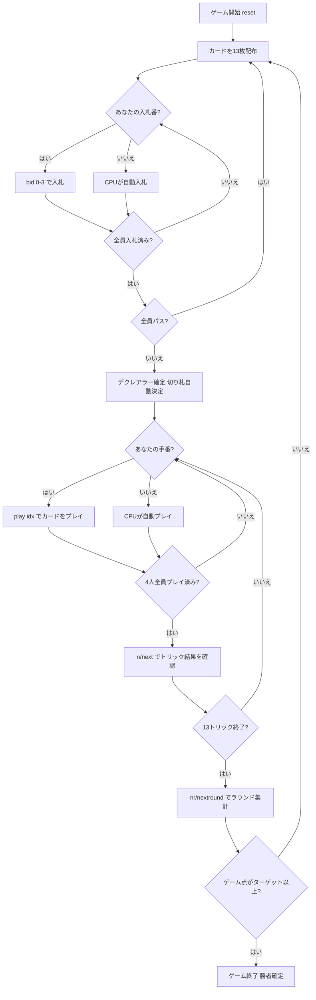

# ソロ・ホイスト（CUI版）遊び方

## ゲーム概要

Solo Whist（ソロ・ホイスト）はイギリスで広く親しまれているトリックテイキングゲームです。52枚の標準デッキを4人でプレイします。各ラウンドの最初に**入札フェーズ**があり、最高入札者が**デクレアラー**（宣言者）として1人で3人の**ディフェンダー**と対戦します。デクレアラーがコントラクトを達成すればそのコントラクトの価値分のゲーム点を獲得し、失敗すれば各ディフェンダーが同じ点数を獲得します。先にターゲット（デフォルト21点）に達したプレイヤーがマッチ勝利です。

## 起動方法

```sh
go run ./cmd/trumpcards solowhist
go run ./cmd/trumpcards --lang en solowhist  # 英語モード
```

## ルール

### デッキと配布

- **デッキ**: 52枚（A,2-10,J,Q,K × 4スート）
- **プレイヤー**: 4人（プレイヤー0 = あなた、プレイヤー1〜3 = CPU）
- **配布**: 各プレイヤー13枚、計13トリック
- **カードの強さ（高い順）**: A > K > Q > J > 10 > 9 > 8 > 7 > 6 > 5 > 4 > 3 > 2

### 入札フェーズ

ディーラーの左隣から時計回りに、各プレイヤーが1回だけ入札します。入札できるコントラクトは以下のとおりです（弱い順）。

| コントラクト | 値 | 内容 |
|--------------|-----|------|
| **Pass（パス）** | — | 入札をパスする |
| **Solo（ソロ）** | 2 | 単独で8トリック以上取ることを宣言 |
| **Misère（ミゼール）** | 3 | 単独で0トリックを取ることを宣言（切り札なし） |
| **Abundance（アバンダンス）** | 4 | 単独で9トリック以上取ることを宣言 |

- 先の入札より高いコントラクトのみ上書きできます（Pass < Solo < Misère < Abundance）。
- 全員がパスした場合はそのラウンドは無効となり、再配布されます。
- 最高入札者が**デクレアラー**となり、他の3人が**ディフェンダー**として対戦します。
- 伝統的な「Prop & Cop」（2人同盟）は省略されており、デクレアラーは常に1対3で戦います。

### 切り札

- **Solo / Abundance**: デクレアラーの手札で最も枚数の多いスートが自動的に切り札スートになります（簡易実装）。
- **Misère**: 切り札はありません。

### トリック・テイキング

- **スートフォロー義務**: リードされたスートのカードを持っている場合は必ず出さなければなりません。
- 持っていない場合は任意のカードを出せます（切り札でも他スートでも可）。
- **トリックの勝者**:
  - 切り札スートのカードが場にあれば、最も強い切り札カードが勝ちます。
  - 切り札がなければ、リードスートの最も強いカードが勝ちます。
- トリックの勝者が次のトリックをリードします。

### 得点計算と勝利条件

| 結果 | 得点 |
|------|------|
| デクレアラーがコントラクト達成 | デクレアラーがコントラクト値（Solo=2, Misère=3, Abundance=4）を獲得 |
| デクレアラーがコントラクト失敗 | **各**ディフェンダーがコントラクト値を獲得 |

**マッチ勝利**: 先にターゲット（デフォルト **21** ゲーム点）に達したプレイヤーが勝利。

## ゲームの流れ



## コマンド一覧

| コマンド | 短縮形 | 説明 |
|----------|--------|------|
| `bid <0-3>` | — | 入札する（0=Pass, 1=Solo, 2=Misère, 3=Abundance） |
| `pass` | — | パスする（bid 0 と同じ） |
| `play <idx>` | — | 手札のidx番目のカードを出す（トリックフェーズ） |
| `next` | `n` | 次のトリックへ進む（トリック終了後） |
| `nextround` | `nr` | 次のラウンドへ進む（13トリック終了後） |
| `setdifficulty <0-2>` | `sd <0-2>` | CPU難易度設定（0=Easy, 1=Normal, 2=Hard） |
| `log` | `l` | アクションログを表示 |
| `reset` | `r` | 新しいゲームを開始（設定保持） |
| `quit` | `q` | ゲーム終了 |
| `help` | `?` | コマンド一覧を表示 |

## 画面の見方

```
==========
Solo Whist (ソロ・ホイスト)
==========
ラウンド: 1  トリック: 0
ゲーム点: あなた=0  CPU1=0  CPU2=0  CPU3=0
----------
フェーズ: BID
入札状況: あなた=?  CPU1=?  CPU2=?  CPU3=?
あなたの手番です。入札してください。
bid <0-3>  (0=Pass, 1=Solo, 2=Misère, 3=Abundance)

==========
ラウンド: 1  トリック: 1
ゲーム点: あなた=0  CPU1=0  CPU2=0  CPU3=0
切り札: ♠  デクレアラー: CPU1 [Solo]
You: 13枚 [ディフェンダー]
[0]A♥ [1]K♥ [2]Q♠ [3]J♦ [4]10♣ [5]9♠ [6]8♥ ...
CPU1: 13枚 [デクレアラー]  CPU2: 13枚 [ディフェンダー]  CPU3: 13枚 [ディフェンダー]
----------
宣言者: 5/8 トリック (残り3)
フェーズ: PLAY
あなたの手番です。カードを出してください。
play <idx>
```

- **フェーズ: BID**: 入札フェーズ。各プレイヤーが1回入札します。
- **フェーズ: PLAY**: トリックフェーズ。スートフォロー義務に従いカードを出します。
- **切り札行**: 現在の切り札スートとデクレアラー・コントラクト表示。
- **ゲーム点行**: 各プレイヤーの累積ゲーム点。
- **`[n]`付き行**: あなたの手札（インデックス付き）。
- **契約進捗行**: PLAY / トリック終了フェーズで表示。宣言者の獲得トリック数と必要数（残りトリック数付き）。届かないことが確定すると「達成不可能が確定」、達成すると「達成」が付きます
- **ミゼールの進捗行**: 必要トリックが0なので専用の文言になり、**1トリックでも取った瞬間に「達成不可能が確定」**と表示されます

## 遊び方のコツ

- **入札の判断**: Solo（8トリック以上）は手札のA・Kが4枚以上あれば検討できます。Abundance（9トリック以上）は強いカードが多数ある場合のみ宣言しましょう。Misèreは弱いカードで揃っていること（2〜5が多く、Aが少ない）が条件です。
- **デクレアラーは切り札を引き出せ**: Solo / Abundance では、デクレアラーの最長スートが切り札になります。序盤に切り札リードを繰り返してディフェンダーの切り札を消費させると、後半の高得点スートで安全にトリックを取れます。
- **ディフェンダーは連携して阻止**: 3人のディフェンダーは互いに協力します。デクレアラーが強いスートでリードしてきたら、他のディフェンダーの高いカードが勝てるよう低いカードを捨ててサポートしましょう。
- **Misèreはボイドを活用**: Misèreのデクレアラーは切り札なしで0トリックを目指します。手札の強いカードを早めに捨てるため、ボイド（そのスートを持たない）状態を意図的に作ることが重要です。ディフェンダーはデクレアラーが強いカードを捨てられないよう、そのスートをリードし続けましょう。
- **コントラクト価値を意識**: Abundanceは失敗すると各ディフェンダーが4点ずつ（合計12点）獲得します。リスクとリターンを考慮し、手札が確実でなければSoloに留めましょう。
- **スートフォロー義務を利用**: ディフェンダーはデクレアラーが苦手なスートをリードして手札を絞りましょう。デクレアラーが切り札を使わざるを得ない状況を作ることが有効です。
- **得点管理**: ゲーム点は誰が勝っても常に変動します。上位者が宣言者になりやすい状況では、ディフェンダーに回るチャンスを活かして複数人で点数を分散させましょう。
