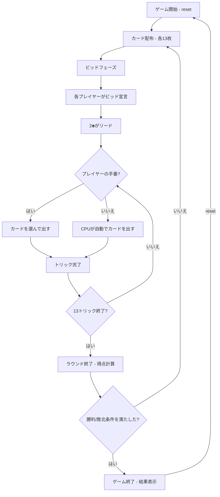

# スペード（CUI版）遊び方

## ゲーム概要

4人（プレイヤー1人 + CPU 3人）で遊ぶトリックテイキング型カードゲームです。スペードが常にトランプ（切り札）で、各ラウンド開始時にビッド（獲得予想トリック数）を宣言します。先に500点に到達したプレイヤーが勝者です。

## 起動方法

```sh
go run ./cmd/trumpcards spades
go run ./cmd/trumpcards --lang en spades  # 英語モード
```

## ルール

### 基本ルール

- 52枚のトランプを4人に配布（1人13枚）
- **スペードが常にトランプ（切り札）**
- 各ラウンド開始時にビッド（0〜13）を宣言
- ビッド0 = ニル（高リスク・高リターン）
- 2♣を持つプレイヤーが最初のトリックをリード
- リードスートに従う（フォロースート）。スペードはブレイクされるまでリードできない
- トリックの勝者: スペード（トランプ）が出ていれば最高のスペード、なければリードスートの最高値

### 得点

- **ビッド成功**: ビッド×10 + オーバートリック（バッグ）
- **ビッド失敗**: -ビッド×10
- **ニル成功**: +100点
- **ニル失敗**: -100点
- **バッグペナルティ**: 累積10バッグごとに-100点

### ゲーム終了

- **勝利条件**: 先に500点に到達
- **敗北条件**: -200点以下

### CPU難易度

- **Easy** (0): ランダムにカードを出す
- **Normal** (1): 基本的なトリック戦略（デフォルト）
- **Hard** (2): 戦略的なプレイ（カウンティング等）

## ゲームの流れ



## コマンド一覧

| コマンド | 短縮形 | 説明 |
|----------|--------|------|
| `reset` | `r` | ゲームリセット（設定保持） |
| `bid <n>` | `b <n>` | ビッドを宣言（0=ニル, 1-13） |
| `play <idx>` | `p <idx>` | カードをプレイ（インデックス指定） |
| `next` | `n` | 次のトリックへ |
| `nextround` | `nr` | ラウンドをスコアリングして次のラウンドへ |
| `setdifficulty <0-2>` | `sd <0-2>` | CPU難易度設定（0=Easy, 1=Normal, 2=Hard） |
| `setlimit <n>` | `sl <n>` | ポイント上限設定 |
| `hint` | `h` | 推奨カード/ビッドのヒントを表示（ビッド・プレイフェーズで使用可） |
| `log` | `l` | 棋譜表示 |
| `quit` | `q` | ゲーム終了 |
| `help` | `?` | ヘルプ表示 |

### コマンド例

- `b 3` → ビッド3を宣言
- `b 0` → ニルビッドを宣言
- `p 2` → インデックス2のカードを出す
- `sd 2` → CPU難易度をHardに設定
- `sl 300` → ポイント上限を300に設定
- `h` → 推奨カード/ビッドのヒントを表示

## 画面の見方

```
==========
Spades (スペード)
==========
ラウンド 2 / トリック 5
スペードブレイク: はい
----------
[You]: 120点 (ビッド: 4, 獲得: 3, バッグ: 2)
[0]SPADE 5  [1]CLOVER 8  [2]HEART K  [3]DIAMOND 3  ...
CPU 1: 80点 (ビッド: 3, 獲得: 2)
CPU 2: 150点 (ビッド: 5, 獲得: 5)
CPU 3: 60点 (ビッド: 0(ニル), 獲得: 0)
----------
現在のトリック:
  CPU 1: CLOVER 10
  CPU 2: CLOVER K
手番: あなた
p <idx>・・・カードを出す
==========
```

- `ラウンド N / トリック M`: 現在のラウンドとトリック番号
- `スペードブレイク`: スペードがブレイクされたかどうか
- `[You]: N点 (ビッド: X, 獲得: Y, バッグ: Z)`: プレイヤーの累計得点、ビッド数、獲得トリック数、バッグ数
- `[0]SPADE 5`...: インデックス付きの手札カード
- `現在のトリック`: 現在のトリックに出されたカード

## 遊び方のコツ

- スペードの高いカード（A♠、K♠）を持っている場合はビッドを多めに設定しましょう
- ニルビッドは手札に高いカードが少ない場合のみ狙いましょう
- バッグ（オーバートリック）が累積10に近い場合は、トリックを取りすぎないよう注意しましょう
- 特定のスートをボイド（手札からなくす）にして、スペードで切る戦略が有効です
- 他のプレイヤーのビッドと獲得トリック数を把握し、戦略を調整しましょう
- 迷った時は `h` コマンドでヒントを表示できます。ビッドフェーズでは推奨ビッド数、プレイフェーズでは推奨カードが表示されます
