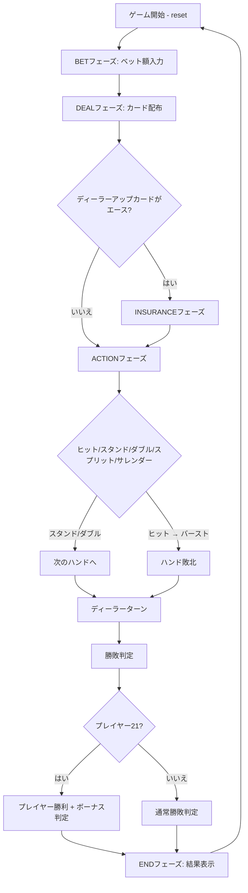

# スパニッシュ21（CUI版）遊び方

## ゲーム概要

Spanish 21（スパニッシュ21）は、ブラックジャックのバリアントです。10のカード（10のみ、J/Q/Kは残す）を抜いた48枚×4スートのSpanishデッキを使用し、プレイヤーの21は常に勝利します（ディーラーも21でも勝ち）。さらに、5枚以上で21を作る、6-7-8や7-7-7のトリオを作るなどの特殊ハンドにボーナス配当が付きます。基本のプレイ操作・コマンドはブラックジャックと共通です。

## 起動方法

```sh
go run ./cmd/trumpcards spanish21
go run ./cmd/trumpcards --lang en spanish21  # 英語モード
go run ./cmd/trumpcards sp21                 # 短縮形
go run ./cmd/trumpcards s21                  # 短縮形
```

## ルール

### Spanishデッキ

- 各スートから値10のカード（10のみ）を除外、J/Q/K（10点扱い）は残す
- 1組48枚 × 4スート = 192枚（標準では1〜8デッキのシューを使用、本実装はデフォルト1デッキ）

### ブラックジャックとの違い

| 項目 | ブラックジャック | Spanish 21 |
|------|------------------|------------|
| デッキ | 52枚 | 48枚（10を除く） |
| プレイヤー21 vs ディーラー21 | プッシュ（引き分け） | プレイヤー勝利 |
| プレイヤーBJ vs ディーラーBJ | プッシュ（引き分け） | プレイヤー勝利 |
| ボーナス配当 | なし | 5/6/7+枚21、6-7-8、7-7-7（後述） |

### ボーナス配当

ボーナスは「ダブルダウンしていない」勝利ハンドにのみ適用されます。ナチュラルブラックジャック（最初の2枚で21）はBJ配当（3:2）が優先され、ボーナスは付与されません。

| 種類 | 配当 |
|------|------|
| 5枚で21 | 3:2 |
| 6枚で21 | 2:1 |
| 7枚以上で21 | 3:1 |
| 6-7-8 異なるスート | 3:2 |
| 6-7-8 同一スート | 2:1 |
| 6-7-8 全スペード | 3:1 |
| 7-7-7 異なるスート | 3:2 |
| 7-7-7 同一スート | 2:1 |
| 7-7-7 全スペード | 3:1 |

その他のルール（ヒット、スタンド、ダブルダウン、スプリット、インシュランス、サレンダー、サイドベット）はブラックジャックと共通です。詳細は [`docs/manual/cui/blackjack.md`](blackjack.md) を参照してください。

## ゲームの流れ



## コマンド一覧

| コマンド | 短縮形 | 説明 |
|----------|--------|------|
| `reset` | `r` | 新しいゲームを開始 |
| `bet <額>` | `b <額>` | ベット |
| `hit` | `h` | カードを1枚引く |
| `stand` | `s` | スタンド |
| `doubledown` | `d` | ダブルダウン |
| `split` | `sp` | スプリット |
| `surrender` | `sur` | サレンダー（半額返金） |
| `insurance` / `declineinsurance` | `i` / `di` | インシュランス受諾/辞退 |
| `quit` | `q` | ゲーム終了 |
| `help` | `?` | コマンド一覧を表示 |

## 画面の見方

```
==========
Spanish 21
==========
Player: 1000 chips    Deck: 1 deck
Dealer: 1000 chips

Phase: ACTION
Dealer hand: ♠K, ??
Your hand:   ♥7, ♦7, ♣7  (Score: 21)
==> 7-7-7 (mixed): bonus 3:2 expected on win
```

ボーナスが適用された場合、結果フェーズの棋譜（actionログ）に `bonus: spanish21.bonus.<key>` 形式で記録されます。

## 遊び方のコツ

- 10のカードがデッキに無いため、ヒットでバーストしにくい一方、ディーラーがブレイクしにくい
- 5枚以上の21を狙えるシチュエーションでは積極的にヒットして良い場合がある（ボーナス3:2〜3:1）
- ダブルダウンするとボーナス対象外になるので、ボーナスが狙える手では基本ヒットを優先
- 7-7-7（特に全スペード）は希少だが配当が大きい
