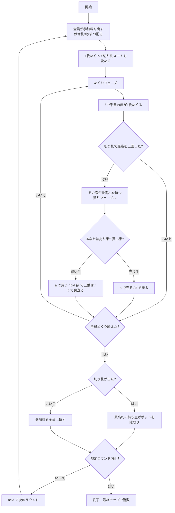

# スペキュレーション（CUI版）遊び方

## ゲーム概要

18〜19世紀のイギリスで遊ばれた**純粋な競り（オークション）ゲーム**です。トリックテイキングも役の強さもありません。あるのは「その札は他人にとっていくらの値打ちがあるか」だけです。

全員が参加料をポットに出し、伏せ札を3枚ずつ受け取ります。もう1枚めくって**切り札スート**を決めたら、順番に自分の伏せ札を1枚ずつ表にしていきます。**切り札以外は何を出しても関係ありません。** 出た札がそれまでの最高切り札を上回ると、その持ち主に対して他家が「その札を買いたい」と値を付けます。持ち主は売っても断ってもかまいません。

全員がめくり終えた時点で最高の切り札を持っている人がポットを総取りします。

## 起動方法

```sh
go run ./cmd/trumpcards speculation
go run ./cmd/trumpcards --lang en speculation   # 英語モード
```

## ルール

### 基本ルール

- 52枚のトランプ（ジョーカーなし）を使用
- 参加は人間1人 + CPU 1〜7人（既定は4人卓）
- 各自に伏せ札3枚。さらに1枚めくって切り札スートを決める（この札は誰の手にもならない）
- 全員が参加料（既定10）をポットに出す
- 手番の席が伏せ札を1枚めくる
- **切り札で、かつそれまでの最高を上回った**とき、その札の持ち主が「最高札」を持つ
- 最高札が動くと競りが開く。買い手が値を付け、持ち主が売るか断るかを決める
- 全員がめくり終えたら、最高切り札の持ち主がポットを総取り

### 札の強さ

**Aは14**として扱い、Kより強くなります。1のままだと最強の札が最弱になってしまいます。

| 札 | 強さ |
|----|------|
| A | 14（最強） |
| K | 13 |
| Q | 12 |
| J | 11 |
| 10〜2 | 数字どおり |

**切り札スート以外の札には強さがありません。** 何枚出ても競りの対象になりません。

### 覚えておくと違う3つの扱い

| 状況 | この実装の扱い | なぜ |
|------|---------------|------|
| 参加料を払えない席がある | **席は残り、出せるだけ出す** | 席を外すと座席番号がずれ、ラウンドを跨いだ集計が崩れる |
| 切り札が1枚も出なかった | **参加料を全員に返す** | 繰り越すと、降りた席の負担だけが積み上がる |
| リセットを続けて呼んだ | **未精算のポットを先に返してから集め直す** | 集め直すだけだとチップが消える（実測: 200→190→180でポットは40のまま） |

## ゲームの流れ



## コマンド一覧

| コマンド | 短縮形 | 説明 |
|---------|--------|------|
| `flip` | `f` | 手番の席の伏せ札を1枚めくる |
| `accept` | `a` | 競りの申し出を受ける（売る／買う） |
| `decline` | `d` | 競りの申し出を断る |
| `bid <額>` | | 提示額に**上乗せ**して買う（下回る額は指定できません） |
| `next` | | ラウンド決着後、次のラウンドを始める |
| `hint` | `h` | 助言を表示 |
| `log` | `l` | 棋譜（アクションログ）を表示 |
| `reset` | `r` | ゲームをリセット |
| `help` | `?` | ヘルプを表示 |
| `quit` | `q` | 終了 |

## 画面の見方

```
----------
ラウンド: 1 / 5
ポット: 40
切り札: ♠
フェーズ: めくり
You: チップ 190 / 伏せ札 3枚
CPU1: チップ 190 / 伏せ札 3枚
CPU2: チップ 190 / 伏せ札 3枚
CPU3: チップ 190 / 伏せ札 3枚
----------
```

各席について**チップと伏せ札の枚数**だけが出ます。**中身は出ません** —— 見えていたら、競りでいくら出すべきかが盤面から丸わかりになり、賭けが賭けでなくなります。

```
----------
ラウンド: 1 / 5
ポット: 40
切り札: ♠
フェーズ: 競り
You: チップ 190 / 伏せ札 2枚 【最高札 ♠K】
CPU1: チップ 190 / 伏せ札 2枚
CPU2 があなたの札に 18 を提示しています。a で売る、d で断る。
----------
```

最高札を持っている席は黄色で示され、`【最高札 ♠K】` が付きます。競りフェーズでは申し出の内容と、取れる操作が出ます。

**助言は札の強さではなく残り枚数で決まります。** 伏せ札が大量に残っているうちは、どれだけ強い札でも上を出される可能性が高く、売り時です。残りが少なければ、その札のままポットを取れる公算が高くなります。
