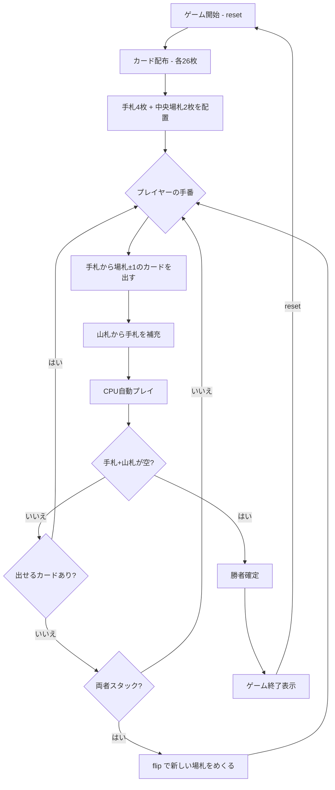

# スピード（CUI版）遊び方

## ゲーム概要

2人（プレイヤー1人 + CPU 1人）で遊ぶスピード系カードゲームです。中央の2つの場札に対して、ランクが±1のカードを素早く出していき、先に手札と山札をすべてなくしたプレイヤーが勝者です。

## 起動方法

```sh
go run ./cmd/trumpcards speed
go run ./cmd/trumpcards --lang en speed  # 英語モード
```

## ルール

### 基本ルール

- 52枚のトランプを2人に26枚ずつ配布
- 各プレイヤーは手札（最大4枚）と山札を持つ
- 中央に2つの場札がある
- 場札のランク±1のカードを手札から出せる（K→Aのラップあり）
- カードを出したら山札から手札を補充する
- 先に手札と山札をすべてなくしたプレイヤーが勝利

### スタック（行き詰まり）

- 両プレイヤーが出せるカードがない場合、スタック状態になる
- スタック時は `flip` コマンドで中央の場札に新しいカードをめくる
- 山札がない場合はゲーム終了

## ゲームの流れ



## コマンド一覧

| コマンド | 短縮形 | 説明 |
|----------|--------|------|
| `reset` | `r` | 新しいゲームを開始 |
| `play idx pile` | `p idx pile` | 手札のカードを場札に出す（idx=手札インデックス, pile=場札インデックス 0or1） |
| `flip` | `f` | スタック時に新しい場札をめくる |
| `hint` | `h` | 出せるカードのヒントを表示 |
| `log` | `l` | アクションログを表示 |
| `quit` | `q` | ゲーム終了 |
| `help` | `?` | コマンド一覧を表示 |

### `play` コマンドの詳細

`p idx pile` の各引数:

| 引数 | 説明 |
|------|------|
| `idx` | 出す手札のインデックス（0から始まる） |
| `pile` | 場札のインデックス（0 = 左, 1 = 右） |

例:
- `p 0 0` → 手札インデックス0のカードを左の場札に出す
- `p 2 1` → 手札インデックス2のカードを右の場札に出す

## 画面の見方

```
==========
Speed (スピード)
==========
CPU: 手札 4枚, 山札 18枚
----------
場札: [HEART 7] [SPADE 10]
----------
[You]: 手札 4枚, 山札 18枚
[0]CLOVER 6*  [1]DIAMOND 8  [2]HEART 3  [3]SPADE Q
手番: あなた
p <idx> <pile>・・・カードを出す
==========
```

- `CPU: 手札 N枚, 山札 M枚`: CPUの手札枚数と山札残り枚数
- `場札: [SUIT VALUE] [SUIT VALUE]`: 中央の2つの場札（左=pile 0, 右=pile 1）
- `[You]: 手札 N枚, 山札 M枚`: プレイヤーの手札枚数と山札残り枚数
- `[0]CLOVER 6`, `[1]DIAMOND 8`...: インデックス付きの手札カード
- 末尾の `*`: いまその札を 2 つの場札のどちらかに出せる印（ランク ±1、K↔A のラップを含む）。出せる札が無いときは 1 つも付きません

## CPU難易度

設定でCPUの強さを3段階から選べます。

| レベル | 名称 | 戦略 |
|--------|------|------|
| 0 | Easy | ランダムに1枚だけ出す |
| 1 | Normal | 貪欲に複数枚を連続で出す |
| 2 | Hard | ブロッキング（相手の手を封じる出し方）とコンボ（連鎖プレイ）を考慮して戦略的に出す |

## 遊び方のコツ

- 場札の±1に合うカードを素早く見つけて出しましょう
- K と A はラップするので、K の場には A を、A の場には K を出せます
- スタック時は `flip` で新しい場札をめくって仕切り直しましょう
- `hint` コマンドで出せるカードを確認できます
