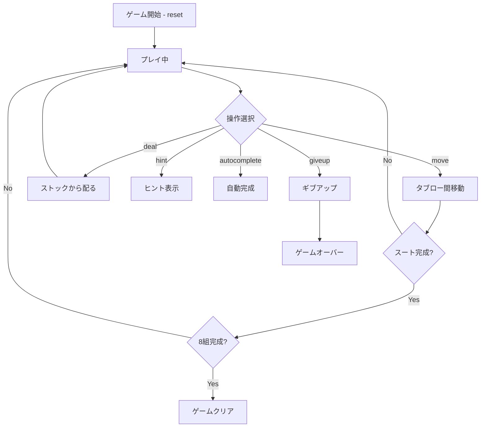

# スパイダー（CUI版）遊び方

## ゲーム概要

1人用のソリティアゲーム。2デッキ（104枚）を使い、10列のタブローで同スート降順のシーケンスを完成させ、K〜Aの13枚を8組すべて除去すれば勝利です。難易度は1/2/4スートから選択できます。

## 起動方法

```sh
go run ./cmd/trumpcards spider
go run ./cmd/trumpcards --lang en spider  # 英語モード
```

## ルール

### 基本ルール
- 2デッキ104枚を使用
- 10列のタブローに配る（最初の4列は6枚、残り6列は5枚、各列の最後の1枚だけ表向き）
- 残り50枚はストック（5回に分けて10枚ずつ配る）
- タブロー間でカードを移動する。値が1つ大きいカードの上に置ける（スート不問）
- 同スート降順の連続シーケンスのみグループ移動可能
- K〜Aの同スート13枚が揃うと自動的に除去される
- 8組すべて除去でゲームクリア

### 難易度
- **1スート（初級）**: スペードのみの104枚
- **2スート（中級）**: スペードとハートの104枚
- **4スート（上級）**: 全4スートの104枚（2デッキ分）

### 得点
- 開始時: 500点
- 移動/配り: -1点
- スート完成: +100点

## ゲームの流れ



## コマンド一覧

| コマンド | 短縮形 | 説明 |
|----------|--------|------|
| `reset [1\|2\|4]` | `r` | 新しいゲームを開始（難易度指定可） |
| `deal` | `d` | ストックから各列に1枚ずつ配る |
| `move t <fromCol> <cardIdx> t <toCol>` | `m` | タブロー間でカードを移動 |
| `giveup` | `g` | ギブアップ |
| `hint` | `h` | ヒントを表示 |
| `autocomplete` | `ac` | 自動完成（全カード表向き時） |
| `undo` | `u` | 直前の操作を取り消す |
| `log` | `l` | 棋譜を表示 |
| `quit` | `q` | ゲーム終了 |
| `help` | `?` | コマンド一覧を表示 |

## 画面の見方

```
==========
Spider Solitaire (スパイダーソリティア)
==========
Completed: 0/8 | Stock: 50枚 | Score: 500
----------
列0: [0]?? [1]?? [2]?? [3]?? [4]?? [5]♠5
列1: [0]?? [1]?? [2]?? [3]?? [4]?? [5]♠K
...
----------
手数: 0
```

## 遊び方のコツ

- まず1スート（初級）で慣れましょう
- 裏カードを開けることを優先する
- 空列を作ると移動の自由度が上がる
- ストックを配る前に空列をなくすこと（空列があるとストックから配れない）
- 同スートの降順シーケンスを意識して組み立てる
