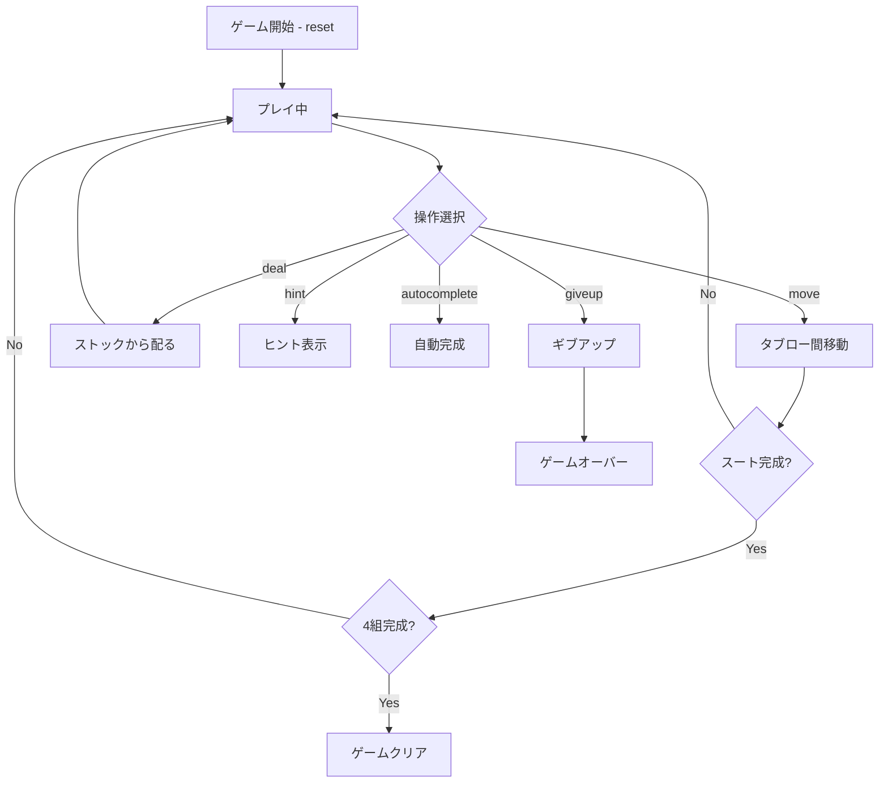

# スパイダレット（CUI版）遊び方

## ゲーム概要

1人用のソリティアゲーム。1デッキ52枚を使い、Klondike と同じ7列の階段配置（列iにi+1枚、最後だけ表向き）からスタートします。スパイダーソリティアと同じ「同スート降順の連続移動」ルールでプレイし、K〜Aの同スートを4組すべて除去すれば勝利です。短時間で遊べる人気バリアントです。

## 起動方法

```sh
go run ./cmd/trumpcards spiderette
go run ./cmd/trumpcards --lang en spiderette  # 英語モード
```

## ルール

### 基本ルール
- 1デッキ52枚（4スート）を使用
- 7列のタブローに配る（列0は1枚、列1は2枚、…列6は7枚。各列の最後の1枚だけ表向き、合計28枚）
- 残り24枚はストック（7枚×3回 + 残り3枚は配り切れない）
- タブロー間でカードを移動する。値が1つ大きいカードの上に置ける（スート不問）
- 同スート降順の連続シーケンスのみグループ移動可能
- K〜Aの同スート13枚が揃うと自動的に除去される
- 4組すべて除去でゲームクリア

### 得点
- 開始時: 500点
- 移動/配り: -1点
- スート完成: +100点

## ゲームの流れ



## コマンド一覧

| コマンド | 短縮形 | 説明 |
|----------|--------|------|
| `reset` | `r` | 新しいゲームを開始 |
| `deal` | `d` | ストックから各列に1枚ずつ配る |
| `move t <fromCol> <cardIdx> t <toCol>` | `m` | タブロー間でカードを移動 |
| `giveup` | `g` | ギブアップ |
| `hint` | `h` | ヒントを表示 |
| `autocomplete` | `ac` | 自動完成（全カード表向き時） |
| `undo` | `u` | 直前の操作を取り消す |
| `log` | `l` | 棋譜を表示 |
| `quit` | `q` | ゲーム終了 |
| `help` | `?` | コマンド一覧を表示 |

## 画面の見方

```
==========
Spiderette (スパイダレット)
==========
完成スーツ: 0/4 | 山札: 24枚 | スコア: 500
----------
列0: [0]♠5
列1: [0]?? [1]♥9
列2: [0]?? [1]?? [2]♣Q
...
列6: [0]?? [1]?? [2]?? [3]?? [4]?? [5]?? [6]♦A
----------
手数: 0
```

## 遊び方のコツ

- 7列構成なので Spider より見通しがよく、短時間で遊べます
- 裏カードを開けることを優先する
- 空列を作ると移動の自由度が上がる
- ストックを配る前に空列をなくすこと（空列があるとストックから配れない）
- 同スートの降順シーケンスを意識して組み立てる
