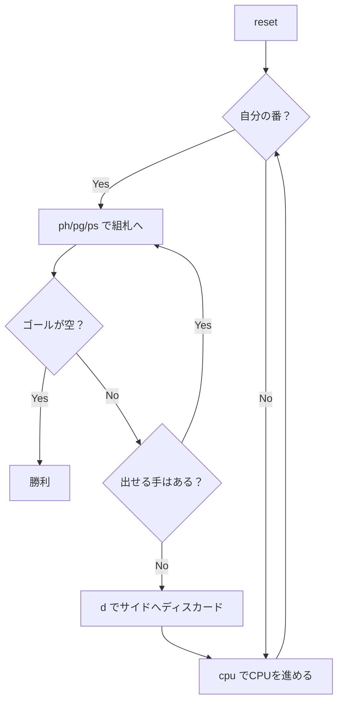

# スパイト・アンド・マリス（CUI版）遊び方

## ゲーム概要

2人対戦型（人間 vs CPU）のレース系カードゲームです（市販ゲーム「Skip-Bo」の原型）。各プレイヤーに割り当てられた「ゴールパイル（自分の山札）」を、中央の共有組札に A から Q まで順に積み上げていき、先に自分のゴールパイルをすべて出し切ったプレイヤーが勝利となります。K はワイルドカードで、任意の値として使えます。

## 起動方法

```sh
go run ./cmd/trumpcards spiteandmalice
go run ./cmd/trumpcards --lang en spiteandmalice  # 英語モード
```

## ルール

- 2デッキ計104枚を使用。シャッフル後、各プレイヤーにゴールパイル20枚（既定値、5〜30枚で設定可能）と手札5枚を配る。残りはストック。
- 組札は中央に最大4スタック並ぶ共有山。A から始めて、A → 2 → ... → Q まで積み上げる。Q で完成し、シャッフルしてストックに戻る。
- K はワイルドで、組札の任意の段に出せる（値はそのまま次の数値として扱う）。
- 自分のターンにできること:
  1. 手札から組札へ出す
  2. ゴールパイルのトップを組札へ出す
  3. サイドパイルのトップを組札へ出す
  4. 手札を1枚サイドパイルに置いてターン終了（ディスカード）
- 手札が0枚になれば自動で5枚補充。ストックが空のときは完成済み山を再シャッフルしてストックへ戻す。
- ゴールパイルを出し切ったプレイヤーが勝者。

## ゲームの流れ



## コマンド一覧

| コマンド | 短縮形 | 説明 |
|----------|--------|------|
| `reset` | `r` | 新しいゲームを開始 |
| `ph <h> <f>` | — | 手札 `<h>` 番目を組札 `<f>` (0..3) に出す |
| `pg <f>` | — | ゴールパイルのトップを組札 `<f>` に出す |
| `ps <s> <f>` | — | サイド `<s>` (0..3) のトップを組札 `<f>` に出す |
| `d <h> <s>` | `discard <h> <s>` | 手札 `<h>` をサイド `<s>` にディスカードしてターン終了 |
| `cpu` | — | CPUターンを1ステップ進める |
| `hint` | `h` | 推奨される手を表示（プレイ不能ならディスカード提案） |
| `log` | `l` | 棋譜を表示（決着後のみ） |
| `quit` | `q` | ゲーム終了 |
| `help` | `?` | コマンド一覧を表示 |

## 画面の見方

```
==========
Spite and Malice (スパイト・アンド・マリス)
==========
[F0] (empty)
[F1] (empty)
[F2] (empty)
[F3] (empty)
----------
[P0 人間] ゴール: ♥9 (残 20) ← 今出せます！
  手札: 0:♠5 1:♥8 2:♦11 3:♣13 4:♠2
  [S0] (empty)
  [S1] (empty)
  [S2] (empty)
  [S3] (empty)
[P1 CPU] ゴール: ♣7 (残 20)
  手札: 5枚
  [S0] (empty) ...
----------
ストック: 64枚 / 完成: 0枚
ターン: 0 (手数 0)
==========
```

- `[F0]`〜`[F3]` が組札。右の `(枚数/12)` が進捗。
- `[P0 人間]` `[P1 CPU]` 各プレイヤーのゴールトップ・手札・サイドパイル。手札はそのプレイヤーのターン中（および CPU）のみ全表示。
- `← 今出せます！`: 自分のゴールトップがいまどれかの組札に出せる印（空の山には A、K はワイルド、完成した山には置けません）。CPU 側には付きません。
- 「ストック」「完成」はゲーム共通の山札情報。

## 遊び方のコツ

- ゴールパイルのトップを出すのが最優先。組札の値が合うように、手札からの中継を意識する。
- ディスカード先のサイドパイルは「同じ値や昇順を意図的に固める」と、後続ターンで連続して組札へ送れる。
- K（ワイルド）は早めに使ってもよいが、相手のゴール top をブロックする狙い手がある場合は温存しておく。
- 相手の進行を遅らせるなら、相手のゴール top の値と一致する手札は組札で使い切ってしまう。
