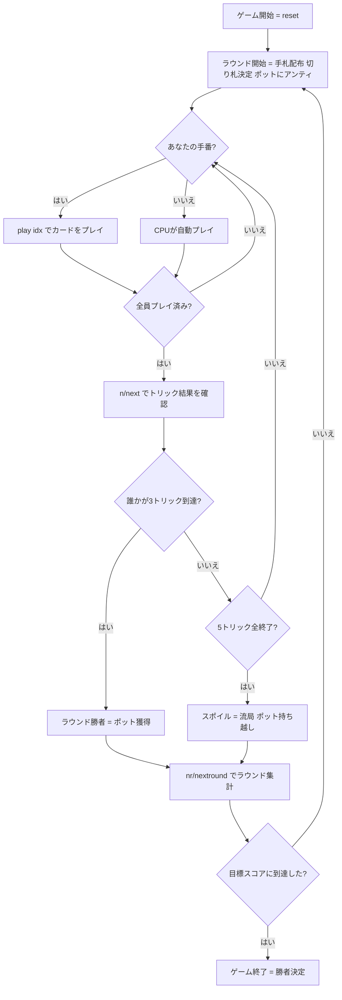

# スポイル・ファイブ（CUI版）遊び方

## ゲーム概要

Spoil Five（スポイル・ファイブ）はアイルランド伝統のトリックテイキングゲームです。52枚のデッキを5人でプレイし、各ラウンドで **最初に3トリックを取ったプレイヤーが勝者** となりポットを獲得します。3トリックを取るプレイヤーが出なかった場合はラウンドが **流局（スポイル）** となりポットが積み上がります。目標スコア（デフォルト30点）に最初に到達したプレイヤーが勝利します。

## 起動方法

```sh
go run ./cmd/trumpcards spoilfive
go run ./cmd/trumpcards --lang en spoilfive  # 英語モード
```

## ルール

### デッキと配布

- **デッキ**: 52枚（標準デッキ）
- **プレイヤー**: 5人（プレイヤー0 = あなた、プレイヤー1〜4 = CPU）
- **手札枚数**: 1人5枚
- **トリック数**: 1ラウンド5トリック
- **切り札**: 残りのデッキからめくった1枚のスートが切り札になります

### トップトランプ（固定上位切り札）

以下の3枚は常にゲーム最強のカードで、順番は固定です：

1. **切り札の5（Five Fingers）** — 最強
2. **切り札のJ（Knave of Trump）**
3. **♥A（ハートのエース）** — 切り札スートがハートでなくても常にトップトランプ

残りの切り札は通常の強さ順（切り札A → K → Q → 10 → … → 2）です。

### リネギング（Reneging）

トップトランプの3枚（切り札5、切り札J、♥A）は **特別免除** があります。切り札リードに対して、これらを持っていても **あえてプレイしないこと（温存）が許可** されています。それ以外のカードは通常のマスト・フォロールールに従います。

### マスト・フォロー

- リードスートが切り札以外の場合: リードスートを持っていれば必ずそのスートを出す（例外: トップトランプの温存は不可）
- 切り札リードの場合: 切り札を持っていれば切り札を出す（ただしトップトランプは温存可）
- リードスートも切り札も持っていない場合: 任意のカードを出せる

### ランク（強さの順番）

ランクの強弱は以下の通りです（パイプ順の伝統的な逆転は省略し、均一に10ハイで処理）：

- **切り札スート（高い順）**: トップ3（5 → J → ♥A）→ A → K → Q → 10 → 9 → 8 → 7 → 6 → 4 → 3 → 2
- **リードスート（切り札以外）**: A → K → Q → J → 10 → 9 → 8 → 7 → 6 → 5 → 4 → 3 → 2
- 切り札はリードスートより常に強い

### 勝利条件（ラウンド）

- **ラウンド勝利**: 5トリック中 **最初に3トリックを取ったプレイヤー** がポットを獲得します
- **スポイル（流局）**: 全5トリックが終わっても誰も3トリックに到達しなかった場合、ポットは積み上がったまま次のラウンドへ

### ポットとスコア

- 各ラウンド開始時、全プレイヤーがポットにアンティを入れます
- ラウンド勝者がポット全額を獲得し、スコアに加算されます
- スポイル時はポットを持ち越し（次ラウンドのスコアが増える）
- **マッチ勝利**: 目標スコア（デフォルト **30** 点）に最初に到達したプレイヤーが勝利

### 注意（簡略化）

以下のルールは実装から省略されています：
- 伝統的な赤/黒スートの強弱逆転（均一10ハイで処理）
- Jink（全5トリック獲得）ボーナス

## ゲームの流れ



## コマンド一覧

| コマンド | 短縮形 | 説明 |
|----------|--------|------|
| `play <idx>` | — | 手札の idx 番目のカードを出す |
| `next` | `n` | 次のトリックへ進む（トリック終了後） |
| `nextround` | `nr` | 次のラウンドへ進む（全トリック終了後またはラウンド勝者決定後） |
| `setdifficulty <0-2>` | `sd <0-2>` | CPU難易度設定（0=Easy, 1=Normal, 2=Hard） |
| `log` | `l` | アクションログを表示 |
| `reset` | `r` | 新しいゲームを開始（設定保持） |
| `quit` | `q` | ゲーム終了 |
| `help` | `?` | コマンド一覧を表示 |

## 画面の見方

```
==========
Spoil Five (スポイル・ファイブ)
==========
ラウンド: 2  トリック: 3/5  切り札: ♣
ポット: 15
You: スコア 10  今ラウンドトリック: 1
[0]5♣ [1]A♥ [2]Q♦ [3]8♠ [4]2♣
CPU 1: スコア 5  CPU 2: スコア 0  CPU 3: スコア 0  CPU 4: スコア 10
----------
フェーズ: PLAY
あなたの手番です。カードを出してください。
play <idx>
```

- **ラウンド / トリック表示**: 現在のラウンド番号とトリック番号（例: 3/5 = ラウンドの5トリック中3トリック目）
- **切り札**: 現在の切り札スート（♠/♣/♥/♦）
- **ポット**: 現在のポット総額（スポイルが続くほど積み上がる）
- **今ラウンドトリック**: 今ラウンドで取得済みのトリック数（3になると即座にラウンド勝利）
- **`[n]`付き行**: あなたの手札（インデックス付き）。プレイできないカードはグレー表示
- **フェーズ表示**: PLAY（カード出し）、TRICK_END（トリック確認待ち）、ROUND_END（ラウンド集計待ち）、GAME_END（ゲーム終了）
- **トップトランプ表示**: `5♣`（切り札の5）や `A♥`（♥A）などはトップトランプとして識別されます

## 遊び方のコツ

- **3トリックが目標**: 全5トリックを取る必要はありません。3トリック取れば即座に勝利です。強いカードをバランスよく使って3トリックを狙いましょう。
- **切り札5（Five Fingers）は最強**: このカードが手にある場合は、決定的な場面で使うことで確実にトリックを取れます。
- **♥Aは常にトップトランプ**: 切り札スートに関わらず、♥Aは切り札Jの次に強いカードです。ハートがリードされた際も、♥Aは切り札として機能します。
- **リネギングを活用する**: 切り札5・切り札J・♥Aの3枚はトランプリードでも温存できます。後のトリックで確実に勝てる場面まで取っておきましょう。
- **スポイル（流局）もあり**: ポットが積み上がった局面では、他プレイヤーに勝たせないように立ち回るのも戦略です。全員が3トリックを阻み合えばポットはさらに成長します。
- **積み上がったポットを狙う**: スポイルが続くとポットが大きくなります。この局面でラウンドを制すれば一気にスコアが伸びます。
- **難易度を上げて腕を磨く**: Easy（ランダム）、Normal（基本戦略）、Hard（高度なヒューリスティクス）と難易度を変更できます。`sd 2` でハードモードに挑戦してみましょう。
