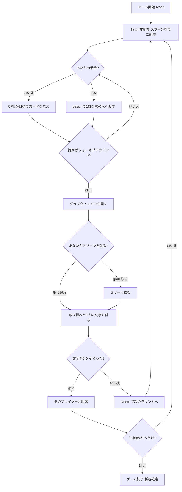

# スプーン（CUI版）遊び方

## ゲーム概要

Spoons（スプーン）はアメリカ生まれの4人用パーティー・スピードゲームです。**52枚のデッキ**から各自4枚ずつ配り、次々に1枚ずつ隣のプレイヤーへカードを回していきます。誰かが**同じランク4枚（フォーオブアカインド）**を揃えてスプーンを取った瞬間、全員が残りのスプーン（人数より1本少ない）を奪い合います。取り損ねたプレイヤーは **S-P-O-O-N-S** の文字を1つ獲得し、6文字そろうと脱落。最後まで生き残ったプレイヤーが勝者です。

## 起動方法

```sh
go run ./cmd/trumpcards spoons
go run ./cmd/trumpcards --lang en spoons  # 英語モード
```

## ルール

### デッキと配布

- **デッキ**: 52枚（標準デッキ）
- **プレイヤー**: 4人（あなた + CPU3人）
- **スプーン**: プレイヤー数より1本少ない本数（4人なら3本）を場に置きます。
- **配布**: 各プレイヤー4枚。「親（feeder）」が山札から1枚引いて回し始めます。

### パス（カード回し）

- 自分の手番では手札4枚のうち1枚を選び、**次のプレイヤーへ渡します**。
- カードは時計回りに同時進行で回り続けます。
- 目標は手札4枚すべてを同じランクで揃える**フォーオブアカインド**です。

### グラブ（スプーン争奪）

- 誰かがフォーオブアカインドを揃えてスプーンを取ると、**グラブウィンドウが開き**ます。
- グラブウィンドウが開いている間、全員が我先にとスプーンへ手を伸ばします（`grab`）。
- スプーンは人数より1本少ないため、**1人だけ取り損ねます**。

### 文字（S-P-O-O-N-S）と脱落

- スプーンを取り損ねたプレイヤーは **S → P → O → O → N → S** の順に文字を1つ獲得します。
- **6文字（S-P-O-O-N-S）そろうと脱落**します。
- 脱落するとそのプレイヤーは以降のラウンドに参加しません。

### 勝利条件

- 脱落者が出るたびにスプーンも1本減ります。
- **最後の1人になったプレイヤーがゲームの勝者**です。

### CPU難易度

- **Easy（0）**: 反応が鈍く、グラブに乗り遅れやすい。
- **Normal（1）**: 標準的な反応。
- **Hard（2）**: 反応が速く、グラブに乗り遅れにくい。

## ゲームの流れ



## コマンド一覧

| コマンド | 短縮形 | 説明 |
|----------|--------|------|
| `pass <i>` | `p` | 手札のi番目（0始まり）を次のプレイヤーへ渡す |
| `grab` | `g` | スプーンを取る（グラブウィンドウが開いている間） |
| `next` | `n` | 次のラウンドへ進む |
| `log` | `l` | アクションログを表示 |
| `reset` | `r` | 新しいゲームを開始（設定保持） |
| `quit` | `q` | ゲーム終了 |
| `help` | `?` | コマンド一覧を表示 |

## 画面の見方

```
==========
Spoons (スプーン)
==========
ラウンド: 1  残りスプーン: 3  山札: 36
----------
フェーズ: PASS
あなた: 文字 - [4 枚]
  [0][A♠] [1][A♥] [2][3♣] [3][9♦]
CPU1: 文字 - [4 枚]
CPU2: 文字 S [4 枚]
CPU3: 文字 - [4 枚]
あなたの番です — pass <i> で渡すカードを選んでください。

==========
ラウンド: 1  残りスプーン: 3
----------
フェーズ: GRAB
グラブ！ g でスプーンを取りましょう！
```

- **フェーズ: PASS**: カード回し中。`pass <i>` で1枚を渡します。
- **フェーズ: GRAB**: スプーン争奪中。`grab` で素早くスプーンを取ります。
- **ラウンド行**: 現在のラウンド数・残りスプーン数・山札の残り枚数。
- **文字表示**: 各プレイヤーが獲得した S-P-O-O-N-S の文字（6文字で脱落）。
- **手札表示**: あなたの4枚のみ公開され、`[i]` の番号で `pass` の対象を指定します。

## 遊び方のコツ

- **同じランクを集める**: フォーオブアカインドを狙うなら、ペアになっているランクを残し、不要なカードを優先的に渡しましょう。
- **周りを観察する**: 誰かが急にスプーンへ手を伸ばしたら、自分の手札に関係なく即座に `grab` するのが鉄則です。取り損ねないことが最優先。
- **反応速度がすべて**: フォーオブアカインドを自分で揃えなくても、他人の動きに反応してスプーンを取れば文字は付きません。
- **難易度調整**: Hard のCPUは反応が速いです。慣れないうちは Easy から始めて、グラブのタイミングをつかみましょう。
