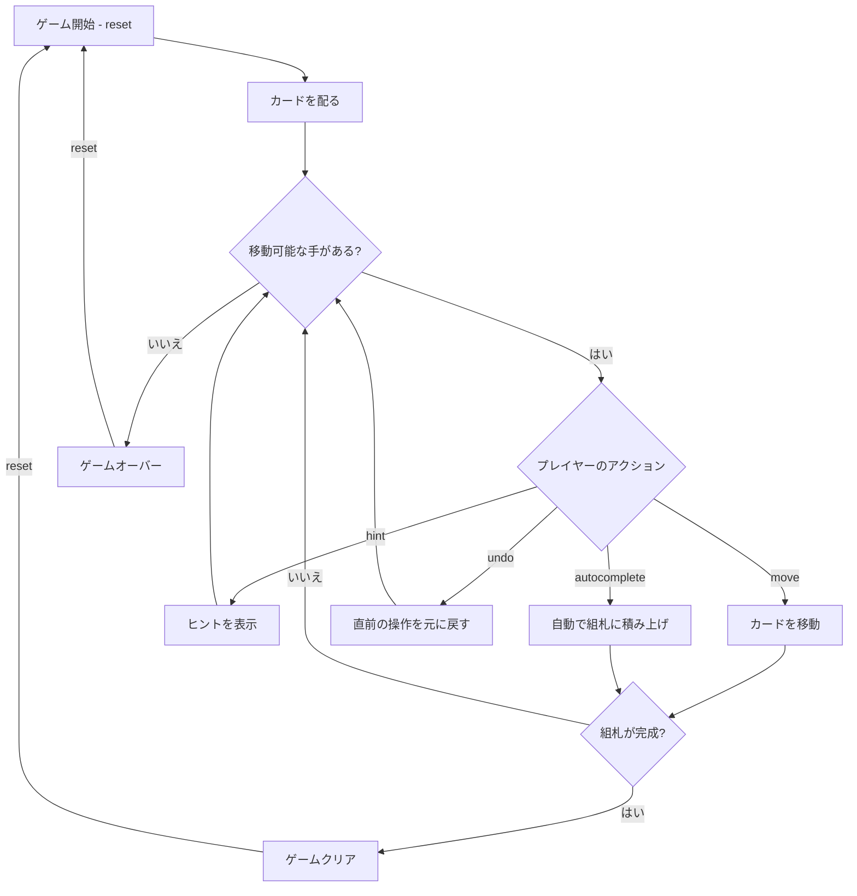

# スタラクタイト（CUI版）遊び方

## ゲーム概要

1人用のソリティアカードゲームです。52枚のうち **4枚が最初からセルに入り**（これが stalactites）、残り48枚を8列×6枚のタブローに表向きで配ります。組札は**スートを無視**して昇順に積み、**K の次は A に戻ります**。開始ランクは A 固定ではなく、**最初のセルの札のランク**で配りごとに変わります。

## 起動方法

```sh
go run ./cmd/trumpcards stalactites
```

## ルール

### 基本ルール

- 52枚のトランプ（ジョーカーなし）を使用
- 8列のタブローに配る（最初の4列に7枚ずつ、残りの4列に6枚ずつ）、すべて表向き
- 4つのセル: 一時的にカード1枚を置ける場所。**開始時は4枚とも埋まっている**ので、まず組札かタブローへ出して空ける
- 4つの組札（ファンデーション）は**スートを無視**して開始ランクから昇順。**K の次は A**（ラップ）
- タブローでは降順かつ交互の色で重ねる（例: 黒のKの上に赤のQ）
- 空いた列にはKのみ置くことができる

### スーパームーブ

一度に移動できるカード数は以下の計算式で決まります:

```
最大移動枚数 = (1 + 空きセル数) × 2^(空きタブロー列数)
```

### ゲームクリア

- 4つの組札すべてに13枚ずつ積み上げるとゲームクリア（52枚すべてが組札に収まる）

### ゲームオーバー

- これ以上移動可能な手がない場合はゲームオーバー

### 手詰まり検出

- 各操作の後、ソルバー（DFS + メモ化）がボード全体を解析し、解法が存在しないと判定された場合「手詰まりです」と表示します
- 手詰まり状態では「元に戻す」またはギブアップを選択できます
- ソルバーの探索上限（100,000状態）を超えた場合は手詰まりとは判定しません

## ゲームの流れ



## コマンド一覧

| コマンド | 短縮形 | 説明 |
|----------|--------|------|
| `reset` | `r` | 新しいゲームを開始 |
| `move` | `m` | カードを移動する（サブ引数で移動元・移動先を指定） |
| `undo` | `u` | 直前の操作を元に戻す |
| `giveup` | `g` | ギブアップしてゲームを終了 |
| `hint` | `h` | 次の一手のヒントを表示 |
| `autocomplete` | `ac` | 自動的に組札へ積み上げ可能なカードを移動 |
| `log` | `l` | アクションログ（棋譜）を表示 |
| `quit` | `q` | ゲーム終了 |
| `help` | `?` | コマンド一覧を表示 |

### 移動コマンドの構文

移動元・移動先にはゾーン名とインデックスを指定します:

- `tableau <列番号>` — タブローの列（0〜7）
- `stalactites <セル番号>` — セル（0〜3）
- `foundation <列番号>` — 組札（0〜3）

### コマンド例

- `m` → 移動コマンド（移動元・移動先の入力を求められる）
- `u` → 直前の操作を元に戻す
- `h` → ヒントを表示
- `ac` → オートコンプリート

## 画面の見方

```
==========
Stalactites (スタラクタイト)
==========
セル: [♠K] [  ] [  ] [  ]
----------
組札:
[♠] A  [♥] A 2  [♦] --  [♣] --
----------
タブロー:
[0] ♥Q ♣J ♦10 ♠9 ♥8 ♣7 ♦6
[1] ♠J ♥10 ♣9 ♦8 ♠7 ♥6
[2] ♦Q ♣K ♥J ♠10 ♦9 ♣8 ♥7
[3] ♣Q ♦J ♠Q ♥K ♦K ♣10 ♠8
[4] ♥9 ♣6 ♦5 ♠4 ♥3 ♣2
[5] ♠6 ♥5 ♦4 ♣3 ♠2 ♥4
[6] ♦3 ♣5 ♠3 ♥2 ♦2 ♣4
[7] ♠5 ♦7 ♣A ♠A ♦A ♥A
----------
手数: 15
m・・・カードを移動  h・・・ヒント  ac・・・オートコンプリート
==========
```

- `セル: [♠K] [  ]`: セルの状態（カードまたは空）
- `組札`: 各スートの組札の状態（`--`は空）
- `[0] ♥Q ♣J ...`: タブロー列（すべて表向き）
- `手数: N`: 現在の手数

## 遊び方のコツ

- セルは一時的な退避場所です。むやみに埋めないようにしましょう
- 空いたタブロー列はスーパームーブの計算に影響するため、戦略的に活用しましょう
- Aが出たらすぐに組札へ移動しましょう
- 空いた列にはKのみ置くことができます
- ヒントコマンドで詰まった時のアドバイスを得られます
- オートコンプリートは組札に安全に移動できるカードがある場合に便利です
