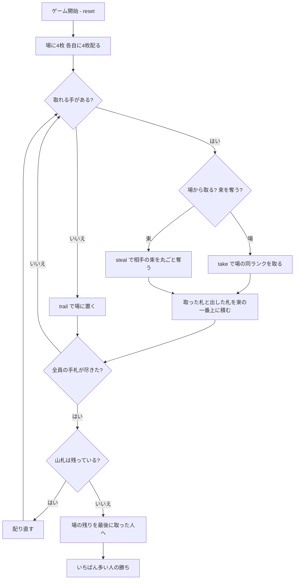

# スティーリングバンドル（CUI版）遊び方

## ゲーム概要

アメリカの子供向け**フィッシングゲーム**。場の同じランクの札を取るのが基本ですが、**相手が獲得した束は「一番上のランク」が弱点**で、そこに同じランクを出すと**束ごと丸ごと奪えます**。すでに得点した札を直接ねらえるのがこのゲームの特徴です。2〜4人で遊べます。

## 起動方法

```sh
go run ./cmd/trumpcards stealingbundles
go run ./cmd/trumpcards --lang en stealingbundles  # 英語モード
```

## ルール

### 配り

標準52枚を使います。**場に4枚公開し、各自に4枚ずつ**配ります。残りは山札です。

| 人数 | 最初の配り | 山札 | 配り直しの回数 |
|------|-----------|------|---------------|
| 2人 | 場4 + 各4（計12枚） | 40枚 | 5回（8枚ずつ） |
| 3人 | 場4 + 各4（計16枚） | 36枚 | 3回（12枚ずつ） |
| 4人 | 場4 + 各4（計20枚） | 32枚 | 2回（16枚ずつ） |

**どの人数でもきれいに割り切れます。** 全員の手札が尽きたら山札から配り直し、山札が尽きたら終わりです。

### 取る

手札から1枚出し、**場にある同じランクの札を取ります**。同じランクが複数あればまとめて取れます。

取った札と出した札は、まとめて**自分の束の一番上**に積まれます。

### 奪う

**相手の束は「一番上のランク」が弱点です。** そこに同じランクを出すと、**束ごと丸ごと**自分のものになります。

束の中身は関係ありません。埋まっているランクは狙えず、**見えている一番上だけ**が的です。

### 取れるときは置けません

**場から取るか、束を奪うか、どちらかを必ず選びます。** どちらもできないときだけ、手札を1枚場に置けます。

### 勝敗

山札が尽きて全員の手札が無くなったら終わりです。**場に残った札は、最後に取った人**が受け取ります。

**いちばん多く集めた人の勝ち**です。

## ゲームの流れ



## コマンド一覧

| コマンド | 短縮形 | 説明 |
|----------|--------|------|
| `take <idx>` | `t` | 手札の `<idx>` 番目で場の同ランクを取る |
| `steal <idx> <席>` | `s` | 手札の `<idx>` 番目で指定した席の束を丸ごと奪う |
| `trail <idx>` | `d` | 手札の `<idx>` 番目を場に置く（**取れないときだけ**） |
| `hint` | `h` | 出すべき札を提示する |
| `giveup` | `g` | 投了する |
| `log` | `l` | 棋譜（アクションログ）を表示する |
| `reset` | `r` | 最初からやり直す |
| `quit` | `q` | 終了する |
| `help` | `?` | コマンド一覧を表示 |

**`steal` は札と相手の2つを指定します。** どちらが欠けているかは個別に知らせます。

## 画面の見方

```
==========
Stealing Bundles (スティーリングバンドル)
==========
手数: 7  山札: 残り24枚
場の同じランクの札を取るのが基本ですが、相手が獲得した束は「一番上のランク」が弱点です。そこに同じランクを出すと束ごと丸ごと奪えます。取れる手があるときは場に置けません——場から取るか、束を奪うか、どちらかです。出した札はそのまま自分の束の一番上になるので、次はそこが狙われます。最後にいちばん多く集めた人の勝ちです。
場: HEART 7,CLOVER 3
>あなた: 手札4枚 束6枚 一番上[SPADE 9]
  [0]♠7 [1]♥9 [2]♣3 [3]♦5
 CPU1[直前に あなた の束を盗んだ]: 手札4枚 束12枚 一番上[DIAMOND 9]
 CPU2: 手札4枚 束0枚 一番上[なし]
 CPU3: 手札4枚 束2枚 一番上[CLOVER 5]
----------
取れる手があります。場に置くことはできません。
take <idx>・・・場札を取る
steal <idx> <席>・・・相手の束を奪う
```

- **場**: 取れる札の一覧。空のときは「（なし）」と出ます
- **束の枚数**: これがそのまま得点です
- **一番上**: **全員分が見えます。** そこが狙われる場所なので、伏せません
- **直前の獲得の印**: `[直前に場から取った]` か `[直前に ◯◯ の束を盗んだ]`。**盗みは相手の束を丸ごと消す**別の出来事なので、被害者の席まで出します
- **促し**: 取れるときは take / steal だけ、取れないときは trail だけを案内します

## 遊び方のコツ

- **自分の一番上を意識する。** 取った直後は、**出したばかりの札のランク**が狙われます
- **大きい束から狙う。** 奪える枚数がそのまま得点差になるので、場の1枚を取るより効きます
- **相手が大きい束を持ったら、そのランクを手札に残す。** いつでも奪える構えが最大の牽制です
- **置くしかないときは、場に同じランクが少ない札を選ぶ。** 次の人に取られにくくなります
- **最後の1手は重い。** 場に残った札は最後に取った人のものなので、終盤の1回が二重に効きます
