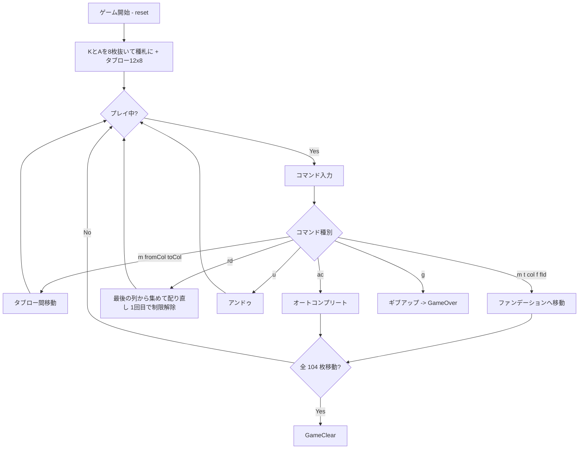

# セント・ヘレナ（CUI版）遊び方

## ゲーム概要

52 枚 2 組（104 枚）で遊ぶソリティアです。各スートの **K と A を 1 枚ずつ抜いて 8 つのファンデーションの種札**にし、残り 96 枚を **12 列 × 8 枚**のタブローに配ります。タブローはファンデーションを囲む輪として並び、**列の位置がそのまま規則になります**。

K の段は降順、A の段は昇順に同じスートで積み、104 枚すべてを片付ければクリアです。行き詰まったら **最大 2 回の再配り**が使えます。

## 起動方法

```sh
go run ./cmd/trumpcards sthelena
go run ./cmd/trumpcards --lang en sthelena   # 英語
```

## ルール

- 52 枚 2 組（104 枚）。各スートの K と A を 1 枚ずつ抜いて種札にし、残り 96 枚を **12 列 × 8 枚**に配ります
- **ファンデーション**: 8 つ。0〜3 は A から昇順、4〜7 は K から降順。どちらも**同じスート**で積みます
- **タブロー**: **スートは問わず値差 ±1** で最上段 1 枚を重ねられます。**K と A は繋がりません**
- **空いた列は二度と埋まりません**。列を空けることは、その列を捨てることを意味します
- **初回の配りでは、列の位置が送り先を決めます**（下表）
- **再配り**: 最大 2 回。**1 回目で送り先の制限が解けます**

### 送り先の制限（初回の配りの間だけ）

| 列 | 位置 | 送れるファンデーション |
|----|------|------------------------|
| 0〜3 | 上 | **4〜7（K からの降順）のみ** |
| 6〜9 | 下 | **0〜3（A からの昇順）のみ** |
| 4, 5, 10, 11 | 横 | どちらでも |

輪に並べたとき、それぞれの列が隣り合っている段しか使えない、という規則です。**1 回目の再配りで解けます。**

| ファンデーション | 方向 | スート割り当て |
|------------------|------|-----------------|
| 0 | A → K（昇順） | ♠ |
| 1 | A → K（昇順） | ♣ |
| 2 | A → K（昇順） | ♥ |
| 3 | A → K（昇順） | ♦ |
| 4 | K → A（降順） | ♠ |
| 5 | K → A（降順） | ♣ |
| 6 | K → A（降順） | ♥ |
| 7 | K → A（降順） | ♦ |

### 再配り（redeal）

- ゲーム中に **最大 2 回**まで `rd` コマンドで再配りができます。
- **最後の列から順に集め、シャッフルせずに配り直します。**列をまたいで並びが変わるので、その場で反転させるのとは違って新しい手が生まれます。
- **1 回目の再配りで、上表の送り先制限が解けます。**これがこのゲームの分水嶺で、制限が残ったままでは後半に手が尽きます。
- アンドゥ可能です（制限の状態も一緒に巻き戻ります）。

### ゲーム終了

- すべてのカードをファンデーションに移せばクリアです。
- 残り再配り 0 回かつ合法手が無くなった場合は手詰まり（stalemate）になります。`g` でギブアップするか、アンドゥで脱出してください。

## ゲームの流れ



## コマンド一覧

| コマンド | 短縮形 | 説明 |
|----------|--------|------|
| `reset` | `r` | 新しいゲームを開始 |
| `m <fromCol> <toCol>` | — | タブロー間でカードを移動（簡略形） |
| `m t <fromCol> t <toCol>` | — | タブロー間でカードを移動 |
| `m t <fromCol> f <foundationId>` | — | タブローからファンデーションへ移動 |
| `redeal` | `rd` | 再配り（各タブロー列の順序を反転、最大 3 回） |
| `hint` | `h` | ヒントを表示 |
| `autocomplete` | `ac` | 残りすべてをファンデーションに移動 |
| `undo` | `u` | 直前の操作を取り消し |
| `giveup` | `g` | ゲームを放棄 |
| `log` | `l` | これまでの操作ログを表示 |
| `quit` | `q` | ゲーム終了 |
| `help` | `?` | コマンド一覧を表示 |

## 画面の見方

```
==========
St. Helena (セント・ヘレナ)
==========
ファンデーション (昇順): [0]♠A | [1]♣A | [2]♥A | [3]♦A
ファンデーション (降順): [4]♠K | [5]♣K | [6]♥K | [7]♦K
残り再配り回数: 2
初回配りの制限: 上4列→K段のみ / 下4列→A段のみ / 左右4列→どちらでも
----------
列0(上): [0]♠6 [1]♥7 [2]♣2 [3]♣8 [4]♦3 [5]♠5 [6]♥J [7]♦9
列4(横): [0]♠9 [1]♥10 ...
列6(下): [0]♣4 ...
...
```

- ファンデーション ID と最上段カードが上 2 行に並びます
- **列番号の後ろの `(上)` `(横)` `(下)` が、その列の送り先を決めます。**制限が解けるとこの注記は消えます
- 各タブロー列は左端から右へカード番号付きで表示されます。動かせるのは常に一番右（最上段）の 1 枚だけです

## 遊び方のコツ

- **スートは関係ありません。**±1 でさえあれば重ねられるので、クレセントなど同スート系のつもりで探すと手を見落とします
- **K と A は繋がりません。**A の上に置けるのは 2 だけ、K の上に置けるのは Q だけです
- **上の列と下の列は、行き先が半分しかありません。**序盤は横の 4 列（4, 5, 10, 11）が最も自由に動けるので、そこを起点に考えましょう
- **1 回目の再配りは制限を外す一手。**「手が無くなったから」ではなく「上下の列を解放したいから」使うと考えると読みやすくなります
- **空けた列は戻りません。**空列は詰みに近づく操作なので、狙って作るものではありません
- アンドゥが残っているうちに行き詰まりを検知して脱出を試みましょう
